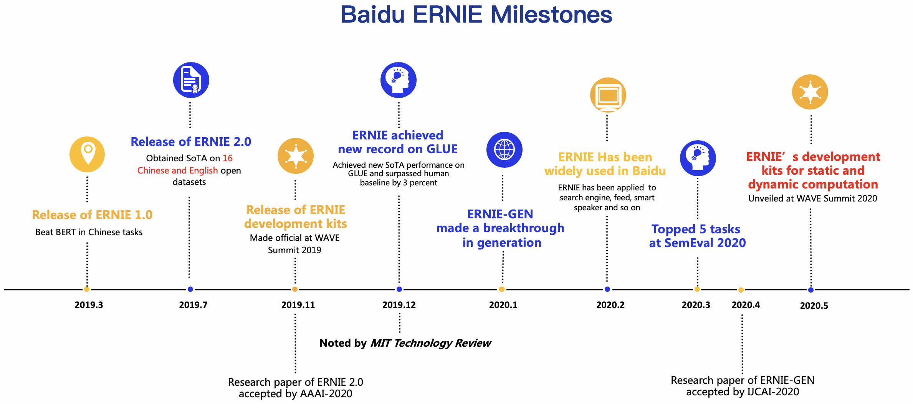

English|[简体中文](./README.zh.md)




**Remind： This repo has been refactored, for paper re-production or backward compatibility; plase checkout to [repro branch](https://github.com/PaddlePaddle/ERNIE/tree/repro)**

ERNIE 2.0 is a continual pre-training framework for language understanding in which pre-training tasks can be incrementally built and learned through multi-task learning.
ERNIE 2.0 builds a strong basic for nearly every NLP tasks: Text Classification, Ranking, NER, machine reading comprehension, text genration and so on.

[\[more information\]](https://wenxin.baidu.com/)

# News
- Sept.24.2020:
    - [`ERNIE-ViL`](https://github.com/PaddlePaddle/ERNIE/tree/repro/ernie-vil) is **avaliable** now!
        - A **knowledge-enhanced** joint representations for vision-language tasks.
            - Constructing three **Scene Graph Prediction** tasks utilizing structured knowledge.
	    - The state-of-the-art performance on 5 downstream tasks, 1st place on [VCR leaderboad](https://visualcommonsense.com/leaderboard/).

- May.20.2020:

    - Try ERNIE in "`dygraph`", with:
    	- Pretrain and finetune ERNIE with [PaddlePaddle v2.0](https://github.com/PaddlePaddle/Paddle/tree/release/2.0-rc).
    	- Eager execution with `paddle.fluid.dygraph`.
    	- Distributed training.
    	- Easy deployment.
    	- Learn NLP in Aistudio tutorials.
    	- Backward compatibility for old-styled checkpoint

    - [`ERNIE-GEN`](https://github.com/PaddlePaddle/ERNIE/tree/repro/ernie-gen) is **avaliable** now! ([link here](https://github.com/PaddlePaddle/ERNIE/tree/repro/ernie-gen))
    	- the **state-of-the-art** pre-trained model for generation tasks, accepted by `IJCAI-2020`.
        	- A novel **span-by-span generation pre-training task**.
        	- An **infilling generation** echanism and a **noise-aware generation** method.
        	- Implemented by a carefully designed **Multi-Flow Attention** architecture.
    	- You are able to `download` all models including `base/large/large-430G`.

- Apr.30.2020: Release [ERNIESage](https://github.com/PaddlePaddle/PGL/tree/master/examples/erniesage), a novel Graph Neural Network Model using ERNIE as its aggregator. It is implemented through [PGL](https://github.com/PaddlePaddle/PGL)
- Mar.27.2020: [Champion on 5 SemEval2020 sub tasks](https://www.jiqizhixin.com/articles/2020-03-27-8)
- Dec.26.2019: [1st place on GLUE leaderboard](https://www.technologyreview.com/2019/12/26/131372/ai-baidu-ernie-google-bert-natural-language-glue/)
- Nov.6.2019: [Introducing ERNIE-tiny](https://www.jiqizhixin.com/articles/2019-11-06-9)
- Jul.7.2019: [Introducing ERNIE2.0](https://www.jiqizhixin.com/articles/2019-07-31-10)
- Mar.16.2019: [Introducing ERNIE1.0](https://www.jiqizhixin.com/articles/2019-03-16-3)


# Table of contents
* [Tutorials](#tutorials)
* [Setup](#setup)
* [Fine-tuning](#fine-tuning)
* [Pre-training with ERNIE 1.0](#pre-training-with-ernie-10)
* [Online inference](#online-inference)
* [Distillation](#distillation)

# Quick Tour

```python
import numpy as np
import paddle.fluid.dygraph as D
from ernie.tokenizing_ernie import ErnieTokenizer
from ernie.modeling_ernie import ErnieModel

D.guard().__enter__() # activate paddle `dygrpah` mode

model = ErnieModel.from_pretrained('ernie-1.0')    # Try to get pretrained model from server, make sure you have network connection
model.eval()
tokenizer = ErnieTokenizer.from_pretrained('ernie-1.0')

ids, _ = tokenizer.encode('hello world')
ids = D.to_variable(np.expand_dims(ids, 0))  # insert extra `batch` dimension
pooled, encoded = model(ids)                 # eager execution
print(pooled.numpy())                        # convert  results to numpy

```

# Tutorials

Don't have GPU? try ERNIE in [AIStudio](https://aistudio.baidu.com/aistudio/index)!
(please choose the latest version and apply for a GPU environment)

1. [ERNIE for beginners](https://aistudio.baidu.com/studio/edu/group/quick/join/314947)
1. [Sementic analysis](https://aistudio.baidu.com/aistudio/projectdetail/427482)
2. [Cloze test](https://aistudio.baidu.com/aistudio/projectdetail/433491)
3. [Knowledge distillation](https://aistudio.baidu.com/aistudio/projectdetail/439460)
4. [Ask ERNIE](https://aistudio.baidu.com/aistudio/projectdetail/456443)
5. [Loading old-styled checkpoint](https://aistudio.baidu.com/aistudio/projectdetail/493415)

# Setup

##### 1. install PaddlePaddle

This repo requires PaddlePaddle 1.7.0+, please see [here](https://www.paddlepaddle.org.cn/install/quick) for installaton instruction.

##### 2. install ernie

```script
pip install paddle-ernie
```

or

```shell
git clone https://github.com/PaddlePaddle/ERNIE.git --depth 1
cd ERNIE
pip install -r requirements.txt
pip install -e .
```

##### 3. download pretrained models (optional)

| Model                                              | Description                                                  |abbreviation|
| :------------------------------------------------- | :----------------------------------------------------------- |:-----------|
| [ERNIE 1.0 Base for Chinese](https://ernie-github.cdn.bcebos.com/model-ernie1.0.1.tar.gz)           | L12H768A12  |ernie-1.0|
| [ERNIE Tiny](https://ernie-github.cdn.bcebos.com/model-ernie_tiny.1.tar.gz)                         | L3H1024A16  |ernie-tiny|
| [ERNIE 2.0 Base for English](https://ernie-github.cdn.bcebos.com/model-ernie2.0-en.1.tar.gz)        | L12H768A12  |ernie-2.0-en|
| [ERNIE 2.0 Large for English](https://ernie-github.cdn.bcebos.com/model-ernie2.0-large-en.1.tar.gz) | L24H1024A16 |ernie-2.0-large-en|
| [ERNIE Gen base for English](https://ernie-github.cdn.bcebos.com/model-ernie-gen-base-en.1.tar.gz)  | L12H768A12  |ernie-gen-base-en|
| [ERNIE Gen Large for English](https://ernie-github.cdn.bcebos.com/model-ernie-gen-large-en.1.tar.gz)| L24H1024A16 | ernie-gen-large-en |
| [ERNIE Gen Large 430G for English](https://ernie-github.cdn.bcebos.com/model-ernie-gen-large-430g-en.1.tar.gz)| Layer:24, Hidden:1024, Heads:16 + 430G pretrain corpus | ernie-gen-large-430g-en |

##### 4. download datasets

**English Datasets**

Download the [GLUE datasets](https://gluebenchmark.com/tasks) by running [this script](https://gist.github.com/W4ngatang/60c2bdb54d156a41194446737ce03e2e)

the `--data_dir` option in the following section assumes a directory tree like this:

```shell
data/xnli
├── dev
│   └── 1
├── test
│   └── 1
└── train
    └── 1
```

see [demo](https://ernie-github.cdn.bcebos.com/data-mnli-m.tar.gz) data for MNLI task.

**Chinese Datasets**

| Datasets|Description|
|:--------|:----------|
| [XNLI](https://ernie-github.cdn.bcebos.com/data-xnli.tar.gz)                 |XNLI is a natural language inference dataset in 15 languages. It was jointly built by Facebook and New York University. We use Chinese data of XNLI to evaluate language understanding ability of our model. [url](https://github.com/facebookresearch/XNLI)|
| [ChnSentiCorp](https://ernie-github.cdn.bcebos.com/data-chnsenticorp.tar.gz) |ChnSentiCorp is a sentiment analysis dataset consisting of reviews on online shopping of hotels, notebooks and books.|
| [MSRA-NER](https://ernie-github.cdn.bcebos.com/data-msra_ner.tar.gz)         |MSRA-NER (SIGHAN2006) dataset is released by MSRA for recognizing the names of people, locations and organizations in text.|
| [NLPCC2016-DBQA](https://ernie-github.cdn.bcebos.com/data-dbqa.tar.gz)       |NLPCC2016-DBQA is a sub-task of NLPCC-ICCPOL 2016 Shared Task which is hosted by NLPCC(Natural Language Processing and Chinese Computing), this task targets on selecting documents from the candidates to answer the questions. [url: http://tcci.ccf.org.cn/conference/2016/dldoc/evagline2.pdf]|
|[CMRC2018](https://ernie-github.cdn.bcebos.com/data-cmrc2018.tar.gz)|CMRC2018 is a evaluation of Chinese extractive reading comprehension hosted by Chinese Information Processing Society of China (CIPS-CL). [url](https://github.com/ymcui/cmrc2018)|


# Fine-tuning

- try eager execution with `dygraph model` :

```script
python3 ./ernie_d/demo/finetune_classifier_dygraph.py \
       --from_pretrained ernie-1.0 \
       --data_dir ./data/xnli
```

- Distributed finetune

`paddle.distributed.launch` is a process manager, we use it to launch python processes on each avalible GPU devices:

When in distributed training, `max_steps` is used as stopping criteria rather than `epoch` to prevent dead block.
You could calculate `max_steps` with `EPOCH * NUM_TRAIN_EXAMPLES / TOTAL_BATCH`.
Also notice than we shard the train data according to device id to prevent over fitting.

demo:
(make sure you have more than 2 GPUs,
online model download can not work in `paddle.distributed.launch`,
you need to run single card finetuning first to get pretrained model, or donwload and extract one manualy from [here](#section-pretrained-models)):


```script
python3 -m paddle.distributed.launch \
./demo/finetune_classifier_dygraph_distributed.py \
    --data_dir data/mnli \
    --max_steps 10000 \
    --from_pretrained ernie-2.0-en
```


many other demo python scripts:

1. [Sentiment Analysis](./demo/finetune_sentiment_analysis_dygraph.py)
1. [Semantic Similarity](./demo/finetune_classifier_dygraph.py)
1. [Name Entity Recognition(NER)](./demo/finetune_ner_dygraph.py)
1. [Machine Reading Comprehension](./demo/finetune_mrc_dygraph.py)
1. [Text generation](./demo/seq2seq/README.md)


**recomended hyper parameters:**

|tasks|batch size|learning rate|
|--|--|--|
| CoLA         | 32 / 64 (base)  | 3e-5                     |
| SST-2        | 64 / 256 (base) | 2e-5                     |
| STS-B        | 128             | 5e-5                     |
| QQP          | 256             | 3e-5(base)/5e-5(large)   |
| MNLI         | 256 / 512 (base)| 3e-5                     |
| QNLI         | 256             | 2e-5                     |
| RTE          | 16 / 4 (base)   | 2e-5(base)/3e-5(large)   |
| MRPC         | 16 / 32 (base)  | 3e-5                     |
| WNLI         | 8               | 2e-5                     |
| XNLI         | 512             | 1e-4(base)/4e-5(large)   |
| CMRC2018     | 64              | 3e-5                     |
| DRCD         | 64              | 5e-5(base)/3e-5(large)   |
| MSRA-NER(SIGHAN2006)  | 16     | 5e-5(base)/1e-5(large)   |
| ChnSentiCorp | 24              | 5e-5(base)/1e-5(large)   |
| LCQMC        | 32              | 2e-5(base)/5e-6(large)   |
| NLPCC2016-DBQA| 64             | 2e-5(base)/1e-5(large)   |
| VCR           | 64             | 2e-5(base)/2e-5(large)   |

# Pretraining with ERNIE 1.0

see [here](./demo/pretrain/README.md)


# Online inference

If `--inference_model_dir` is passed to `finetune_classifier_dygraph.py`,
a deployable model will be generated at the end of finetuning and your model is ready to serve.

For details about online inferece, see [C++ inference API](./inference/README.md),
or you can start a multi-gpu inference server with a few lines of codes:

```shell
python -m propeller.tools.start_server -m /path/to/saved/inference_model  -p 8881
```

and call the server just like calling local function (python3 only):

```python
from propeller.service.client import InferenceClient
from ernie.tokenizing_ernie import ErnieTokenizer

client = InferenceClient('tcp://localhost:8881')
tokenizer = ErnieTokenizer.from_pretrained('ernie-1.0')
ids, sids = tokenizer.encode('hello world')
ids = np.expand_dims(ids, 0)
sids = np.expand_dims(sids, 0)
result = client(ids, sids)
```

A pre-made `inference model` for ernie-1.0 can be downloaded at [here](https://ernie.bj.bcebos.com/ernie1.0_zh_inference_model.tar.gz).
It can be used for feature-based finetuning or feature extraction.

# Distillation

Knowledge distillation is good way to compress and accelerate ERNIE.

For details about distillation, see [here](./distill/README.md)

# Citation

### ERNIE 1.0
```
@article{sun2019ernie,
  title={Ernie: Enhanced representation through knowledge integration},
  author={Sun, Yu and Wang, Shuohuan and Li, Yukun and Feng, Shikun and Chen, Xuyi and Zhang, Han and Tian, Xin and Zhu, Danxiang and Tian, Hao and Wu, Hua},
  journal={arXiv preprint arXiv:1904.09223},
  year={2019}
}
```

### ERNIE 2.0
```
@article{sun2019ernie20,
  title={ERNIE 2.0: A Continual Pre-training Framework for Language Understanding},
  author={Sun, Yu and Wang, Shuohuan and Li, Yukun and Feng, Shikun and Tian, Hao and Wu, Hua and Wang, Haifeng},
  journal={arXiv preprint arXiv:1907.12412},
  year={2019}
}
```

### ERNIE-GEN

```
@article{xiao2020ernie-gen,
  title={ERNIE-GEN: An Enhanced Multi-Flow Pre-training and Fine-tuning Framework for Natural Language Generation},
  author={Xiao, Dongling and Zhang, Han and Li, Yukun and Sun, Yu and Tian, Hao and Wu, Hua and Wang, Haifeng},
  journal={arXiv preprint arXiv:2001.11314},
  year={2020}
}
```

### ERNIE-ViL
```
@article{yu2020ernie,
  title={ERNIE-ViL: Knowledge Enhanced Vision-Language Representations Through Scene Graph},
  author={Yu, Fei and Tang, Jiji and Yin, Weichong and Sun, Yu and Tian, Hao and Wu, Hua and Wang, Haifeng},
  journal={arXiv preprint arXiv:2006.16934},
  year={2020}
}

```

For full reproduction of paper results, please checkout to `repro` branch of this repo.

### Communication

- [ERNIE homepage](https://wenxin.baidu.com/)
- [Github Issues](https://github.com/PaddlePaddle/ERNIE/issues): bug reports, feature requests, install issues, usage issues, etc.
- QQ discussion group: 760439550 (ERNIE discussion group).
- QQ discussion group: 958422639 (ERNIE discussion group-v2).
- [Forums](http://ai.baidu.com/forum/topic/list/168?pageNo=1): discuss implementations, research, etc.
