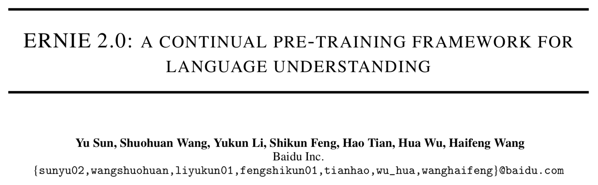
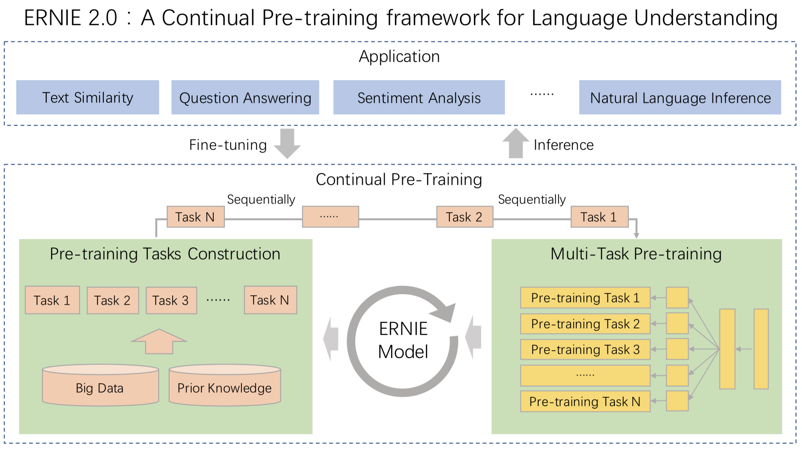
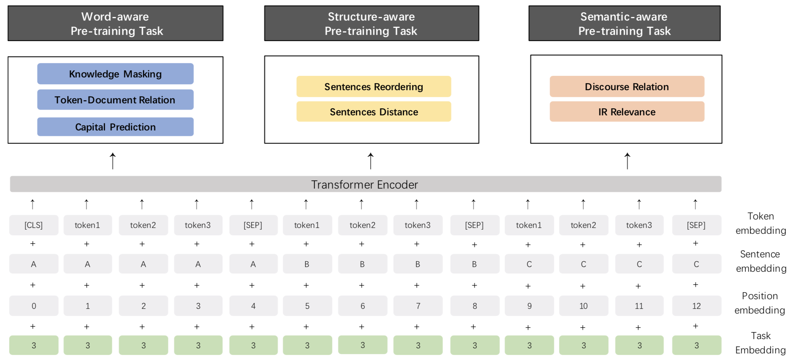

English | [简体中文](./README.zh.md)

## ERNIE 2.0: A Continual Pre-training Framework for Language Understanding


 * [Pre-training Tasks](#pre-training-tasks)
    * [Word-aware Tasks](#word-aware-tasks)
       * [Knowledge Masking Task](#knowledge-masking-task)
       * [Capitalization Prediction Task](#capitalization-prediction-task)
       * [Token-Document Relation Prediction Task](#token-document-relation-prediction-task)
    * [Structure-aware Tasks](#structure-aware-tasks)
       * [Sentence Reordering Task](#sentence-reordering-task)
       * [Sentence Distance Task](#sentence-distance-task)
    * [Semantic-aware Tasks](#semantic-aware-tasks)
       * [Discourse Relation Task](#discourse-relation-task)
       * [IR Relevance Task](#ir-relevance-task)
 * [ERNIE 1.0: <strong>E</strong>nhanced <strong>R</strong>epresentation through k<strong>N</strong>owledge <strong>I</strong>nt<strong>E</strong>gration](#ernie-10-enhanced-representation-through-knowledge-integration)
 * [Compare the ERNIE 1.0 and ERNIE 2.0](#compare-the-ernie-10-and-ernie-20)
 * [Results](#results)
   * [Results on English Datasets](#results-on-english-datasets)
   * [Results on Chinese Datasets](#results-on-chinese-datasets)
 * [Communication](#communication)
 * [Usage](#usage)




<div align="center"><i>arxiv: ERNIE 2.0: A Continual Pre-training Framework for Language Understanding</i>, <a href="https://arxiv.org/abs/1907.12412v1" target="_blank"><i>link</i></a> </div>

---

**[ERNIE 2.0](https://arxiv.org/abs/1907.12412v1) is a continual pre-training framework for language understanding** in which pre-training tasks can be incrementally built and learned through multi-task learning. In this framework, different customized tasks can be incrementally introduced at any time. For example, the tasks including named entity prediction, discourse relation recognition, sentence order prediction are leveraged in order to enable the models to learn language representations.



We compare the performance of [ERNIE 2.0 model](https://arxiv.org/abs/1907.12412v1) with the existing SOTA pre-training models on the authoritative English dataset GLUE and 9 popular Chinese datasets separately. And the results show that [ERNIE 2.0 model](https://arxiv.org/abs/1907.12412v1) outperforms BERT and XLNet on 7 GLUE tasks and outperforms BERT on all of the 9 Chinese NLP tasks. Specifically, according to the experimental results on GLUE datasets, we observe that [ERNIE 2.0 model](https://arxiv.org/abs/1907.12412v1) almost comprehensively outperforms BERT and XLNet on English tasks, whether the base model or the large model. And according to the experimental results on all Chinese datasets, ERNIE 2.0 model comprehensively outperforms BERT on all of the 9 Chinese datasets. Furthermore, ERNIE 2.0 large model achieves the best performance and creates new state-of-the-art results on these Chinese NLP task.

### Pre-training Tasks

We construct several tasks to capture different aspects of information in the training corpora:

- **Word-aware Tasks**: to handle the lexical information
- **Structure-aware Tasks**:  to capture the syntactic information
- **Semantic-aware Tasks**:  in charge of semantic signals

At the same time, ERINE 2.0 feeds task embedding to model the characteristic of different tasks. We represent different tasks with an ID ranging from 0 to N. Each task ID is assigned to one unique task embedding.




#### Word-aware Tasks

##### Knowledge Masking Task

- [ERNIE 1.0](https://arxiv.org/abs/1904.09223) introduced phrase and named entity masking strategies to help the model learn the dependency information in both local contexts and global contexts.

##### Capitalization Prediction Task

- Capitalized words usually have certain specific semantic value compared to other words in sentences. we add a task to predict whether the word is capitalized or not.

##### Token-Document Relation Prediction Task

- A task to predict whether the token in a segment appears in other segments of the original document.

#### Structure-aware Tasks

##### Sentence Reordering Task

- This task try to learn the relationships among sentences by randomly spliting a given paragraph into 1 to m segments and reorganizing these permuted segments as a standard classification task.

##### Sentence Distance Task

- This task handles the distance between sentences as a 3-class classification problem.

#### Semantic-aware Tasks

##### Discourse Relation Task

- A task try to predict the semantic or rhetorical relation between two sentences.

##### IR Relevance Task

- A 3-class classification task which predicts the relationship between a query and a title.


### ERNIE 1.0: **E**nhanced **R**epresentation through k**N**owledge **I**nt**E**gration

**[ERNIE 1.0](https://arxiv.org/abs/1904.09223)** is a new unsupervised language representation learning method enhanced by knowledge masking strategies, which includes entity-level masking and phrase-level masking. Inspired by the masking strategy of BERT ([Devlin et al., 2018](https://arxiv.org/abs/1810.04805)), **ERNIE** introduced phrase masking and named entity masking and predicts the whole masked phrases or named entities. Phrase-level strategy masks the whole phrase which is a group of words that functions as a conceptual unit. Entity-level strategy masks named entities including persons, locations, organizations, products, etc., which can be denoted with proper names.

**Example**:

**Harry Potter is a series of fantasy novel written by J. K. Rowling**


```- Learned by BERT ：[mask] Potter is a series [mask] fantasy novel [mask] by J. [mask] Rowling```

```- Learned by ERNIE：Harry Potter is a series of [mask] [mask] written by [mask] [mask] [mask]```


In the example sentence above, BERT can identify the  “K.” through the local co-occurring words J., K., and Rowling, but the model fails to learn any knowledge related to the word "J. K. Rowling". ERNIE however can extrapolate the relationship between Harry Potter and J. K. Rowling by analyzing implicit knowledge of words and entities, and infer that Harry Potter is a novel written by J. K. Rowling.

Integrating both phrase information and named entity information enables the model to obtain better language representation compare to BERT. ERNIE is trained on multi-source data and knowledge collected from encyclopedia articles, news, and forum dialogues, which improves its performance in context-based knowledge reasoning.

### Compare the ERNIE 1.0 and ERNIE 2.0

#### Pre-Training Tasks
| Tasks | ERNIE model 1.0 | ERNIE model 2.0 (en) | ERNIE model 2.0 (zh) |
| ------------------- | -------------------------- | ------------------------------------------------------------ | ----------------------------------------- |
| **Word-aware**      | ✅ Knowledge Masking        | ✅ Knowledge Masking <br> ✅ Capitalization Prediction <br> ✅ Token-Document Relation Prediction | ✅ Knowledge Masking                       |
| **Structure-aware** |                            | ✅ Sentence Reordering                                        | ✅ Sentence Reordering <br> ✅ Sentence Distance |
| **Semantic-aware**  | ✅ Next Sentence Prediction | ✅ Discourse Relation                                         | ✅ Discourse Relation <br> ✅ IR Relevance  |


## Results

### Results on English Datasets

The English version ERNIE 2.0 is evaluated on [GLUE benchmark](https://gluebenchmark.com/) including 10 datasets and 11 test sets, which cover tasks about Natural Language Inference, e.g., MNLI, Sentiment Analysis, e.g., SST-2, Coreference Resolution, e.g., WNLI and so on. We compare single model ERNIE 2.0 with XLNet and BERT on GLUE dev set according to the result in the paper [XLNet (Z. Yang. etc)](https://arxiv.org/abs/1906.08237)  and compare with BERT on GLUE test set according to the [open leaderboard](https://gluebenchmark.com/leaderboard).


#### Single Model Results on GLUE-Dev

| <strong>Dataset</strong> | <strong>CoLA</strong> | <strong>SST-2</strong> | <strong>MRPC</strong> | <strong>STS-B</strong> | <strong>QQP</strong> | <strong>MNLI-m</strong> | <strong>QNLI</strong> | <strong>RTE</strong> |
| --------------------- | --------------------- | ---------------------- | --------------------- | ---------------------- | -------------------- | ----------------------- | --------------------- | -------------------- |
| **metric**            | **matthews corr.**    | **acc**                | **acc**          | **pearson corr.**      | **acc**              | **acc**                 | **acc**               | **acc**              |
| **BERT Large**        | 60.6                  | 93.2                   | 88.0                  | 90.0                   | 91.3                 | 86.6                    | 92.3                  | 70.4                 |
| **XLNet Large**       | 63.6          | 95.6   | 89.2   | 91.8    | 91.8  | 89.8   | 93.9   | 83.8   |
| **ERNIE 2.0 Large**   | 65.4<br/>(**+4.8,+1.8**)   | 96.0<br/>(**+2.8,+0.4**)    | 89.7<br/>(**+1.7,+0.5**)   | 92.3<br/>(**+2.3,+0.5**)    | 92.5<br/>(**+1.2,+0.7**)  | 89.1<br/>(**+2.5,-0.7**)     | 94.3<br/>(**+2.0,+0.4**)   | 85.2<br/>(**+14.8,+1.4**) |


We use single-task dev results in the table.


#### Single Model Results on GLUE-Test

| <strong>Dataset</strong>                | -                          | <strong>CoLA</strong> | <strong>SST-2</strong> | <strong>MRPC</strong>         | <strong>STS-B</strong>        | <strong>QQP</strong>          | <strong>MNLI-m</strong> | <strong>MNLI-mm</strong> | <strong>QNLI</strong> | <strong>RTE</strong> | <strong>WNLI</strong> | <strong>AX</strong> |
| ------------------- | -------------------------- | --------------------- | ---------------------- | ----------------------------- | ----------------------------- | ----------------------------- | ----------------------- | ------------------------ | --------------------- | -------------------- | --------------------- | ------------------- |
| **Metric**          | **<strong>score</strong>** | **matthews corr.**    | **acc**                | **f1-score/acc**              | **spearman/pearson corr.**    | **f1-score/acc**              | **acc**                 | **acc**                  | **acc**               | **acc**              | **acc**               | **matthews corr.**  |
| **BERT Base**       | 78.3                       | 52.1                  | 93.5                   | 88.9/84.8                     | 85.8/87.1                     | 71.2/89.2                     | 84.6                    | 83.4                     | 90.5                  | 66.4                 | 65.1                  | 34.2                |
| **ERNIE 2.0 Base**  | 80.6<br/>(**+2.3**)        | 55.2<br/>(**+3.1**)   | 95.0<br/>(**+1.5**)    | 89.9/86.1<br/>(**+1.0/+1.3**) | 86.5/87.6<br/>(**+0.7/+0.5**) | 73.2/89.8<br/>(**+2.0/+0.6**) | 86.1<br/>(**+1.5**)     | 85.5<br/>(**+2.1**)      | 92.9<br/>(**+2.4**)   | 74.8<br/>(**+8.4**)  | 65.1                  | 37.4<br/>(**+3.2**) |
| **BERT Large**      | 80.5                       | 60.5                  | 94.9                   | 89.3/85.4                     | 86.5/87.6                     | 72.1/89.3                     | 86.7                    | 85.9                     | 92.7                  | 70.1                 | 65.1                  | 39.6                |
| **ERNIE 2.0 Large** | 83.6<br/>(**+3.1**)        | 63.5<br/>(**+3.0**)   | 95.6<br/>(**+0.7**)    | 90.2/87.4<br/>(**+0.9/+2.0**) | 90.6/91.2<br/>(**+4.1/+3.6**) | 73.8/90.1<br/>(**+1.7/+0.8**) | 88.7<br/>(**+2.0**)     | 88.8<br/>(**+2.9**)      | 94.6<br/>(**+1.9**)   | 80.2<br/>(**+10.1**) | 67.8<br/>(**+2.7**)   | 48.0<br/>(**+8.4**) |


Because XLNet have not published single model test result on GLUE, so we only compare ERNIE 2.0 with BERT here.

### Results on Chinese Datasets

#### Results on Natural Language Inference

<table>
  <tbody>
    <tr>
      <th><strong>Dataset</strong>
        <br></th>
      <th colspan="2"><center><strong>XNLI</strong></center></th>
    </tr>
    <tr>
      <td rowspan="2">
        <p>
          <strong>Metric</strong>
          <br></p>
      </td>
      <td colspan="2">
        <center><strong>acc</strong></center>
        <br></td>
    </tr>
    <tr>
      <td colspan="1" width="">
        <strong>dev</strong>
        <br></td>
      <td colspan="1" width="">
        <strong>test</strong>
        <br></td>
    </tr>
    <tr>
      <td>
        <strong>BERT Base
          <br></strong></td>
      <td>78.1</td>
      <td>77.2</td>
    </tr>
    <tr>
      <td>
        <strong>ERNIE 1.0 Base
          <br></strong></td>
      <td>79.9 <span>(<strong>+1.8</strong>)</span></td>
      <td>78.4 <span>(<strong>+1.2</strong>)</span></td>
    </tr>
    <tr>
      <td>
        <strong>ERNIE 2.0 Base
          <br></strong></td>
      <td>81.2 <span>(<strong>+3.1</strong>)</span></td>
      <td>79.7 <span>(<strong>+2.5</strong>)</span></td>
    </tr>
    <tr>
      <td>
        <strong>ERNIE 2.0 Large
          <br></strong></td>
      <td>82.6 <span>(<strong>+4.5</strong>)</span></td>
      <td>81.0 <span>(<strong>+3.8</strong>)</span></td>
    </tr>
  </tbody>
</table>

 - **XNLI**

```text
XNLI is a natural language inference dataset in 15 languages. It was jointly built by Facebook and New York University. We use Chinese data of XNLI to evaluate language understanding ability of our model. [url: https://github.com/facebookresearch/XNLI]
```


#### Results on Machine Reading Comprehension

<table>
  <tbody>
    <tr>
      <th><strong>Dataset</strong>
        <br></th>
      <th colspan="2"><center><strong>DuReader</strong></center></th>
      <th colspan="2"><center><strong>CMRC2018</strong><center></th>
      <th colspan="4"><strong>DRCD</strong></th>
    </tr>
    <tr>
      <td rowspan="2">
        <p>
          <strong>Metric</strong>
          <br></p>
      </td>
      <td colspan="1">
        <center><strong>em</strong></center>
        <br></td>
      <td colspan="1">
        <strong>f1-score</strong>
        <br></td>
      <td colspan="1">
        <strong>em</strong>
        <br></td>
      <td colspan="1">
        <strong>f1-score</strong>
        <strong></strong>
        <br></td>
      <td colspan="2">
        <strong>em</strong>
        <br></td>
      <td colspan="2">
        <strong>f1-score</strong>
        <br></td>
    </tr>
    <tr>
      <td colspan="2" width="">
        <strong>dev</strong>
        <br></td>
      <td colspan="2" width="">
        <strong>dev</strong>
        <br></td>
      <td colspan="1" width="">
        <strong>dev</strong>
        <br></td>
      <td colspan="1" width="">
        <strong>test</strong>
        <br></td>
      <td colspan="1" width="">
        <strong>dev</strong>
        <br></td>
      <td colspan="1" width="">
        <strong>test</strong>
        <br></td>
    </tr>
    <tr>
      <td><strong>BERT Base</strong></td>
      <td>59.5</td>
      <td>73.1</td>
      <td>66.3</td>
      <td>85.9</td>
      <td>85.7</td>
      <td>84.9</td>
      <td>91.6</td>
      <td>90.9</td>
    </tr>
    <tr>
      <td><strong>ERNIE 1.0 Base</strong></td>
      <td>57.9 <span>(<strong>-1.6</strong>)</span></td>
      <td>72.1 <span>(<strong>-1.0</strong>)</span></td>
      <td>65.1 <span>(<strong>-1.2</strong>)</span></td>
      <td>85.1 <span>(<strong>-0.8</strong>)</span></td>
      <td>84.6 <span>(<strong>-1.1</strong>)</span></td>
      <td>84.0 <span>(<strong>-0.9</strong>)</span></td>
      <td>90.9 <span>(<strong>-0.7</strong>)</span></td>
      <td>90.5 <span>(<strong>-0.4</strong>)</span></td>
    </tr>
    <tr>
      <td><strong>ERNIE 2.0 Base</strong></td>
      <td>61.3 <span>(<strong>+1.8</strong>)</span></td>
      <td>74.9 <span>(<strong>+1.8</strong>)</span></td>
      <td>69.1 <span>(<strong>+2.8</strong>)</span></td>
      <td>88.6 <span>(<strong>+2.7</strong>)</span></td>
      <td>88.5 <span>(<strong>+2.8</strong>)</span></td>
      <td>88.0 <span>(<strong>+3.1</strong>)</span></td>
      <td>93.8 <span>(<strong>+2.2</strong>)</span></td>
      <td>93.4 <span>(<strong>+2.5</strong>)</span></td>
    </tr>
    <tr>
      <td><strong>ERNIE 2.0 Large</strong></td>
      <td>64.2 <span>(<strong>+4.7</strong>)</span></td>
      <td>77.3 <span>(<strong>+4.2</strong>)</span></td>
      <td>71.5 <span>(<strong>+5.2</strong>)</span></td>
      <td>89.9 <span>(<strong>+4.0</strong>)</span></td>
      <td>89.7 <span>(<strong>+4.0</strong>)</span></td>
      <td>89.0 <span>(<strong>+4.1</strong>)</span></td>
      <td>94.7 <span>(<strong>+3.1</strong>)</span></td>
      <td>94.2 <span>(<strong>+3.3</strong>)</span></td>
    </tr>


  </tbody>
</table>

*\*The extractive single-document subset of DuReader dataset is an internal data set*

*\*The DRCD dataset is converted from Traditional Chinese to Simplified Chinese based on tool: https://github.com/skydark/nstools/tree/master/zhtools*

\* *The pre-training data of ERNIE 1.0 BASE does not contain instances whose length exceeds 128, but other models is pre-trained with the instances whose length are 512. It causes poorer performance of ERNIE 1.0 BASE on long-text tasks. So We have released [ERNIE 1.0 Base (max-len-512)](https://ernie.bj.bcebos.com/ERNIE_1.0_max-len-512.tar.gz) on July 29th, 2019*


 - **DuReader**

```text
DuReader is a new large-scale, open-domain Chinese machine reading comprehension (MRC) dataset, which is designed to address real-world MRC. This dataset was released in ACL2018 (He et al., 2018) by Baidu. In this dataset, questions and documents are based on Baidu Search and Baidu Zhidao, answers are manually generated.
Our experiment was carried out on an extractive single-document subset of DuReader. The training set contained 15,763 documents and questions, and the validation set contained 1628 documents and questions. The goal was to extract continuous fragments from documents as answers. [url: https://arxiv.org/pdf/1711.05073.pdf]
```

 - **CMRC2018**

```text
CMRC2018 is a evaluation of Chinese extractive reading comprehension hosted by Chinese Information Processing Society of China (CIPS-CL). [url: https://github.com/ymcui/cmrc2018]
```

 - **DRCD**

```text
DRCD is an open domain Traditional Chinese machine reading comprehension (MRC) dataset released by Delta Research Center. We translate this dataset to Simplified Chinese for our experiment. [url: https://github.com/DRCKnowledgeTeam/DRCD]
```


#### Results on Named Entity Recognition

<table>
  <tbody>
    <tr>
      <th><strong>Dataset</strong>
        <br></th>
      <th colspan="2"><center><strong>MSRA-NER (SIGHAN2006)</strong></center></th>
    <tr>
      <td rowspan="2">
        <p>
          <strong>Metric</strong>
          <br></p>
      </td>
      <td colspan="2">
        <center><strong>f1-score</strong></center>
        <br></td>
    </tr>
    <tr>
      <td colspan="1" width="">
        <strong>dev</strong>
        <br></td>
      <td colspan="1" width="">
        <strong>test</strong>
        <br></td>
    </tr>
    <tr>
      <td><strong>BERT Base</strong></td>
      <td>94.0</td>
      <td>92.6</td>
    </tr>
    <tr>
      <td><strong>ERNIE 1.0 Base</strong></td>
      <td>95.0 <span>(<strong>+1.0</strong>)</span></td>
      <td>93.8 <span>(<strong>+1.2</strong>)</span></td>
    </tr>
    <tr>
      <td><strong>ERNIE 2.0 Base</strong></td>
      <td>95.2 <span>(<strong>+1.2</strong>)</span></td>
      <td>93.8 <span>(<strong>+1.2</strong>)</span></td>
    </tr>
    <tr>
      <td><strong>ERNIE 2.0 Large</strong></td>
      <td>96.3 <span>(<strong>+2.3</strong>)</span></td>
      <td>95.0 <span>(<strong>+2.4</strong>)</span></td>
    </tr>
  </tbody>
</table>

 - **MSRA-NER (SIGHAN2006)**

```text
MSRA-NER (SIGHAN2006) dataset is released by MSRA for recognizing the names of people, locations and organizations in text.
```

#### Results on Sentiment Analysis Task

<table>
  <tbody>
    <tr>
      <th><strong>Dataset</strong>
        <br></th>
      <th colspan="2"><center><strong>ChnSentiCorp</strong></center></th>
    <tr>
      <td rowspan="2">
        <p>
          <strong>Metric</strong>
          <br></p>
      </td>
      <td colspan="2">
        <center><strong>acc</strong></center>
        <br></td>
    </tr>
    <tr>
      <td colspan="1" width="">
        <strong>dev</strong>
        <br></td>
      <td colspan="1" width="">
        <strong>test</strong>
        <br></td>
    </tr>
    <tr>
      <td><strong>BERT Base</strong></td>
      <td>94.6</td>
      <td>94.3</td>
    </tr>
    <tr>
      <td><strong>ERNIE 1.0 Base</strong></td>
      <td>95.2 <span>(<strong>+0.6</strong>)</span></td>
      <td>95.4 <span>(<strong>+1.1</strong>)</span></td>
    </tr>
    <tr>
      <td><strong>ERNIE 2.0 Base</strong></td>
      <td>95.7 <span>(<strong>+1.1</strong>)</span></td>
      <td>95.5 <span>(<strong>+1.2</strong>)</span></td>
    </tr>
    <tr>
      <td><strong>ERNIE 2.0 Large</strong></td>
      <td>96.1 <span>(<strong>+1.5</strong>)</span></td>
      <td>95.8 <span>(<strong>+1.5</strong>)</span></td>
    </tr>
  </tbody>
</table>

 - **ChnSentiCorp**

```text
ChnSentiCorp is a sentiment analysis dataset consisting of reviews on online shopping of hotels, notebooks and books.
```

#### Results on Question Answering Task

<table>
  <tbody>
    <tr>
      <th><strong>Datset</strong>
        <br></th>
      <th colspan="4"><center><strong>NLPCC2016-DBQA</strong></center></th>
    <tr>
      <td rowspan="2">
        <p>
          <strong>Metric</strong>
          <br></p>
      </td>
      <td colspan="2">
        <center><strong>mrr</strong></center>
        <br></td>
      <td colspan="2">
        <center><strong>f1-score</strong></center>
        <br></td>
    </tr>
    <tr>
      <td colspan="1" width="">
        <strong>dev</strong>
        <br></td>
      <td colspan="1" width="">
        <strong>test</strong>
        <br></td>
      <td colspan="1" width="">
        <strong>dev</strong>
        <br></td>
      <td colspan="1" width="">
        <strong>test</strong>
        <br></td>
    </tr>
    <tr>
      <td><strong>BERT Base</strong></td>
      <td>94.7</td>
      <td>94.6</td>
      <td>80.7</td>
      <td>80.8</td>
    </tr>
    <tr>
      <td><strong>ERNIE 1.0 Base</strong></td>
      <td>95.0 <span>(<strong>+0.3</strong>)</span></td>
      <td>95.1 <span>(<strong>+0.5</strong>)</span></td>
      <td>82.3 <span>(<strong>+1.6</strong>)</span></td>
      <td>82.7 <span>(<strong>+1.9</strong>)</span></td>
    </tr>
    <tr>
      <td><strong>ERNIE 2.0 Base</strong></td>
      <td>95.7 <span>(<strong>+1.0</strong>)</span></td>
      <td>95.7 <span>(<strong>+1.1</strong>)</span></td>
      <td>84.7 <span>(<strong>+4.0</strong>)</span></td>
      <td>85.3 <span>(<strong>+4.5</strong>)</span></td>
    </tr>
    <tr>
      <td><strong>ERNIE 2.0 Large</strong></td>
      <td>95.9 <span>(<strong>+1.2</strong>)</span></td>
      <td>95.8 <span>(<strong>+1.2</strong>)</span></td>
      <td>85.3 <span>(<strong>+4.6</strong>)</span></td>
      <td>85.8 <span>(<strong>+5.0</strong>)</span></td>
    </tr>
  </tbody>
</table>

 - **NLPCC2016-DBQA**

```text
NLPCC2016-DBQA is a sub-task of NLPCC-ICCPOL 2016 Shared Task which is hosted by NLPCC(Natural Language Processing and Chinese Computing), this task targets on selecting documents from the candidates to answer the questions. [url: http://tcci.ccf.org.cn/conference/2016/dldoc/evagline2.pdf]
```

#### Results on Semantic Similarity

<table>
  <tbody>
    <tr>
      <th><strong>Dataset</strong>
        <br></th>
      <th colspan="2"><center><strong>LCQMC</strong></center></th>
      <th colspan="2"><center><strong>BQ Corpus</strong></center></th>
    <tr>
      <td rowspan="2">
        <p>
          <strong>Metric</strong>
          <br></p>
      </td>
      <td colspan="2">
        <center><strong>acc</strong></center></td>
      <td colspan="2">
        <center><strong>acc</strong></center></td>
    </tr>
    <tr>
      <td colspan="1" width="">
        <strong>dev</strong>
        <br></td>
      <td colspan="1" width="">
        <strong>test</strong>
        <br></td>
      <td colspan="1" width="">
        <strong>dev</strong>
        <br></td>
      <td colspan="1" width="">
        <strong>test</strong>
        <br></td>
    </tr>
    <tr>
      <td><strong>BERT Base</strong></td>
      <td>88.8</td>
      <td>87.0</td>
      <td>85.9</td>
      <td>84.8</td>
    </tr>
    <tr>
      <td><strong>ERNIE 1.0 Base</strong></td>
      <td>89.7 <span>(<strong>+0.9</strong>)</span></td>
      <td>87.4 <span>(<strong>+0.4</strong>)</span></td>
      <td>86.1 <span>(<strong>+0.2</strong>)</span></td>
      <td>84.8</td>
    </tr>
    <tr>
      <td><strong>ERNIE 2.0 Base</strong></td>
      <td>90.9 <span>(<strong>+2.1</strong>)</span></td>
      <td>87.9 <span>(<strong>+0.9</strong>)</span></td>
      <td>86.4 <span>(<strong>+0.5</strong>)</span></td>
      <td>85.0 <span>(<strong>+0.2</strong>)</span></td>
    </tr>
    <tr>
      <td><strong>ERNIE 2.0 Large</strong></td>
      <td>90.9 <span>(<strong>+2.1</strong>)</span></td>
      <td>87.9 <span>(<strong>+0.9</strong>)</span></td>
      <td>86.5 <span>(<strong>+0.6</strong>)</span></td>
      <td>85.2 <span>(<strong>+0.4</strong>)</span></td>
    </tr>
  </tbody>
</table>

*\* You can apply to the dataset owners for LCQMC、BQ Corpus. For the LCQMC:  http://icrc.hitsz.edu.cn/info/1037/1146.htm, For BQ Corpus: http://icrc.hitsz.edu.cn/Article/show/175.html*

 - **LCQMC**

```text
LCQMC is a Chinese question semantic matching corpus published in COLING2018. [url: http://aclweb.org/anthology/C18-1166]
```

 - **BQ Corpus**

```text
BQ Corpus (Bank Question corpus) is a Chinese corpus for sentence semantic equivalence identification. This dataset was published in EMNLP 2018. [url: https://www.aclweb.org/anthology/D18-1536]
```


## Communication

- [Github Issues](https://github.com/PaddlePaddle/ERNIE/issues): bug reports, feature requests, install issues, usage issues, etc.
- QQ discussion group: 760439550 (ERNIE discussion group).
- [Forums](http://ai.baidu.com/forum/topic/list/168?pageNo=1): discuss implementations, research, etc.


## Usage
  * [Install PaddlePaddle](#install-paddlepaddle)
  * [Pre-trained Models &amp; Datasets](#pre-trained-models--datasets)
     * [Models](#models)
     * [Datasets](#datasets)
        * [English Datasets](#english-datasets)
        * [Chinese Datasets](#chinese-datasets)
  * [Fine-tuning](#fine-tuning)
     * [Batchsize and GPU Settings](#batchsize-and-gpu-settings)
     * [Multiprocessing and fp16 auto mix-precision finetune](#multiprocessing-and-fp16-auto-mix-precision-finetune)
     * [Classification](#classification)
        * [Single Sentence Classification Tasks](#single-sentence-classification-tasks)
        * [Sentence Pair Classification Tasks](#sentence-pair-classification-tasks)
     * [Sequence Labeling](#sequence-labeling)
        * [Named Entity Recognition](#named-entity-recognition)
     * [Machine Reading Comprehension](#machine-reading-comprehension)
  * [Pre-training with ERNIE 1.0](#pre-training-with-ernie-10)
     * [Data Preprocessing](#data-preprocessing)
     * [Pretrain ERNIE1.0](#pretrain-ernie10)
  * [Distillation](#distillation)
  * [FAQ](#faq)
     * [FAQ1: How to get sentence/tokens embedding of ERNIE?](#faq1-how-to-get-sentencetokens-embedding-of-ernie)
     * [FAQ2: How to predict on new data with Fine-tuning model?](#faq2-how-to-predict-on-new-data-with-fine-tuning-model)
     * [FAQ3: Is the  argument batch_size for one GPU card or for all GPU cards?](#faq3-is-the--argument-batch_size-for-one-gpu-card-or-for-all-gpu-cards)
     * [FAQ4: Can not find library: libcudnn.so. Please try to add the lib path to LD_LIBRARY_PATH.](#faq4-can-not-find-library-libcudnnso-please-try-to-add-the-lib-path-to-ld_library_path)
     * [FAQ5: Can not find library: libnccl.so. Please try to add the lib path to LD_LIBRARY_PATH.](#faq5-can-not-find-library-libncclso-please-try-to-add-the-lib-path-to-ld_library_path)
     * [FQA6: Runtime error: `ModuleNotFoundError No module named propeller`](#faq6)


### Install PaddlePaddle

This code base has been tested with Paddle Fluid 1.6 with Python 2/3.5+, since Paddle 1.6 has changed some of APIs, using version before 1.6 might have bug on NER tasks.

**\*Important\*** When finished installing Paddle Fluid, remember to update LD_LIBRARY_PATH about CUDA, cuDNN, NCCL2, for more information on paddlepaddle setup, you can click [here](http://en.paddlepaddle.org/documentation/docs/en/1.5/beginners_guide/index_en.html) and [here](http://en.paddlepaddle.org/documentation/docs/en/1.5/beginners_guide/install/install_Ubuntu_en.html). Also, you can read FAQ at the end of this document when you encounter errors.

For beginners of PaddlePaddle, the following documentation will tutor you about installing PaddlePaddle:

> - [Installation Manuals](https://www.paddlepaddle.org.cn/documentation/docs/en/1.5/beginners_guide/install/index_en.html) ：Installation on Ubuntu/CentOS/Windows/MacOS is supported.

If you have been armed with certain level of deep learning knowledge, and it happens to be the first time to try PaddlePaddle, the following cases of model building will expedite your learning process:

> - [Programming with Fluid](https://www.paddlepaddle.org.cn/documentation/docs/en/1.5/beginners_guide/programming_guide/programming_guide_en.html) ： Core concepts and basic usage of Fluid
> - [Deep Learning Basics](https://www.paddlepaddle.org.cn/documentation/docs/en/1.5/beginners_guide/basics/index_en.html)： This section encompasses various fields of fundamental deep learning knowledge, such as image classification, customized recommendation, machine translation, and examples implemented by Fluid are provided.

For more information about paddlepadde, Please refer to [PaddlePaddle Github](https://github.com/PaddlePaddle/Paddle) or [Official Website](https://www.paddlepaddle.org.cn/) for details.

Other dependency of ERNIE is listed in `requirements.txt`, you can install it by
```script
pip install -r requirements.txt
```


### Pre-trained Models & Datasets

#### Models

| Model                                              | Description                                                 |
| :------------------------------------------------- | :----------------------------------------------------------- |
| [ERNIE 1.0 Base for Chinese](https://ernie.bj.bcebos.com/ERNIE_stable.tgz)                    | with params |
| [ERNIE 1.0 Base for Chinese](https://baidu-nlp.bj.bcebos.com/ERNIE_stable-1.0.1.tar.gz)       | with params, config and vocabs|
| [ERNIE 1.0 Base for Chinese(max-len-512)](https://ernie.bj.bcebos.com/ERNIE_1.0_max-len-512.tar.gz)    | with params, config and vocabs|
| [ERNIE 2.0 Base for English](https://ernie.bj.bcebos.com/ERNIE_Base_en_stable-2.0.0.tar.gz)   | with params, config and vocabs |
| [ERNIE 2.0 Large for English](https://ernie.bj.bcebos.com/ERNIE_Large_en_stable-2.0.0.tar.gz) | with params, config and vocabs |

#### Datasets

##### English Datasets

Download the [GLUE data](https://gluebenchmark.com/tasks) by running [this script](https://gist.github.com/W4ngatang/60c2bdb54d156a41194446737ce03e2e) and unpack it to some directory `${TASK_DATA_PATH}`

After the dataset is downloaded, you should run `sh ./script/en_glue/preprocess/cvt.sh $TASK_DATA_PATH` to convert the data format for training. If everything goes well, there will be a folder named `glue_data_processed`  created with all the converted datas in it.

##### Chinese Datasets

You can download Chinese Datasets from [here](https://ernie.bj.bcebos.com/task_data_zh.tgz)


#### Fine-tuning

##### Batchsize and GPU Settings

In our experiments, we found that the batch size is important for different tasks. For users can more easily reproducing results, we list the batch size and gpu cards here:

| Dataset      | Batch Size      | GPU                 |
| ------------ | --------------- | ------------------- |
| CoLA         | 32 / 64 (base)   | 1                   |
| SST-2        | 64 / 256 (base)  | 8                   |
| STS-B        | 128             | 8                   |
| QQP          | 256             | 8                   |
| MNLI         | 256 / 512 (base) | 8                   |
| QNLI         | 256             | 8                   |
| RTE          | 16 / 4 (base)    | 1                   |
| MRPC         | 16 / 32 (base)   | 2                   |
| WNLI         | 8               | 1                   |
| XNLI         | 65536 (tokens) | 8                   |
| CMRC2018     | 64              | 8 (large) / 4(base) |
| DRCD         | 64              | 8 (large) / 4(base) |
| MSRA-NER(SIGHAN2006)     | 16              | 1                   |
| ChnSentiCorp | 24              | 1                   |
| LCQMC        | 32              | 1                   |
| BQ Corpus    | 64              | 1                   |
| NLPCC2016-DBQA         | 64              | 8                   |

\* *For MNLI, QNLI，we used 32GB V100, for other tasks we used 22GB P40*


#### Multiprocessing and fp16 auto mix-precision finetune

multiprocessing finetuning can be simply enabled with `finetune_launch.py`  in your finetune script.
with multiprocessing finetune paddle can fully utilize your CPU/GPU capacity to accelerate finetuning.
`finetune_launch.py` should place in front of your finetune command. make sure to provide number of process and device id per node by specifiying `--nproc_per_node` and `--selected_gpus`. Number of device ids should match `nproc_per_node` and `CUDA_VISIBLE_DEVICES`, and the indexing should start from 0.

fp16 finetuning can be simply enable by specifing `--use_fp16 true` in your training script (make sure you use have a Tensor Core device). ERNIE will cast computation op to fp16 precision, while maintain storage in fp32 precision. approximately 60% speedup is seen on XNLI finetuning.
dynamic loss scale is used to avoid gradient vanish.


#### Classification

##### Single Sentence Classification Tasks

The code used to perform classification/regression finetuning is in `run_classifier.py`, we also provide the shell scripts for each task including best hyperpameters.

Take an English task `SST-2` and a Chinese task `ChnSentCorp` for example,

Step1: Download and unarchive  the model in path `${MODEL_PATH}`, if everything goes well, there should be a folder named `params` in `$MODEL_PATH`;

Step2: Download and unarchive the data set in `${TASK_DATA_PATH}`, for English tasks, there should be 9 folders named `CoLA` , `MNLI`,  `MRPC`,  `QNLI` , `QQP`,  `RTE` , `SST-2`,  `STS-B` , `WNLI`; for Chinese tasks, there should be 6 folders named  `cmrc2018` `drc`, `xnli`, `msra-ner`, `chnsentcorp`,  `nlpcc-dbqa` in `${TASK_DATA_PATH}`;

Step3: Follow the instructions below based on your own task type for starting  your programs.

 Take `SST-2` as an example, the path of its training data set should be `${TASK_DATA_PATH}/SST-2/train.tsv`,  the data should have 2 fields with tsv format: `text_a  label`, Here is some example datas:

 ```
label  text_a
...
0   hide new secretions from the parental units
0   contains no wit , only labored gags
1   that loves its characters and communicates something rather beautiful about human nature
0   remains utterly satisfied to remain the same throughout
0   on the worst revenge-of-the-nerds clichés the filmmakers could dredge up
0   that 's far too tragic to merit such superficial treatment
1   demonstrates that the director of such hollywood blockbusters as patriot games can still turn out a small , personal film with an emotional wallop .
1   of saucy
...
 ```


Before runinng the scripts, we should set some environment variables

```
export TASK_DATA_PATH=(the value of ${TASK_DATA_PATH} mentioned above)
export MODEL_PATH=(the value of ${MODEL_PATH} mentioned above)
```


Run `sh script/en_glue/ernie_large/SST-2/task.sh`  for finetuning，some logs will be shown below:

```
epoch: 3, progress: 22456/67349, step: 3500, ave loss: 0.015862, ave acc: 0.984375, speed: 1.328810 steps/s
[dev evaluation] ave loss: 0.174793, acc:0.957569, data_num: 872, elapsed time: 15.314256 s file: ./data/dev.tsv, epoch: 3, steps: 3500
testing ./data/test.tsv, save to output/test_out.tsv
```


Similarly, for the Chinese task `ChnSentCorp`, after setting the environment variables, run`sh script/zh_task/ernie_base/run_ChnSentiCorp.sh`, some logs will be shown below:

```
[dev evaluation] ave loss: 0.303819, acc:0.943333, data_num: 1200, elapsed time: 16.280898 s, file: ./task_data/chnsenticorp/dev.tsv, epoch: 9, steps: 4001
[dev evaluation] ave loss: 0.228482, acc:0.958333, data_num: 1200, elapsed time: 16.023091 s, file: ./task_data/chnsenticorp/test.tsv, epoch: 9, steps: 4001
```


##### Sentence Pair Classification Tasks

Take `RTE` as an example,  the data should have 3 fields `text_a    text_b   label` with tsv format. Here is some example datas:
```
text_a  text_b  label
Oil prices fall back as Yukos oil threat lifted Oil prices rise.    0
No Weapons of Mass Destruction Found in Iraq Yet.   Weapons of Mass Destruction Found in Iraq.  0
Iran is said to give up al Qaeda members.   Iran hands over al Qaeda members.   1
Sani-Seat can offset the rising cost of paper products  The cost of paper is rising.    1
```

the path of its training data set should be `${TASK_DATA_PATH}/RTE/train.tsv`

Before runinng the scripts, we should set some environment variables like before:

```
export TASK_DATA_PATH=(the value of ${TASK_DATA_PATH} mentioned above)
export MODEL_PATH=(the value of ${MODEL_PATH} mentioned above)
```

Run `sh script/en_glue/ernie_large/RTE/task.sh` for finetuning, some logs are shown below:

```
epoch: 4, progress: 2489/2490, step: 760, ave loss: 0.000729, ave acc: 1.000000, speed: 1.221889 steps/s
train pyreader queue size: 9, learning rate: 0.000000
epoch: 4, progress: 2489/2490, step: 770, ave loss: 0.000833, ave acc: 1.000000, speed: 1.246080 steps/s
train pyreader queue size: 0, learning rate: 0.000000
epoch: 4, progress: 2489/2490, step: 780, ave loss: 0.000786, ave acc: 1.000000, speed: 1.265365 steps/s
validation result of dataset ./data/dev.tsv:
[dev evaluation] ave loss: 0.898279, acc:0.851986, data_num: 277, elapsed time: 6.425834 s file: ./data/dev.tsv, epoch: 4, steps: 781
testing ./data/test.tsv, save to output/test_out.5.2019-07-23-15-25-06.tsv.4.781
```


#### Sequence Labeling

##### Named Entity Recognition

 Take `MSRA-NER(SIGHAN2006)` as an example, the data should have 2 fields,  `text_a  label`, with tsv format. Here is some example datas :
 ```
text_a  label
在 这 里 恕 弟 不 恭 之 罪 ， 敢 在 尊 前 一 诤 ： 前 人 论 书 ， 每 曰 “ 字 字 有 来 历 ， 笔 笔 有 出 处 ” ， 细 读 公 字 ， 何 尝 跳 出 前 人 藩 篱 ， 自 隶 变 而 后 ， 直 至 明 季 ， 兄 有 何 新 出 ？    O O O O O O O O O O O O O O O O O O O O O O O O O O O O O O O O O O O O O O O O O O O O O O O O O O O O O O O O O O O O O O O O O O O O O
相 比 之 下 ， 青 岛 海 牛 队 和 广 州 松 日 队 的 雨 中 之 战 虽 然 也 是 0 ∶ 0 ， 但 乏 善 可 陈 。   O O O O O B-ORG I-ORG I-ORG I-ORG I-ORG O B-ORG I-ORG I-ORG I-ORG I-ORG O O O O O O O O O O O O O O O O O O O
理 由 多 多 ， 最 无 奈 的 却 是 ： 5 月 恰 逢 双 重 考 试 ， 她 攻 读 的 博 士 学 位 论 文 要 通 考 ； 她 任 教 的 两 所 学 校 ， 也 要 在 这 段 时 日 大 考 。    O O O O O O O O O O O O O O O O O O O O O O O O O O O O O O O O O O O O O O O O O O O O O O O O O O O O O O
 ```

Also, remember to set environmental variables like above, and run `sh script/zh_task/ernie_base/run_msra_ner.sh`  for finetuning, some logs are shown below:

```
[dev evaluation] f1: 0.951949, precision: 0.944636, recall: 0.959376, elapsed time: 19.156693 s
[test evaluation] f1: 0.937390, precision: 0.925988, recall: 0.949077, elapsed time: 36.565929 s
```

#### Machine Reading Comprehension


 Take `DRCD` as an example, convert the data into SQUAD format firstly:
 ```
{
  "version": "1.3",
  "data": [
    {
      "paragraphs": [
        {
          "id": "1001-11",
          "context": "广州是京广铁路、广深铁路、广茂铁路、广梅汕铁路的终点站。2009年末，武广客运专线投入运营，多单元列车覆盖980公里的路程，最高时速可达350公里/小时。2011年1月7日，广珠城际铁路投入运营，平均时速可达200公里/小时。广州铁路、长途汽车和渡轮直达香港，广九直通车从广州东站开出，直达香港九龙红磡站，总长度约182公里，车程在两小时内。繁忙的长途汽车每年会从城市中的不同载客点把旅客接载至香港。在珠江靠市中心的北航道有渡轮线路，用于近江居民直接渡江而无需乘坐公交或步行过桥。南沙码头和莲花山码头间每天都有高速双体船往返，渡轮也开往香港中国客运码头和港澳码头。",
          "qas": [
            {
              "question": "广珠城际铁路平均每小时可以走多远？",
              "id": "1001-11-1",
              "answers": [
                {
                  "text": "200公里",
                  "answer_start": 104,
                  "id": "1"
                }
              ]
            }
          ]
        }
      ],
      "id": "1001",
      "title": "广州"
    }
  ]
}
 ```

Also, remember to set environmental variables like above, and run `sh script/zh_task/ernie_base/run_drcd.sh`  for finetuning, some logs are shown below:

```
[dev evaluation] em: 88.450624, f1: 93.749887, avg: 91.100255, question_num: 3524
[test evaluation] em: 88.061838, f1: 93.520152, avg: 90.790995, question_num: 3493
```


### Pre-training with ERNIE 1.0

#### Data Preprocessing

We construct the training dataset based on [Baidu Baike](https://en.wikipedia.org/wiki/Baidu_Baike), [Baidu Knows(Baidu Zhidao)](https://en.wikipedia.org/wiki/Baidu_Knows), [Baidu Tieba](https://en.wikipedia.org/wiki/Baidu_Tieba) for Chinese version ERNIE, and [Wikipedia](https://en.wikipedia.org/wiki/Wikipedia:Database_download), [Reddit](https://en.wikipedia.org/wiki/Reddit), [BookCorpus](https://github.com/soskek/bookcorpus) for English version ERNIE.

For the Chinese version dataset, we use a private version wordseg tool in Baidu to label those Chinese corpora in different granularities, such as character, word, entity, etc. Then using class `CharTokenizer` in [`tokenization.py`](tokenization.py)  for tokenization to get word boundaries. Finally, the words are mapped to ids according to the vocabulary  [`config/vocab.txt`](config/vocab.txt) . During training progress, we randomly mask words based on boundary information.

Here are some train instances after processing (which can be found in [`data/demo_train_set.gz`](./data/demo_train_set.gz) and [`data/demo_valid_set.gz`](./data/demo_valid_set.gz)), each line corresponds to one training instance:

```
1 1048 492 1333 1361 1051 326 2508 5 1803 1827 98 164 133 2777 2696 983 121 4 19 9 634 551 844 85 14 2476 1895 33 13 983 121 23 7 1093 24 46 660 12043 2 1263 6 328 33 121 126 398 276 315 5 63 44 35 25 12043 2;0 0 0 0 0 0 0 0 0 0 0 0 0 0 0 0 0 0 0 0 0 0 0 0 0 0 0 0 0 0 0 0 0 0 0 0 0 0 0 0 1 1 1 1 1 1 1 1 1 1 1 1 1 1 1 1;0 1 2 3 4 5 6 7 8 9 10 11 12 13 14 15 16 17 18 19 20 21 22 23 24 25 26 27 28 29 30 31 32 33 34 35 36 37 38 39 40 41 42 43 44 45 46 47 48 49 50 51 52 53 54 55;-1 0 0 0 0 1 0 1 0 0 1 0 0 1 0 1 0 0 0 0 0 0 1 0 1 0 0 1 0 1 0 0 0 0 1 0 0 0 0 -1 0 0 0 1 0 0 1 0 1 0 0 1 0 1 0 -1;0
```

Each instance is composed of 5 fields, which are joined by `;`in one line, represented `token_ids; sentence_type_ids; position_ids; seg_labels; next_sentence_label` respectively. Especially, in the field`seg_labels`,  0 means the begin of one word, 1 means non-begin of one word, -1 means placeholder, the other number means  `CLS` or `SEP`.

#### Pretrain ERNIE 1.0

The start entry for pretrain is  [`script/zh_task/pretrain.sh`](./script/zh_task/pretrain.sh). Before we run the train program, remember to set  CUDA、cuDNN、NCCL2 etc. in the environment variable LD_LIBRARY_PATH.

Execute  `sh script/zh_task/pretrain.sh` , the progress of pretrain will start with default parameters.

Here are some logs in the pretraining progress, including learning rate, epochs, steps, errors, training speed etc. The information will be printed according to the command parameter `--validation_steps`

```
current learning_rate:0.000001
epoch: 1, progress: 1/1, step: 30, loss: 10.540648, ppl: 19106.925781, next_sent_acc: 0.625000, speed: 0.849662 steps/s, file: ./data/demo_train_set.gz, mask_type: mask_word
feed_queue size 70
current learning_rate:0.000001
epoch: 1, progress: 1/1, step: 40, loss: 10.529287, ppl: 18056.654297, next_sent_acc: 0.531250, speed: 0.849549 steps/s, file: ./data/demo_train_set.gz, mask_type: mask_word
feed_queue size 70
current learning_rate:0.000001
epoch: 1, progress: 1/1, step: 50, loss: 10.360563, ppl: 16398.287109, next_sent_acc: 0.625000, speed: 0.843776 steps/s, file: ./data/demo_train_set.gz, mask_type: mask_word
```


### Distillation


ERNIE provide a toolkit for data distillation to further accelerate your ineference, see <a href="./distill/README.md">here</a> for detail


### FAQ

#### FAQ1: How to get sentence/tokens embedding of ERNIE?

Run ```ernie_encoder.py ``` we can get the both sentence embedding and tokens embeddings. The input data format should be same as that mentioned in chapter [Fine-tuning](#fine-tuning).

Here is an example to get sentence embedding and token embedding for LCQMC dev dataset:

```
export FLAGS_sync_nccl_allreduce=1
export CUDA_VISIBLE_DEVICES=0

python -u ernie_encoder.py \
                   --use_cuda true \
                   --batch_size 32 \
                   --output_dir "./test" \
                   --init_pretraining_params ${MODEL_PATH}/params \
                   --data_set ${TASK_DATA_PATH}/lcqmc/dev.tsv \
                   --vocab_path ${MODEL_PATH}/vocab.txt \
                   --max_seq_len 128 \
                   --ernie_config_path ${MODEL_PATH}/ernie_config.json
```

when finished running this script,  `cls_emb.npy` and `top_layer_emb.npy `will be generated for sentence embedding and token embedding respectively in folder `test` .


#### FAQ2: How to predict on new data with Fine-tuning model?

Take classification tasks for example, here is the script for batch prediction:

```
python -u infer_classifyer.py \
    --ernie_config_path ${MODEL_PATH}/ernie_config.json \
    --init_checkpoint "./checkpoints/step_100" \
    --save_inference_model_path ./saved_model \
    --predict_set  ${TASK_DATA_PATH}/xnli/test.tsv \
    --vocab_path ${MODEL_PATH}/vocab.txt \
    --num_labels 3 
```

Argument  `init_checkpoint` is the path of the model, `predict_set` is the path of test file,  `num_labels` is the number of target labels.

**Note**: `predict_set `should be a tsv file with two fields named `text_a`、`text_b(optional)`


#### FAQ3: Is the  argument batch_size for one GPU card or for all GPU cards?

For one GPU card.


#### FAQ4: Can not find library: libcudnn.so. Please try to add the lib path to LD_LIBRARY_PATH.

Export the path of cuda to LD_LIBRARY_PATH, e.g.: `export LD_LIBRARY_PATH=/home/work/cudnn/cudnn_v[your cudnn version]/cuda/lib64`


#### FAQ5: Can not find library: libnccl.so. Please try to add the lib path to LD_LIBRARY_PATH.

Download [NCCL2](https://developer.nvidia.com/nccl/nccl-download), and export the library path to LD_LIBRARY_PATH, e.g.:`export LD_LIBRARY_PATH=/home/work/nccl/lib`

### FAQ6: Runtime error: `ModuleNotFoundError No module named propeller`<a name="faq6"></a>

you can import propeller to your PYTHONPATH by `export PYTHONPATH:./:$PYTHONPATH`


#### FAQ7: Cannot malloc XXX MB GPU memory.

Try to reduce the batch_size, reduce the max_seq_len and set FLAGS_eager_delete_tensor_gb=0.0

