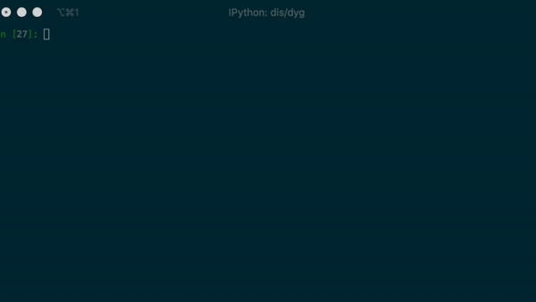

# ERNIE

**key features**

1. pretrain and finetune ERNIE with [PaddlePaddle v1.7](https://github.com/PaddlePaddle/Paddle/tree/release/1.7)
1. supports eager execution with `paddle.fluid.dygraph`
1. supports `distributed training`



### Quick Tour

```python
import numpy as np
import paddle.fluid.dygraph as D
from ernie.tokenizing_ernie import ErnieTokenizer
from ernie.modeling_ernie import ErnieModel

D.guard().__enter__() # acticate paddle `dygrpah` mode

model = ErnieModel.from_pretrained('ernie-1.0')    # Try to get pretrained model from server, make sure you have network connection
tokenizer = ErnieTokenizer.from_pretrained('ernie-1.0')

ids, _ = tokenizer.encode('hello world')
ids = D.to_variable(np.expand_dims(ids, 0))  # insert extra `batch` dimension
pooled, encoded = model(ids)                 # eager execution
print(pooled.numpy())                        # convert  results to numpy

```

### Tutorials

Don't have GPU? try ERNIE in [AIStudio](https://aistudio.baidu.com/aistudio/index)!

1. [Text classification](https://aistudio.baidu.com/aistudio/projectdetail/427482)
2. [Cloze test](https://aistudio.baidu.com/aistudio/projectdetail/433491)
3. Knowledge Distillation
4. ...

### Setup
1. install dependencies with:
```script
pip install -r requirement.txt
```

2.  put `$PWD`(root directory of this repo) into `$PYTHONPATH` with:
```script
export PYTHONPATH=$PWD:$PYTHONPATH
```

3. download pretrained models

| Model                                              | Description                                                  |
| :------------------------------------------------- | :----------------------------------------------------------- |
| [ERNIE 1.0 Base for Chinese](https://ernie-github.cdn.bcebos.com/model-ernie1.0.1.tar.gz)           | ernie 1.0 base: L12H768A12|
| [ERNIE tiny](https://ernie-github.cdn.bcebos.com/model-ernie_tiny.1.tar.gz)                         | erine tiny: L3H1024A16|
| [ERNIE 2.0 Base for English](https://ernie-github.cdn.bcebos.com/model-ernie2.0-en.1.tar.gz)        | ernie 2.0 base: L12H768A12  |
| [ERNIE 2.0 Large for English](https://ernie-github.cdn.bcebos.com/model-ernie2.0-large-en.1.tar.gz) | ernie 2.0 large: L24H1024A16 |


4. download datasets
 
**English Datasets**

Download the [GLUE datasets](https://gluebenchmark.com/tasks) by running [this script](https://gist.github.com/W4ngatang/60c2bdb54d156a41194446737ce03e2e) 

the `--data_dir` option in the following section assumes a directory tree like this:

```shell
data/xnli
├── dev
│   └── 1
├── test
│   └── 1
└── train
    └── 1
```

see [demo](https://ernie-github.cdn.bcebos.com/data-mnli-m.tar.gz) data for MNLI task.

**Chinese Datasets**

- [XNLI](https://ernie-github.cdn.bcebos.com/data-xnli.tar.gz)
- [ChnSentiCorp](https://ernie-github.cdn.bcebos.com/data-chnsenticorp.tar.gz)
- [MSRA-NER](https://ernie-github.cdn.bcebos.com/data-msra_ner.tar.gz)
- [NLPCC2016-DBQA](https://ernie-github.cdn.bcebos.com/data-dbqa.tar.gz)


### Finetune 

1. try eager execution with `dygraph model` :

```script
python3 ./ernie/finetune_classifier_dygraph.py \
    --from_pretrained ernie_1.0 \
    --data_dir ./data/xnli 
```

2. Distributed finetune

`paddle.distributed.launch` is a process manager, we use it to launch a python process on each avalible GPU devices:

when in distributed training, we use `max_steps` as stopping criteria rather than `epoch` to prevent dead block.
also notice than we shard the train data according to device id to prevent over fitting.

demo: 

```script
python3 -m paddle.distributed.launch \
./ernie/finetune_classifier_dygraph_distributed.py \
    --data_dir data/mnli \
    --max_steps 10000 \
    --from_pretrained ernie2.0-en
```


### Distributed pretrain

only **mask word** strategy from [Ernie1.0](https://arxiv.org/pdf/1904.09223.pdf) is illustrated in this section.

1. make pretrain data

we use documents from multiple datasource (e.g. Wikipedia) to pretrain. 
input text should be segmented with space (even in chinese, this segmentation is used for *mask word*).
each line corresonds to a *sentence*.
empty line indicates end of document.

example:

> 数学 是 利用 符号语言 研究 数量 、 结构 、 变化 以及 空间 等 概念 的 一门 学科 ， 从 某种 角度看 属于 形式 科学 的 一种 。
> 数学 透过 抽象化 和 逻辑推理 的 使用 ， 由 计数 、 计算 、 量度 和 对 物体 形状 及 运动 的 观察 而 产生 。
> 数学家 们 拓展 这些 概念 ， 为了 公式化 新 的 猜想 以及 从 选定 的 公理 及 定义 中 建立 起 严谨 推导 出 的 定理 。
> 基础 数学 的 知识 与 运用 总是 个人 与 团体 生活 中 不可或缺 的 一环 。
> 对 数学 基本概念 的 完善 ， 早 在 古埃及 、 美索不达米亚 及 古印度 内 的 古代 数学 文本 便 可观 见 ， 而 在 古希腊 那里 有 更为 严谨 的 处理 。
> 从 那时 开始 ， 数学 的 发展 便 持续 不断 地 小幅 进展 ， 至 16 世纪 的 文艺复兴 时期 ， 因为 新 的 科学 发现 和 数学 革新 两者 的 交互 ， 致使 数学 的 加速 发展 ， 直至 今日 。
>
> 云外镜 （ ） 是 一种 能 反映 遥远 地方 影像 的 镜子 ， 就 好比 现在 的 电视 ， 或是 吉卜赛人 占卜 用 的 水晶球 一样 。
> 它 属于 付丧神 的 一种 ， 是 镜子 历经 百年 后 幻化 而成 的 妖怪 ， 又名 镜 妖 。
> 也 有人 说云 外镜 是 狸 妖 幻化 而成 的 ， 当狸 妖 的 肚子 胀大 ， 像 电视 的 映像管 一样 发光 时 ， 就 可以 自由 地 显现出 远方 的 情景 。
> 著名 的 妖怪 绘师 鸟 山石 燕曾 记载 云外镜 经常 容易 跟 照妖镜 搞混 ， 因为 照妖镜 可以 映照 出 肉眼 看不见 的 妖怪 ， 这点 与 云外 镜会 映照 出 怪异 的 脸孔 是 有些 相似 。
> 据说 在 阴历 八月 十五日 的 夜晚 ， 在 水晶 盆内 注满 水 ， 将 镜子 平 放在 水面 ， 若 是 映照 出 妖怪 的 模样 ， 就 表示 这 面 镜子 里 住 著 妖怪 。


make pretrain data with:

```script
python3 ernie/make_pretrain_data.py input_file output_file.gz  --vocab ./pretrained/vocab.txt
```

2. run distributed pretrain

```sript

python3 -m paddle.distributed.launch \
./ernie/pretrain_dygraph.py \
    --data_dir data/* \
    --from_pretrained ./ernie_1.0_pretrain_dir/ 

```

### Citation

please cite our [Arxiv paper](https://arxiv.org/abs/1907.12412):

```
@article{SunERNIE,
  title={ERNIE 2.0: A Continual Pre-training Framework for Language Understanding},
  author={Sun, Yu and Wang, Shuohuan and Li, Yukun and Feng, Shikun and Tian, Hao and Wu, Hua and Wang, Haifeng},
}
```

