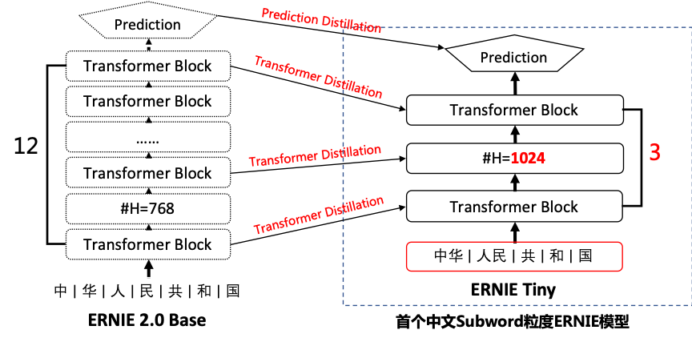

[English](./README.md) | 简体中文

## ERNIE 2.0: A Continual Pre-training Framework for Language Understanding


 * [Pre-Training 任务](#pre-training-任务)
    * [Word-aware Tasks](#word-aware-tasks)
       * [Knowledge Masking Task](#knowledge-masking-task)
       * [Capitalization Prediction Task](#capitalization-prediction-task)
       * [Token-Document Relation Prediction Task](#token-document-relation-prediction-task)
    * [Structure-aware Tasks](#structure-aware-tasks)
       * [Sentence Reordering Task](#sentence-reordering-task)
       * [Sentence Distance Task](#sentence-distance-task)
    * [Semantic-aware Tasks](#semantic-aware-tasks)
       * [Discourse Relation Task](#discourse-relation-task)
       * [IR Relevance Task](#ir-relevance-task)
 * [ERNIE 1.0: <strong>E</strong>nhanced <strong>R</strong>epresentation through k<strong>N</strong>owledge <strong>I</strong>nt<strong>E</strong>gration](#ernie-10-enhanced-representation-through-knowledge-integration)
 * [对比 ERNIE 1.0 和 ERNIE 2.0](#对比-ernie-10-和-ernie-20)
 * [效果验证](#效果验证)
    * [中文效果验证](#中文效果验证)
    * [英文效果验证](#英文效果验证)
 * [ERNIE tiny](#ernie-tiny)
 * [技术交流](#技术交流)
 * [使用](#使用)


<div align="center"><i>arxiv: ERNIE 2.0: A Continual Pre-training Framework for Language Understanding</i>, <a href="https://arxiv.org/abs/1907.12412v1" target="_blank"><i>link</i></a> </div>

---

**[ERNIE 2.0](https://arxiv.org/abs/1907.12412v1)** 是基于持续学习的语义理解预训练框架，使用多任务学习增量式构建预训练任务。**[ERNIE 2.0](https://arxiv.org/abs/1907.12412v1)** 中，新构建的预训练任务类型可以无缝的加入训练框架，持续的进行语义理解学习。 通过新增的实体预测、句子因果关系判断、文章句子结构重建等语义任务，**[ERNIE 2.0](https://arxiv.org/abs/1907.12412v1)** 语义理解预训练模型从训练数据中获取了词法、句法、语义等多个维度的自然语言信息，极大地增强了通用语义表示能力。


我们对 **ERNIE 2.0** 模型和现有 SOTA 预训练模型在 **9 个中文数据集**、以及**英文数据集合 GLUE** 上进行效果比较。结果表明：**ERNIE 2.0** 模型在英语任务上几乎全面优于 **BERT** 和 **XLNet**，在 7 个 GLUE 任务上取得了最好的结果；中文任务上，**ERNIE 2.0** 模型在所有 9 个中文 NLP 任务上全面优于 **BERT**。

### Pre-Training 任务

针对 ERNIE 2.0 模型，我们构建了多个预训练任务，试图从 3 个层面去更好的理解训练语料中蕴含的信息：

- **Word-aware Tasks**: 词汇 (lexical) 级别信息的学习
- **Structure-aware Tasks**: 语法 (syntactic) 级别信息的学习
- **Semantic-aware Tasks**:  语义 (semantic) 级别信息的学习

同时，针对不同的 pre-training 任务，ERNIE 2.0 引入了 Task Embedding 来精细化地建模不同类型的任务。不同的任务用从 0 到 N 的 ID 表示，每个 ID 代表了不同的预训练任务。


#### Word-aware Tasks

##### Knowledge Masking Task

- [ERNIE 1.0](https://arxiv.org/abs/1904.09223) 中已经引入的 phrase & named entity 知识增强 masking 策略。相较于 sub-word masking, 该策略可以更好的捕捉输入样本局部和全局的语义信息。

##### Capitalization Prediction Task

- 针对英文首字母大写词汇（如 Apple）所包含的特殊语义信息，我们在英文 Pre-training 训练中构造了一个分类任务去学习该词汇是否为大写。

##### Token-Document Relation Prediction Task

- 针对一个 segment 中出现的词汇，去预测该词汇是否也在原文档的其他 segments 中出现。

#### Structure-aware Tasks

##### Sentence Reordering Task

- 针对一个 paragraph （包含 M 个 segments），我们随机打乱 segments 的顺序，通过一个分类任务去预测打乱的顺序类别。

##### Sentence Distance Task

- 通过一个 3 分类任务，去判断句对 (sentence pairs) 位置关系 (包含邻近句子、文档内非邻近句子、非同文档内句子 3 种类别)，更好的建模语义相关性。

#### Semantic-aware Tasks

##### Discourse Relation Task

- 通过判断句对 (sentence pairs) 间的修辞关系 (semantic & rhetorical relation)，更好的学习句间语义。

##### IR Relevance Task

- 学习 IR 相关性弱监督信息，更好的建模句对相关性。


### ERNIE 1.0: **E**nhanced **R**epresentation through k**N**owledge **I**nt**E**gration

**[ERNIE 1.0](https://arxiv.org/abs/1904.09223)** 通过建模海量数据中的词、实体及实体关系，学习真实世界的语义知识。相较于 **BERT** 学习原始语言信号，**ERNIE** 直接对先验语义知识单元进行建模，增强了模型语义表示能力。

这里我们举个例子：

```Learnt by BERT ：哈 [mask] 滨是 [mask] 龙江的省会，[mask] 际冰 [mask] 文化名城。```

```Learnt by ERNIE：[mask] [mask] [mask] 是黑龙江的省会，国际 [mask] [mask] 文化名城。```

在 **BERT** 模型中，我们通过『哈』与『滨』的局部共现，即可判断出『尔』字，模型没有学习与『哈尔滨』相关的任何知识。而 **ERNIE** 通过学习词与实体的表达，使模型能够建模出『哈尔滨』与『黑龙江』的关系，学到『哈尔滨』是 『黑龙江』的省会以及『哈尔滨』是个冰雪城市。

训练数据方面，除百科类、资讯类中文语料外，**ERNIE** 还引入了论坛对话类数据，利用 **DLM**（Dialogue Language Model）建模 Query-Response 对话结构，将对话 Pair 对作为输入，引入 Dialogue Embedding 标识对话的角色，利用 Dialogue Response Loss 学习对话的隐式关系，进一步提升模型的语义表示能力。

### 对比 ERNIE 1.0 和 ERNIE 2.0

#### Pre-Training Tasks

| 任务 | ERNIE 1.0 模型 | ERNIE 2.0 英文模型 | ERNIE 2.0 中文模型 |
| ------------------- | -------------------------- | ------------------------------------------------------------ | ----------------------------------------- |
| **Word-aware**      | ✅ Knowledge Masking        | ✅ Knowledge Masking <br> ✅ Capitalization Prediction <br> ✅ Token-Document Relation Prediction | ✅ Knowledge Masking                       |
| **Structure-aware** |                            | ✅ Sentence Reordering                                        | ✅ Sentence Reordering <br> ✅ Sentence Distance |
| **Semantic-aware**  | ✅ Next Sentence Prediction | ✅ Discourse Relation                                         | ✅ Discourse Relation <br> ✅ IR Relevance  |


## 效果验证

### 中文效果验证

我们在 9 个任务上验证 ERNIE 2.0 中文模型的效果。这些任务包括：自然语言推断任务 XNLI；阅读理解任务 DRCD、DuReader、CMRC2018；命名实体识别任务 MSRA-NER (SIGHAN2006)；情感分析任务 ChnSentiCorp；语义相似度任务 BQ Corpus、LCQMC；问答任务 NLPCC2016-DBQA 。任务的详情和效果会在如下章节中介绍。


#### 自然语言推断任务

<table>
  <tbody>
    <tr>
      <th><strong>数据集</strong>
        <br></th>
      <th colspan="2"><center><strong>XNLI</strong></center></th>
    <tr>
      <td rowspan="2">
        <p>
          <strong>评估</strong></p>
        <p>
          <strong>指标</strong>
          <br></p>
      </td>
      <td colspan="2">
        <center><strong>acc</strong></center>
        <br></td>
    </tr>
    <tr>
      <td colspan="1" width="">
        <strong>dev</strong>
        <br></td>
      <td colspan="1" width="">
        <strong>test</strong>
        <br></td>
    </tr>
    <tr>
      <td>
        <strong>BERT Base
          <br></strong></td>
      <td>78.1</td>
      <td>77.2</td>
    </tr>
    <tr>
      <td>
        <strong>ERNIE 1.0 Base
          <br></strong></td>
      <td>79.9 <span>(<strong>+1.8</strong>)</span></td>
      <td>78.4 <span>(<strong>+1.2</strong>)</span></td>
    </tr>
    <tr>
      <td>
        <strong>ERNIE 2.0 Base
          <br></strong></td>
      <td>81.2 <span>(<strong>+3.1</strong>)</span></td>
      <td>79.7 <span>(<strong>+2.5</strong>)</span></td>
    </tr>
    <tr>
      <td>
        <strong>ERNIE 2.0 Large
          <br></strong></td>
      <td>82.6 <span>(<strong>+4.5</strong>)</span></td>
      <td>81.0 <span>(<strong>+3.8</strong>)</span></td>
    </tr>
  </tbody>
</table>

 - **XNLI**

```text
XNLI 是由 Facebook 和纽约大学的研究者联合构建的自然语言推断数据集，包括 15 种语言的数据。我们用其中的中文数据来评估模型的语言理解能力。[链接: https://github.com/facebookresearch/XNLI]
```

#### 阅读理解任务

<table>
  <tbody>
    <tr>
      <th><strong>数据集</strong>
        <br></th>
      <th colspan="2"><center><strong>DuReader</strong></center></th>
      <th colspan="2"><center><strong>CMRC2018</strong><center></th>
      <th colspan="4"><strong>DRCD</strong></th></tr>
    <tr>
      <td rowspan="2">
        <p>
          <strong>评估</strong></p>
        <p>
          <strong>指标</strong>
          <br></p>
      </td>
      <td colspan="1">
        <center><strong>em</strong></center>
        <br></td>
      <td colspan="1">
        <strong>f1-score</strong>
        <br></td>
      <td colspan="1">
        <strong>em</strong>
        <br></td>
      <td colspan="1">
        <strong>f1-score</strong>
        <strong></strong>
        <br></td>
      <td colspan="2">
        <strong>em</strong>
        <br></td>
      <td colspan="2">
        <strong>f1-score</strong>
        <br></td>
    </tr>
    <tr>
      <td colspan="2" width="">
        <strong>dev</strong>
        <br></td>
      <td colspan="2" width="">
        <strong>dev</strong>
        <br></td>
      <td colspan="1" width="">
        <strong>dev</strong>
        <br></td>
      <td colspan="1" width="">
        <strong>test</strong>
        <br></td>
      <td colspan="1" width="">
        <strong>dev</strong>
        <br></td>
      <td colspan="1" width="">
        <strong>test</strong>
        <br></td>
    </tr>
    <tr>
      <td><strong>BERT Base</strong></td>
      <td>59.5</td>
      <td>73.1</td>
      <td>66.3</td>
      <td>85.9</td>
      <td>85.7</td>
      <td>84.9</td>
      <td>91.6</td>
      <td>90.9</td>
    </tr>
    <tr>
      <td><strong>ERNIE 1.0 Base</strong></td>
      <td>57.9 <span>(<strong>-1.6</strong>)</span></td>
      <td>72.1 <span>(<strong>-1.0</strong>)</span></td>
      <td>65.1 <span>(<strong>-1.2</strong>)</span></td>
      <td>85.1 <span>(<strong>-0.8</strong>)</span></td>
      <td>84.6 <span>(<strong>-1.1</strong>)</span></td>
      <td>84.0 <span>(<strong>-0.9</strong>)</span></td>
      <td>90.9 <span>(<strong>-0.7</strong>)</span></td>
      <td>90.5 <span>(<strong>-0.4</strong>)</span></td>
    </tr>
    <tr>
      <td><strong>ERNIE 2.0 Base</strong></td>
      <td>61.3 <span>(<strong>+1.8</strong>)</span></td>
      <td>74.9 <span>(<strong>+1.8</strong>)</span></td>
      <td>69.1 <span>(<strong>+2.8</strong>)</span></td>
      <td>88.6 <span>(<strong>+2.7</strong>)</span></td>
      <td>88.5 <span>(<strong>+2.8</strong>)</span></td>
      <td>88.0 <span>(<strong>+3.1</strong>)</span></td>
      <td>93.8 <span>(<strong>+2.2</strong>)</span></td>
      <td>93.4 <span>(<strong>+2.5</strong>)</span></td>
    </tr>
    <tr>
      <td><strong>ERNIE 2.0 Large</strong></td>
      <td>64.2 <span>(<strong>+4.7</strong>)</span></td>
      <td>77.3 <span>(<strong>+4.2</strong>)</span></td>
      <td>71.5 <span>(<strong>+5.2</strong>)</span></td>
      <td>89.9 <span>(<strong>+4.0</strong>)</span></td>
      <td>89.7 <span>(<strong>+4.0</strong>)</span></td>
      <td>89.0 <span>(<strong>+4.1</strong>)</span></td>
      <td>94.7 <span>(<strong>+3.1</strong>)</span></td>
      <td>94.2 <span>(<strong>+3.3</strong>)</span></td>
    </tr>
  </tbody>
</table>

\* *实验所用的 DuReader 抽取类、单文档子集为内部数据集。*

\* *实验时将 DRCD 繁体数据转换成简体，繁简转换工具：https://github.com/skydark/nstools/tree/master/zhtools*

\* *ERNIE 1.0 的预训练数据长度为 128，其他模型使用 512 长度的数据训练，这导致 ERNIE 1.0 BASE 在长文本任务上性能较差, 为此我们发布了 [ERNIE 1.0 Base (max-len-512) 模型](https://ernie.bj.bcebos.com/ERNIE_1.0_max-len-512.tar.gz) (2019-07-29)*

 - **DuReader**

```text
DuReader 是百度在自然语言处理国际顶会 ACL 2018 发布的机器阅读理解数据集，所有的问题、原文都来源于百度搜索引擎数据和百度知道问答社区，答案是由人工整理的。实验是在 DuReader 的单文档、抽取类的子集上进行的，训练集包含15763个文档和问题，验证集包含1628个文档和问题，目标是从篇章中抽取出连续片段作为答案。[链接: https://arxiv.org/pdf/1711.05073.pdf]
```

 - **CMRC2018**

```text
CMRC2018 是中文信息学会举办的评测，评测的任务是抽取类阅读理解。[链接: https://github.com/ymcui/cmrc2018]
```

 - **DRCD**

```text
DRCD 是台达研究院发布的繁体中文阅读理解数据集，目标是从篇章中抽取出连续片段作为答案。我们在实验时先将其转换成简体中文。[链接: https://github.com/DRCKnowledgeTeam/DRCD]
```

#### 命名实体识别任务

<table>
  <tbody>
    <tr>
      <th><strong>数据集</strong>
        <br></th>
      <th colspan="2"><center><strong>MSRA-NER(SIGHAN2006)</strong></center></th>
    <tr>
      <td rowspan="2">
        <p>
          <strong>评估</strong></p>
        <p>
          <strong>指标</strong>
          <br></p>
      </td>
      <td colspan="2">
        <center><strong>f1-score</strong></center>
        <br></td>
    </tr>
    <tr>
      <td colspan="1" width="">
        <strong>dev</strong>
        <br></td>
      <td colspan="1" width="">
        <strong>test</strong>
        <br></td>
    </tr>
    <tr>
      <td><strong>BERT Base</strong></td>
      <td>94.0</td>
      <td>92.6</td>
    </tr>
    <tr>
      <td><strong>ERNIE 1.0 Base</strong></td>
      <td>95.0 <span>(<strong>+1.0</strong>)</span></td>
      <td>93.8 <span>(<strong>+1.2</strong>)</span></td>
    </tr>
    <tr>
      <td><strong>ERNIE 2.0 Base</strong></td>
      <td>95.2 <span>(<strong>+1.2</strong>)</span></td>
      <td>93.8 <span>(<strong>+1.2</strong>)</span></td>
    </tr>
    <tr>
      <td><strong>ERNIE 2.0 Large</strong></td>
      <td>96.3 <span>(<strong>+2.3</strong>)</span></td>
      <td>95.0 <span>(<strong>+2.4</strong>)</span></td>
    </tr>
  </tbody>
</table>

 - **MSRA-NER (SIGHAN2006)**

```text
MSRA-NER (SIGHAN2006) 数据集由微软亚研院发布，其目标是识别文本中具有特定意义的实体，包括人名、地名、机构名。
```

#### 情感分析任务

<table>
  <tbody>
    <tr>
      <th><strong>数据集</strong>
        <br></th>
      <th colspan="2"><center><strong>ChnSentiCorp</strong></center></th>
    <tr>
      <td rowspan="2">
        <p>
          <strong>评估</strong></p>
        <p>
          <strong>指标</strong>
          <br></p>
      </td>
      <td colspan="2">
        <center><strong>acc</strong></center>
        <br></td>
    </tr>
    <tr>
      <td colspan="1" width="">
        <strong>dev</strong>
        <br></td>
      <td colspan="1" width="">
        <strong>test</strong>
        <br></td>
    </tr>
    <tr>
      <td><strong>BERT Base</strong></td>
      <td>94.6</td>
      <td>94.3</td>
    </tr>
    <tr>
      <td><strong>ERNIE 1.0 Base</strong></td>
      <td>95.2 <span>(<strong>+0.6</strong>)</span></td>
      <td>95.4 <span>(<strong>+1.1</strong>)</span></td>
    </tr>
    <tr>
      <td><strong>ERNIE 2.0 Base</strong></td>
      <td>95.7 <span>(<strong>+1.1</strong>)</span></td>
      <td>95.5 <span>(<strong>+1.2</strong>)</span></td>
    </tr>
    <tr>
      <td><strong>ERNIE 2.0 Large</strong></td>
      <td>96.1 <span>(<strong>+1.5</strong>)</span></td>
      <td>95.8 <span>(<strong>+1.5</strong>)</span></td>
    </tr>
  </tbody>
</table>

 - **ChnSentiCorp**

```text
ChnSentiCorp 是一个中文情感分析数据集，包含酒店、笔记本电脑和书籍的网购评论。
```

#### 问答任务

<table>
  <tbody>
    <tr>
      <th><strong>数据集</strong>
        <br></th>
      <th colspan="4"><center><strong>NLPCC2016-DBQA</strong></center></th>
    <tr>
      <td rowspan="2">
        <p>
          <strong>评估</strong></p>
        <p>
          <strong>指标</strong>
          <br></p>
      </td>
      <td colspan="2">
        <center><strong>mrr</strong></center>
        <br></td>
      <td colspan="2">
        <center><strong>f1-score</strong></center>
        <br></td>
    </tr>
    <tr>
      <td colspan="1" width="">
        <strong>dev</strong>
        <br></td>
      <td colspan="1" width="">
        <strong>test</strong>
        <br></td>
      <td colspan="1" width="">
        <strong>dev</strong>
        <br></td>
      <td colspan="1" width="">
        <strong>test</strong>
        <br></td>
    </tr>
    <tr>
      <td><strong>BERT Base</strong></td>
      <td>94.7</td>
      <td>94.6</td>
      <td>80.7</td>
      <td>80.8</td>
    </tr>
    <tr>
      <td><strong>ERNIE 1.0 Base</strong></td>
      <td>95.0 <span>(<strong>+0.3</strong>)</span></td>
      <td>95.1 <span>(<strong>+0.5</strong>)</span></td>
      <td>82.3 <span>(<strong>+1.6</strong>)</span></td>
      <td>82.7 <span>(<strong>+1.9</strong>)</span></td>
    </tr>
    <tr>
      <td><strong>ERNIE 2.0 Base</strong></td>
      <td>95.7 <span>(<strong>+1.0</strong>)</span></td>
      <td>95.7 <span>(<strong>+1.1</strong>)</span></td>
      <td>84.7 <span>(<strong>+4.0</strong>)</span></td>
      <td>85.3 <span>(<strong>+4.5</strong>)</span></td>
    </tr>
    <tr>
      <td><strong>ERNIE 2.0 Large</strong></td>
      <td>95.9 <span>(<strong>+1.2</strong>)</span></td>
      <td>95.8 <span>(<strong>+1.2</strong>)</span></td>
      <td>85.3 <span>(<strong>+4.6</strong>)</span></td>
      <td>85.8 <span>(<strong>+5.0</strong>)</span></td>
    </tr>
  </tbody>
</table>

 - **NLPCC2016-DBQA**

```text
NLPCC2016-DBQA 是由国际自然语言处理和中文计算会议 NLPCC 于 2016 年举办的评测任务，其目标是从候选中找到合适的文档作为问题的答案。[链接: http://tcci.ccf.org.cn/conference/2016/dldoc/evagline2.pdf]
```

#### 语义相似度

<table>
  <tbody>
    <tr>
      <th><strong>数据集</strong>
        <br></th>
      <th colspan="2"><center><strong>LCQMC</strong></center></th>
      <th colspan="2"><center><strong>BQ Corpus</strong></center></th>
    <tr>
      <td rowspan="2">
        <p>
          <strong>评估</strong></p>
        <p>
          <strong>指标</strong>
          <br></p>
      </td>
      <td colspan="2">
        <center><strong>acc</strong></center></td>
      <td colspan="2">
        <center><strong>acc</strong></center></td>
    </tr>
    <tr>
      <td colspan="1" width="">
        <strong>dev</strong>
        <br></td>
      <td colspan="1" width="">
        <strong>test</strong>
        <br></td>
      <td colspan="1" width="">
        <strong>dev</strong>
        <br></td>
      <td colspan="1" width="">
        <strong>test</strong>
        <br></td>
    </tr>
    <tr>
      <td><strong>BERT Base</strong></td>
      <td>88.8</td>
      <td>87.0</td>
      <td>85.9</td>
      <td>84.8</td>
    </tr>
    <tr>
      <td><strong>ERNIE 1.0 Base</strong></td>
      <td>89.7 <span>(<strong>+0.9</strong>)</span></td>
      <td>87.4 <span>(<strong>+0.4</strong>)</span></td>
      <td>86.1 <span>(<strong>+0.2</strong>)</span></td>
      <td>84.8</td>
    </tr>
    <tr>
      <td><strong>ERNIE 2.0 Base</strong></td>
      <td>90.9 <span>(<strong>+2.1</strong>)</span></td>
      <td>87.9 <span>(<strong>+0.9</strong>)</span></td>
      <td>86.4 <span>(<strong>+0.5</strong>)</span></td>
      <td>85.0 <span>(<strong>+0.2</strong>)</span></td>
    </tr>
    <tr>
      <td><strong>ERNIE 2.0 Large</strong></td>
      <td>90.9 <span>(<strong>+2.1</strong>)</span></td>
      <td>87.9 <span>(<strong>+0.9</strong>)</span></td>
      <td>86.5 <span>(<strong>+0.6</strong>)</span></td>
      <td>85.2 <span>(<strong>+0.4</strong>)</span></td>
    </tr>
  </tbody>
</table>

\* *LCQMC 、BQ Corpus 数据集需要向作者申请，LCQMC 申请地址：http://icrc.hitsz.edu.cn/info/1037/1146.htm, BQ Corpus 申请地址：http://icrc.hitsz.edu.cn/Article/show/175.html*

 - **LCQMC**

```text
LCQMC 是在自然语言处理国际顶会 COLING 2018 发布的语义匹配数据集，其目标是判断两个问题的语义是否相同。[链接: http://aclweb.org/anthology/C18-1166]
```

 - **BQ Corpus**

```text
BQ Corpus 是在自然语言处理国际顶会 EMNLP 2018 发布的语义匹配数据集，该数据集针对银行领域，其目标是判断两个问题的语义是否相同。[链接: https://www.aclweb.org/anthology/D18-1536]
```


###  英文效果验证

ERNIE 2.0 的英文效果验证在 GLUE 上进行。GLUE 评测的官方地址为  https://gluebenchmark.com/ ，该评测涵盖了不同类型任务的 10 个数据集，其中包含 11 个测试集，涉及到 Accuracy, F1-score, Spearman Corr,. Pearson Corr,. Matthew Corr., 5 类指标。GLUE 排行榜使用每个数据集的平均分作为总体得分，并以此为依据将不同算法进行排名。


#### GLUE - 验证集结果

| <strong>数据集</strong> | <strong>CoLA</strong> | <strong>SST-2</strong> | <strong>MRPC</strong> | <strong>STS-B</strong> | <strong>QQP</strong>  | <strong>MNLI-m</strong> | <strong>QNLI</strong> | <strong>RTE</strong>  |
| ----------- | ---- | ----- | ---- | ----- | ---- | ---- | ---- | ---- |
| **评测指标** | **matthews corr.** | **acc** | **acc** | **pearson corr.** | **acc** | **acc** | **acc** | **acc** |
| **BERT Large** | 60.6 | 93.2  | 88.0 | 90.0  | 91.3 | 86.6 | 92.3 | 70.4 |
| **XLNet Large** | 63.6 | 95.6 | 89.2 | 91.8 | 91.8 | 89.8 | 93.9 | 83.8 |
| **ERNIE 2.0 Large** | 65.4<br/>(**+4.8,+1.8**) | 96.0<br/>(**+2.8,+0.4**) | 89.7<br/>(**+1.7,+0.5**) | 92.3<br/>(**+2.3,+0.5**) | 92.5<br/>(**+1.2,+0.7**) | 89.1<br/>(**+2.5,-0.7**) | 94.3<br/>(**+2.0,+0.4**) | 85.2<br/>(**+14.8,+1.4**) |

我们使用单模型的验证集结果，来与 BERT/XLNet 进行比较。


#### GLUE - 测试集结果

| <strong>数据集</strong> | - | <strong>CoLA</strong> | <strong>SST-2</strong> | <strong>MRPC</strong> | <strong>STS-B</strong> | <strong>QQP</strong>  | <strong>MNLI-m</strong> | <strong>MNLI-mm</strong> | <strong>QNLI</strong> | <strong>RTE</strong>  | <strong>WNLI</strong> |<strong>AX</strong>|
| ----------- | ----- | ---- | ----- | ---- | ----- | ---- | ------ | ------- | ---- | ---- | ---- | ---- |
| **评测指标** | **<strong>score</strong>** | **matthews corr.** | **acc** | **f1-score/acc** | **spearman/pearson corr.** | **f1-score/acc** | **acc** | **acc** |**acc**|**acc**|**acc**| **matthews corr.** |
| **BERT Base** | 78.3  | 52.1 | 93.5  | 88.9/84.8 | 85.8/87.1 | 71.2/89.2 | 84.6   | 83.4    | 90.5 | 66.4 | 65.1 | 34.2 |
| **ERNIE 2.0 Base** | 80.6<br/>(**+2.3**) | 55.2<br/>(**+3.1**) | 95.0<br/>(**+1.5**) | 89.9/86.1<br/>(**+1.0/+1.3**) | 86.5/87.6<br/>(**+0.7/+0.5**) | 73.2/89.8<br/>(**+2.0/+0.6**) | 86.1<br/>(**+1.5**) | 85.5<br/>(**+2.1**) | 92.9<br/>(**+2.4**) | 74.8<br/>(**+8.4**) | 65.1 | 37.4<br/>(**+3.2**) |
| **BERT Large** | 80.5  | 60.5 | 94.9  | 89.3/85.4 | 86.5/87.6 | 72.1/89.3 | 86.7   | 85.9    | 92.7 | 70.1 | 65.1 | 39.6 |
| **ERNIE 2.0 Large** | 83.6<br/>(**+3.1**) | 63.5<br/>(**+3.0**) | 95.6<br/>(**+0.7**) | 90.2/87.4<br/>(**+0.9/+2.0**) | 90.6/91.2<br/>(**+4.1/+3.6**) | 73.8/90.1<br/>(**+1.7/+0.8**) | 88.7<br/>(**+2.0**) | 88.8<br/>(**+2.9**) | 94.6<br/>(**+1.9**) | 80.2<br/>(**+10.1**) | 67.8<br/>(**+2.7**) | 48.0<br/>(**+8.4**) |


由于 XLNet 暂未公布 GLUE 测试集上的单模型结果，所以我们只与 BERT 进行单模型比较。上表为ERNIE 2.0 单模型在 GLUE 测试集的表现结果。


### ERNIE tiny

为了提升ERNIE模型在实际工业应用中的落地能力，我们推出ERNIE-tiny模型。 



ERNIE-tiny作为小型化ERNIE，采用了以下4点技术，保证了在实际真实数据中将近4.3倍的预测提速。

1. 浅：12层的ERNIE Base模型直接压缩为3层，线性提速4倍，但效果也会有较大幅度的下降；

1. 胖：模型变浅带来的损失可通过hidden size的增大来弥补。由于fluid inference框架对于通用矩阵运算（gemm）的最后一维（hidden size）参数的不同取值会有深度的优化，因为将hidden size从768提升至1024并不会带来速度线性的增加；

1. 短：ERNIE Tiny是首个开源的中文subword粒度的预训练模型。这里的短是指通过subword粒度替换字（char）粒度，能够明显地缩短输入文本的长度，而输入文本长度是和预测速度有线性相关。统计表明，在XNLI dev集上采用subword字典切分出来的序列长度比字表平均缩短40%；

1. 萃：为了进一步提升模型的效果，ERNIE Tiny扮演学生角色，利用模型蒸馏的方式在Transformer层和Prediction层去学习教师模型ERNIE模型对应层的分布或输出，这种方式能够缩近ERNIE Tiny和ERNIE的效果差异。


#### Benchmark

ERNIE Tiny轻量级模型在公开数据集的效果如下所示，任务均值相对于ERNIE Base只下降了2.37%，但相对于“SOTA Before BERT”提升了8%。在延迟测试中，ERNIE Tiny能够带来4.3倍的速度提升
（测试环境为：GPU P4，Paddle Inference C++ API，XNLI Dev集，最大maxlen=128，测试结果10次均值）

|model|XNLI(acc)|LCQCM(acc)|CHNSENTICORP(acc)|NLPCC-DBQA(mrr/f1)|Average|Latency
|--|--|--|--|--|--|--|
|SOTA-before-ERNIE|68.3|83.4|92.2|72.01/-|78.98|-|
|ERNIE2.0-base|79.7|87.9|95.5|95.7/85.3|89.70|633ms(1x)|
|ERNIE-tiny-subword|75.1|86.1|95.2|92.9/78.6|87.33|146ms(4.3x)|


## 技术交流

- [Github Issues](https://github.com/PaddlePaddle/ERNIE/issues): bug reports, feature requests, install issues, usage issues, etc.
- ERNIE QQ 群: 760439550 (ERNIE discussion group).
- [论坛](http://ai.baidu.com/forum/topic/list/168?pageNo=1): discuss implementations, research, etc.


## 使用
  * [PaddlePaddle 安装](#paddlepaddle安装)
  * [模型&amp;数据](#模型数据)
     * [预训练模型下载](#预训练模型下载)
     * [数据下载](#数据下载)
        * [中文数据](#中文数据)
        * [英文数据](#英文数据)
  * [Fine-tuning 任务](#fine-tuning-任务)
     * [运行参数配置](#运行参数配置)
     * [多进程训练与fp16混合精度](#多进程训练与fp16混合精度)
     * [单句和句对分类任务](#单句和句对分类任务)
        * [单句分类任务](#单句分类任务)
        * [句对分类任务](#句对分类任务)
     * [序列标注任务](#序列标注任务)
        * [实体识别](#实体识别)
     * [阅读理解任务](#阅读理解任务-1)
     * [ERNIE tiny](#tune-ernie-tiny)
  * [利用Propeller进行二次开发](#利用propeller进行二次开发)
  * [预训练 (ERNIE 1.0)](#预训练-ernie-10)
     * [数据预处理](#数据预处理)
     * [开始训练](#开始训练)
  * [向量服务器](#向量服务器)
  * [蒸馏](#蒸馏)
  * [上线](#上线)
       * [生成inference_model](#生成inference_model)
       * [在线预测](#在线预测)
  * [FAQ](#faq)
     * [FAQ1: 如何获取输入句子/词经过 ERNIE 编码后的 Embedding 表示?](#faq1-如何获取输入句子词经过-ernie-编码后的-embedding-表示)
     * [FAQ2: 如何利用 Fine-tuning 得到的模型对新数据进行批量预测？](#faq2-如何利用-fine-tuning-得到的模型对新数据进行批量预测)
     * [FAQ3: 运行脚本中的batch size指的是单卡分配的数据量还是多卡的总数据量？](#faq3-运行脚本中的batch-size指的是单卡分配的数据量还是多卡的总数据量)
     * [FAQ4: Can not find library: libcudnn.so. Please try to add the lib path to LD_LIBRARY_PATH.](#faq4-can-not-find-library-libcudnnso-please-try-to-add-the-lib-path-to-ld_library_path)
     * [FAQ5: Can not find library: libnccl.so. Please try to add the lib path to LD_LIBRARY_PATH.](#faq5-can-not-find-library-libncclso-please-try-to-add-the-lib-path-to-ld_library_path)
     * [FQA6: 运行报错`ModuleNotFoundError: No module named 'propeller'`](#faq6)


## PaddlePaddle安装

本项目依赖于 Paddle 1.6，* 由于Paddle 1.6版本相比之前版本有较大API改动，使用Paddle 1.6以前版本运行本代码库会导致序列标注等任务报错 *，请参考[安装指南](http://www.paddlepaddle.org/#quick-start)进行安装。

**【重要】安装后，需要及时的将 CUDA、cuDNN、NCCL2 等动态库路径加入到环境变量 LD_LIBRARY_PATH 之中，否则训练过程中会报相关的库错误。具体的paddlepaddle配置细节请查阅[这里](http://en.paddlepaddle.org/documentation/docs/zh/1.5/beginners_guide/quick_start_cn.html)**

如果您想了解更多的 Paddle 的相关信息，例如针对实际问题建模、搭建自己网络等，这里有更多的来自官方的文档供您参考：

> - [基本概念](https://www.paddlepaddle.org.cn/documentation/docs/zh/1.5/user_guides/howto/basic_concept/index_cn.html) ：介绍了 Fluid 的基本使用概念
> - [准备数据](https://www.paddlepaddle.org.cn/documentation/docs/zh/1.5/user_guides/howto/prepare_data/index_cn.html) ：介绍使用 Fluid 训练网络时，数据的支持类型及传输方法
> - [配置简单的网络](https://www.paddlepaddle.org.cn/documentation/docs/zh/1.5/user_guides/howto/configure_simple_model/index_cn.html)： 介绍如何针对问题建模，并利用 Fluid 中相关算子搭建网络
> - [训练神经网络](https://www.paddlepaddle.org.cn/documentation/docs/zh/1.5/user_guides/howto/training/index_cn.html)：介绍如何使用 Fluid 进行单机训练、多机训练、以及保存和载入模型变量
> - [模型评估与调试](https://www.paddlepaddle.org.cn/documentation/docs/zh/1.5/user_guides/howto/evaluation_and_debugging/index_cn.html)：介绍在 Fluid 下进行模型评估和调试的方法

ERNIE的其他依赖列在`requirements.txt`文件中，使用以下命令安装

```script
pip install -r requirements.txt
```

## 模型&数据

### 预训练模型下载

| Model | Description |
| :------| :------ |
| [ERNIE 1.0 中文 Base 模型](https://ernie.bj.bcebos.com/ERNIE_stable.tgz) | 包含预训练模型参数 |
| [ERNIE 1.0 中文 Base 模型](https://baidu-nlp.bj.bcebos.com/ERNIE_stable-1.0.1.tar.gz) | 包含预训练模型参数、词典 vocab.txt、模型配置 ernie_config.json|
| [ERNIE 1.0 中文 Base 模型(max_len=512)](https://ernie.bj.bcebos.com/ERNIE_1.0_max-len-512.tar.gz) | 包含预训练模型参数、词典 vocab.txt、模型配置 ernie_config.json|
| [ERNIE 2.0 英文 Base 模型](https://ernie.bj.bcebos.com/ERNIE_Base_en_stable-2.0.0.tar.gz) | 包含预训练模型参数、词典 vocab.txt、模型配置 ernie_config.json|
| [ERNIE 2.0 英文 Large 模型](https://ernie.bj.bcebos.com/ERNIE_Large_en_stable-2.0.0.tar.gz) | 包含预训练模型参数、词典 vocab.txt、模型配置 ernie_config.json|
| [ERNIE tiny 中文模型](https://ernie.bj.bcebos.com/ernie_tiny.tar.gz)|包含预训练模型参数、词典 vocab.txt、模型配置 ernie_config.json 以及切词词表|


### 数据下载

#### 中文数据

 [下载地址](https://ernie.bj.bcebos.com/task_data_zh.tgz)

#### 英文数据

由于数据集协议问题，在这里无法直接提供英文数据集。GLUE 的数据下载方式请参考[GLUE 主页](https://gluebenchmark.com/tasks)以及 GLUE 提供的数据[下载代码](https://gist.github.com/W4ngatang/60c2bdb54d156a41194446737ce03e2e)。

假设所有数据集下载放置的路径为`$GLUE_DATA`，将数据下载完毕后，执行 `sh ./script/en_glue/preprocess/cvt.sh $GLUE_DATA `，将完成所有数据的格式转换，默认转换后的数据会输出到文件夹`./glue_data_processed/`。


## Fine-tuning 任务

### 运行参数配置

在实验中我们发现，不同的任务对应的 batch size 会影响任务的最终效果，因此在这里列出了具体实验中我们使用的具体配置，在具体的实验运行时，请注意本地 GPU 卡数。

在下表的 Batch Size 一栏，*"(base)"* 指 ERNIE BASE 模型 Fine-tuning 时使用的参数，未特殊标明则表示 ERNIE Large 和 ERNIE Base 使用同样的 batch size。

| 任务 |   Batch Size   | GPU卡数 |
| ------ | ---- | ------- |
| CoLA | 32 / 64 (base) | 1 |
| SST-2  | 64 / 256 (base) | 8 |
| STS-B  | 128 | 8 |
| QQP    | 256 | 8 |
| MNLI   | 256 / 512 (base) | 8 |
| QNLI   | 256 | 8 |
| RTE    | 16 / 4 (base) | 1 |
| MRPC   | 16 / 32 (base) | 2 |
| WNLI | 8 | 1 |
| XNLI | 65536 (tokens) | 8 |
| CMRC2018 | 64 | 8 (large) / 4 (base) |
| DRCD | 64 | 8 (large) / 4 (base) |
| MSRA-NER(SIGHAN 2006) | 16 | 1 |
| ChnSentiCorp | 24 | 1 |
| LCQMC | 32 | 1 |
| BQ Corpus | 64 | 1 |
| NLPCC2016-DBQA | 64 | 8 |

\* *MNLI 和 QNLI 的任务中，使用了 32 GB 显存的 V100。除此之外的显卡皆为22 GB 的 P40。*


### 多进程训练与fp16混合精度

使用`finetune_launch.py`脚本来启动多进程训练 。多进程训练可以提升充分利用多核CPU/多卡GPU 的能力来加速finetune过程。
`finetune_launch.py` 需要放在原来finetune脚本前面, 同时指定每个节点的进程数`--nproc_per_node`, 以及每个节点上的gpu卡号`--selected_gpus`, 一般数量与进程数, `CUDA_VISIBLE_DEVICES`相同且从0开始编号 (参考`script/zh_task/ernie_base/run_xnli.sh`)

只需在训练脚本中加入`--use_fp16 true`即可启用fp16混合精度训练（确保您的硬件支持Tensor Core技术）。ERNIE会将计算Op转换成fp16精度，同时仍然使用fp32精度存储参数。ERNIE使用动态loss scale来避免梯度消失。在XNLI任务上可以观察到大约60%加速。

### 单句和句对分类任务

分类或者回归任务的逻辑都封装在 `run_classifier.py` 文件中。为了方便的复现上述的实验效果，该项目将每个任务与其对应的超参封装到了任务对应的 shell 文件中。

下面提供了中英文情感分析 `ChnSentiCorp`，`SST-2`，和  `LCQMC` 的运行示例。在运行前，请通过 [模型&amp;数据](#模型数据) 一节提供的链接预先下载好对应的预训练模型。


#### 单句分类任务

以 `ChnSentiCorp` 情感分类数据集作为单句分类任务示例，假设下载数据并解压后的路径为 `/home/task_data/ ` ，则在该目录中应该存在文件夹`chnsenticorp`，其训练数据路径为`/home/task_data/chnsenticorp/train.tsv`，该数据格式为包含2个字段的tsv文件，2个字段分别为: `text_a  label`, 示例数据如下:

```
label  text_a
...
0   当当网名不符实，订货多日不见送货，询问客服只会推托，只会要求用户再下订单。如此服务留不住顾客的。去别的网站买书服务更好。
0   XP的驱动不好找！我的17号提的货，现在就降价了100元，而且还送杀毒软件！
1   <荐书> 推荐所有喜欢<红楼>的红迷们一定要收藏这本书,要知道当年我听说这本书的时候花很长时间去图书馆找和借都没能如愿,所以这次一看到当当有,马上买了,红迷们也要记得备货哦!
...
```

假设下载的模型路径为 `/home/model/`，则该目录中应该有名为 `params `的文件夹。在执行任务前，需要提前设置环境变量：

```
export TASK_DATA_PATH=/home/task_data/
export MODEL_PATH=/home/model/
```

执行 `sh script/zh_task/ernie_base/run_ChnSentiCorp.sh` 即可开始 finetune，执行结束后会输出如下所示的在验证集和测试集上的测试结果:

 ```
[dev evaluation] ave loss: 0.303819, acc:0.943333, data_num: 1200, elapsed time: 16.280898 s, file: /home/task_data/chnsenticorp/dev.tsv, epoch: 9, steps: 4001
[dev evaluation] ave loss: 0.228482, acc:0.958333, data_num: 1200, elapsed time: 16.023091 s, file: /home/task_data/chnsenticorp/test.tsv, epoch: 9, steps: 4001
 ```

再以一个英文的数据集 `SST-2` 为例，文件的格式和中文文件的格式类似。假设经过 [模型&amp;数据](#模型数据) 章节中转换完数据之后，得到的路径为 `/home/glue_data_processed/ ` ，其训练数据路径为 `/home/glue_data_processed/SST-2/train.tsv`，该文件同样要有2列，分别为 `text_a  label`，示例数据如:

```
label  text_a
0   hide new secretions from the parental units
0   contains no wit , only labored gags
1   that loves its characters and communicates something rather beautiful about human nature
0   remains utterly satisfied to remain the same throughout
0   on the worst revenge-of-the-nerds clichés the filmmakers could dredge up
0   that 's far too tragic to merit such superficial treatment
1   demonstrates that the director of such hollywood blockbusters as patriot games can still turn out a small , personal film with an emotional wallop .
1   of saucy
```

同样在运行前设置环境变量：

```
export TASK_DATA_PATH=/home/glue_data_processed/
export MODEL_PATH=/home/model/
```

执行 `sh script/en_glue/ernie_large/SST-2/task.sh` ，可以观测到类似如下内容的日志:

```
epoch: 3, progress: 22456/67349, step: 3500, ave loss: 0.015862, ave acc: 0.984375, speed: 1.328810 steps/s
[dev evaluation] ave loss: 0.174793, acc:0.957569, data_num: 872, elapsed time: 15.314256 s file: ./data/dev.tsv, epoch: 3, steps: 3500
testing ./data/test.tsv, save to output/test_out.tsv
```

#### 句对分类任务

以 `LCQMC` 语义相似度任务作为句对分类任务示例，数据格式为包含 3 个字段的 tsv 文件，3 个字段分别为: `text_a    text_b   label`，示例数据如下:
```
text_a  text_b  label
开初婚未育证明怎么弄？  初婚未育情况证明怎么开？    1
谁知道她是网络美女吗？  爱情这杯酒谁喝都会醉是什么歌    0
这腰带是什么牌子    护腰带什么牌子好    0
```
执行 ` sh script/zh_task/ernie_base/run_lcqmc.sh` 即可开始 fine-tuning，执行结束后会输出如下所示的在验证集和测试集上的测试结果:

```
[dev evaluation] ave loss: 0.299115, acc:0.900704, data_num: 8802, elapsed time: 32.327663 s, file: ./task_data/lcqmc/dev.tsv, epoch: 2, steps: 22387
[dev evaluation] ave loss: 0.374148, acc:0.878080, data_num: 12500, elapsed time: 39.780520 s, file: ./task_data/lcqmc/test.tsv, epoch: 2, steps: 22387
```


### 序列标注任务

#### 实体识别

 以 `MSRA-NER(SIGHAN2006)` 作为示例，数据格式为包含 2 个字段的 tsv 文件，2 个字段分别为: `text_a  label`, 示例数据如下:
```
text_a  label
在 这 里 恕 弟 不 恭 之 罪 ， 敢 在 尊 前 一 诤 ： 前 人 论 书 ， 每 曰 “ 字 字 有 来 历 ， 笔 笔 有 出 处 ” ， 细 读 公 字 ， 何 尝 跳 出 前 人 藩 篱 ， 自 隶 变 而 后 ， 直 至 明 季 ， 兄 有 何 新 出 ？    O O O O O O O O O O O O O O O O O O O O O O O O O O O O O O O O O O O O O O O O O O O O O O O O O O O O O O O O O O O O O O O O O O O O O
相 比 之 下 ， 青 岛 海 牛 队 和 广 州 松 日 队 的 雨 中 之 战 虽 然 也 是 0 ∶ 0 ， 但 乏 善 可 陈 。   O O O O O B-ORG I-ORG I-ORG I-ORG I-ORG O B-ORG I-ORG I-ORG I-ORG I-ORG O O O O O O O O O O O O O O O O O O O
理 由 多 多 ， 最 无 奈 的 却 是 ： 5 月 恰 逢 双 重 考 试 ， 她 攻 读 的 博 士 学 位 论 文 要 通 考 ； 她 任 教 的 两 所 学 校 ， 也 要 在 这 段 时 日 大 考 。    O O O O O O O O O O O O O O O O O O O O O O O O O O O O O O O O O O O O O O O O O O O O O O O O O O O O O O
```

执行 `sh script/zh_task/ernie_base/run_msra_ner.sh` 即可开始 finetune，执行结束后会输出如下所示的在验证集和测试集上的测试结果:

 ```
[dev evaluation] f1: 0.951949, precision: 0.944636, recall: 0.959376, elapsed time: 19.156693 s
[test evaluation] f1: 0.937390, precision: 0.925988, recall: 0.949077, elapsed time: 36.565929 s
 ```


### 阅读理解任务


 以 `DRCD` 作为示例，首先将数据转换成 SQUAD 格式:
 ```
{
  "version": "1.3",
  "data": [
    {
      "paragraphs": [
        {
          "id": "1001-11",
          "context": "广州是京广铁路、广深铁路、广茂铁路、广梅汕铁路的终点站。2009年末，武广客运专线投入运营，多单元列车覆盖980公里的路程，最高时速可达350公里/小时。2011年1月7日，广珠城际铁路投入运营，平均时速可达200公里/小时。广州铁路、长途汽车和渡轮直达香港，广九直通车从广州东站开出，直达香港九龙红磡站，总长度约182公里，车程在两小时内。繁忙的长途汽车每年会从城市中的不同载客点把旅客接载至香港。在珠江靠市中心的北航道有渡轮线路，用于近江居民直接渡江而无需乘坐公交或步行过桥。南沙码头和莲花山码头间每天都有高速双体船往返，渡轮也开往香港中国客运码头和港澳码头。",
          "qas": [
            {
              "question": "广珠城际铁路平均每小时可以走多远？",
              "id": "1001-11-1",
              "answers": [
                {
                  "text": "200公里",
                  "answer_start": 104,
                  "id": "1"
                }
              ]
            }
          ]
        }
      ],
      "id": "1001",
      "title": "广州"
    }
  ]
}
 ```

执行 `sh script/zh_task/ernie_base/run_drcd.sh` 即可开始 finetune，执行结束后会输出如下所示的在验证集和测试集上的测试结果:

 ```
[dev evaluation] em: 88.450624, f1: 93.749887, avg: 91.100255, question_num: 3524
[test evaluation] em: 88.061838, f1: 93.520152, avg: 90.790995, question_num: 3493
 ```


### ERNIE tiny <a name="tune-ernie-tiny"></a>

ERNIE tiny 模型采用了subword粒度输入，需要在数据前处理中加入切词(segmentation)并使用[sentence piece](https://github.com/google/sentencepiece)进行tokenization. 
segmentation 以及 tokenization 需要使用的模型包含在了 ERNIE tiny 的[预训练模型文件](#预训练模型下载)中，分别是 `./subword/dict.wordseg.pickle` 和 `./subword/spm_cased_simp_sampled.model`.

目前`./example/`下的代码针对 ERNIE tiny 的前处理进行了适配只需在脚本中通过 `--sentence_piece_model` 引入tokenization 模型，再通过 `--word_dict` 引入 segmentation 模型之后即可进行 ERNIE tiny 的 Fine-tune。
对于命名实体识别类型的任务，为了跟输入标注对齐，ERNIE tiny 仍然采用中文单字粒度进行作为输入。因此使用 `./example/finetune_ner.py` 时只需要打开 `--use_sentence_piece_vocab` 即可。
具体的使用方法可以参考[下节](#利用propeller进行二次开发).

## 利用Propeller进行二次开发

[Propeller](./propeller/README.md) 是基于PaddlePaddle构建的一键式训练API，对于具备一定机器学习应用经验的开发者可以使用Propeller获得定制化开发体验。
您可以通过`export PYTHONPATH=./:$PYTHONPATH`的方式引入Propeller.
Propeller基础教程可以参考`./example/propeller_xnli_demo.ipynb`. 
您只需定义好自己的模型以及 Dataset， 剩下的工作，如多卡并行，模型存储等等，都交给Propeller来处理吧。
./example/ 里放了使用Propeller进行分类任务、排序任务和命名实体识别任务的finetune流程，可以作为您修改的模板。

模板中使用的demo数据可以从[这里](https://ernie.bj.bcebos.com/propeller_demo_data.tar.gz)下载，解压完成后放到 ${TASK_DATA_PATH} 中。
以分类任务为例，用下面脚本即可启动finetune，在训练的过程中框架会自动把准确率最好的模型保存在 `./output/best/inference` 下面。利用 infernce\_model 进行在线预测的方案请参考: [在线预测](#在线预测)

```script
python3 ./example/finetune_classifier.py \
    --data_dir ${TASK_DATA_PATH}/chnsenticorp/  \
    --warm_start_from ${MODEL_PATH}/params \
    --vocab_file ${MODEL_PATH}/vocab.txt \
    --max_seqlen 128 \
    --run_config '{
        "model_dir": "output",
        "max_steps": '$((10 * 9600 / 32))',
        "save_steps": 100,
        "log_steps": 10,
        "max_ckpt": 1,
        "skip_steps": 0,
        "eval_steps": 100
    }' \
    --hparam ${MODEL_PATH}/ernie_config.json \
    --hparam '{ # model definition
        "sent_type_vocab_size": None,    # default term in official config
        "use_task_id": False,
        "task_id": 0,
        }' \
    --hparam '{ # learn
      "warmup_proportion":  0.1,
      "weight_decay": 0.01,
      "use_fp16": 0,
      "learning_rate": 0.00005,
      "num_label": 2,
      "batch_size": 32
    }'
```

finetune完成后，在上述脚本中加入--do_predict 参数后即可启动开始预测：

```script
cat input_file | python3 ./example/finetune_classifier.py --do_predict ... > output_score
```


## 预训练 (ERNIE 1.0)

### 数据预处理

基于百科类、资讯类、论坛对话类数据构造具有上下文关系的句子对数据，利用百度内部词法分析工具对句对数据进行字、词、实体等不同粒度的切分，然后基于 [`tokenization.py`](./ernie/tokenization.py) 中的 CharTokenizer 对切分后的数据进行 token 化处理，得到明文的 token 序列及切分边界，然后将明文数据根据词典 [`config/vocab.txt`](config/vocab.txt) 映射为 id 数据，在训练过程中，根据切分边界对连续的 token 进行随机 mask 操作；

我们给出了 id 化后的部分训练数据：[`data/demo_train_set.gz`](./data/demo_train_set.gz)、和测试数据：[`data/demo_valid_set.gz`](./data/demo_valid_set.gz)，每行数据为1个训练样本，示例如下:

```
1 1048 492 1333 1361 1051 326 2508 5 1803 1827 98 164 133 2777 2696 983 121 4 19 9 634 551 844 85 14 2476 1895 33 13 983 121 23 7 1093 24 46 660 12043 2 1263 6 328 33 121 126 398 276 315 5 63 44 35 25 12043 2;0 0 0 0 0 0 0 0 0 0 0 0 0 0 0 0 0 0 0 0 0 0 0 0 0 0 0 0 0 0 0 0 0 0 0 0 0 0 0 0 1 1 1 1 1 1 1 1 1 1 1 1 1 1 1 1;0 1 2 3 4 5 6 7 8 9 10 11 12 13 14 15 16 17 18 19 20 21 22 23 24 25 26 27 28 29 30 31 32 33 34 35 36 37 38 39 40 41 42 43 44 45 46 47 48 49 50 51 52 53 54 55;-1 0 0 0 0 1 0 1 0 0 1 0 0 1 0 1 0 0 0 0 0 0 1 0 1 0 0 1 0 1 0 0 0 0 1 0 0 0 0 -1 0 0 0 1 0 0 1 0 1 0 0 1 0 1 0 -1;0
```

每个样本由5个 '`;`' 分隔的字段组成，数据格式: `token_ids; sentence_type_ids; position_ids; seg_labels; next_sentence_label`；其中 `seg_labels` 表示分词边界信息: 0表示词首、1表示非词首、-1为占位符, 其对应的词为 `CLS` 或者 `SEP`；

### 开始训练

预训练任务的启动脚本是 [`script/zh_task/pretrain.sh`](./script/zh_task/pretrain.sh)，
在开始预训练之前需要把 CUDA、cuDNN、NCCL2 等动态库路径加入到环境变量 LD_LIBRARY_PATH 之中；然后执行 `sh script/zh_task/pretrain.sh` 就可以基于 demo 数据和默认参数配置开始预训练；

预训练任务进行的过程中会输出当前学习率、训练数据所经过的轮数、当前迭代的总步数、训练误差、训练速度等信息，根据 --validation_steps ${N} 的配置，每间隔 N 步输出模型在验证集的各种指标:

```
current learning_rate:0.000001
epoch: 1, progress: 1/1, step: 30, loss: 10.540648, ppl: 19106.925781, next_sent_acc: 0.625000, speed: 0.849662 steps/s, file: ./data/demo_train_set.gz, mask_type: mask_word
feed_queue size 70
current learning_rate:0.000001
epoch: 1, progress: 1/1, step: 40, loss: 10.529287, ppl: 18056.654297, next_sent_acc: 0.531250, speed: 0.849549 steps/s, file: ./data/demo_train_set.gz, mask_type: mask_word
feed_queue size 70
current learning_rate:0.000001
epoch: 1, progress: 1/1, step: 50, loss: 10.360563, ppl: 16398.287109, next_sent_acc: 0.625000, speed: 0.843776 steps/s, file: ./data/demo_train_set.gz, mask_type: mask_word
```

如果用自定义的真实数据进行训练，请参照[`script/zh_task/pretrain.sh`](./script/zh_task/pretrain.sh)脚本对参数做相应修改。

## 向量服务器

经过预训练的 ERNIE 模型能够直接用于文本语义表示。模型预测的句子 embedding 可以很方便地应用于语义近邻搜索(ANN)， 或者下游任务feature-based finetune 任务中。为了更方便地将 ERNIE 用作特征抽取器，我们提供了一个ERNIE server来完成这项工作。
ERNIE server 依赖propeller，
您可以通过`export PYTHONPATH=./:$PYTHONPATH`的方式引入Propeller.
请从 [这里](https://ernie.bj.bcebos.com/ernie1.0_zh_inference_model.tar.gz) 下载中文 ERNIE1.0-base 模型的 inference\_model, 随后您可以通过下面的指令启动ERNIE server服务

```script
python3 ernie/service/encoder_server.py -m ./ernie1.0_base_inference_model/ -p 8888 -v --encode_layer pooler
```

通过 `--encode_layer` 可以指定特征抽取的位置，`pooler` 代表选取 ERNIE pooler fc 的输出作为特征。

您可以通过下面的方式请求ERNIE server服务，目前客户端支持python3调用：
```python
from ernie.service.client import ErnieClient
client = ErnieClient('./config/vocab.txt', host='localhost', port=8888)
ret = client(['谁有狂三这张高清的', '英雄联盟什么英雄最好']) # 单句输入
# output:
# array([[-1.        , -1.        ,  0.9937699 , ..., -0.99991065,
#        -0.9999997 , -0.9999985 ],
#       [-1.        , -1.        , -0.05038145, ..., -0.9912302 ,
#        -0.9999436 , -0.9739356 ]], dtype=float32)
ret = client(['谁有狂三这张高清的', '这张高清图，谁有'], ['英雄联盟什么英雄最好', '英雄联盟最好英雄是什么']) # 句对输入
# output:
# array([[-1.        , -0.99528974, -0.99174845, ..., -0.9781673 ,
#        -1.        , -1.        ],
#       [-1.        , -1.        , -0.8699475 , ..., -0.997155  ,
#        -1.        , -0.99999994]], dtype=float32)
```

## 蒸馏

ERNIE提供了通过数据蒸馏从而达到模型压缩、加速的开发套件，具体开发流程请参考 <a href="./distill/README.md">这里</a>

## 上线

完成finetune之后只需几步操作即可生成inference\_model, PaddlePaddle可以在生产环境中加载生成的预测模型并进行高效地预测。

### 生成inference\_model
运行`infer_classifyer.py`  脚本时通过指定 `--save_inference_model_path` 便可生成 inference_model 到指定位置。 

如果您采用 `propeller` 完成finetune，则 `BestInferenceExporter` 会在finetune过程中根据预测指标，挑最好的模型生成 inference_model .

### 在线预测
随后您可以使用[ERNIE fast inference C++ API](./inference/README.md)将模型的前向预测代码联编到您的生产环境中。或者您可以使用我们为您构建好的python预测引擎来完成一个简单的服务。执行如下指令，便可以开启一个propeller server：

```script
python -m propeller.tools.start_server -m /path/to/saved/model -p 8888
```

您可以在python脚本很方便地调用propeller server:
```python
from propeller.service.client import InferenceClient
client = InferenceClient('tcp://localhost:8888')
sentence_id = np.array([[[20], [1560], [1175], [8], [42]]], dtype=np.int64)
position_id = np.array([[[0], [1], [2], [3], [4]]], dtype=np.int64)
token_type_id = np.array([[[0], [0], [0], [1], [1]]], dtype=np.int64)
input_mask = np.array([[1., 1., 1., 1., 1.]], dtype=np.float32)
result = client(sentence_id, token_type_id, position_id, input_mask)
```
`client`的请求参数类型是numpy array,对应了save_inference_model时指定的输入tensor. 如果是使用`infer_classifyer.py` 生成的inference_model则请求参数有四个：(sentence_id, position_id, token_type_id, input_mask)。 如果是`propeller` 生成的inference_model, client的请求参数对应您`eval_dataset` 的元素类型。目前`InferenceClient`只支持在python3环境下使用。


## FAQ

### FAQ1: 如何获取输入句子/词经过 ERNIE 编码后的 Embedding 表示?

可以通过 `ernie_encoder.py` 抽取出输入句子的 Embedding 表示和句子中每个 token 的 Embedding 表示，数据格式和 [Fine-tuning 任务](#fine-tuning-任务) 一节中介绍的各种类型 Fine-tuning 任务的训练数据格式一致；以获取 LCQMC dev 数据集中的句子 Embedding 和 token embedding 为例，示例脚本如下:

```
export FLAGS_sync_nccl_allreduce=1
export CUDA_VISIBLE_DEVICES=0

python -u ernie_encoder.py \
                   --use_cuda true \
                   --batch_size 32 \
                   --output_dir "./test" \
                   --init_pretraining_params ${MODEL_PATH}/params \
                   --data_set ${TASK_DATA_PATH}/lcqmc/dev.tsv \
                   --vocab_path ${MODEL_PATH}/vocab.txt \
                   --max_seq_len 128 \
                   --ernie_config_path ${MODEL_PATH}/ernie_config.json
```

上述脚本运行结束后，会在当前路径的 test 目录下分别生成 `cls_emb.npy` 文件存储句子 embeddings 和 `top_layer_emb.npy` 文件存储 token embeddings; 实际使用时，参照示例脚本修改数据路径、embeddings 文件存储路径等配置即可运行；


### FAQ2: 如何利用 Fine-tuning 得到的模型对新数据进行批量预测？

我们以分类任务为例，给出了分类任务进行批量预测的脚本, 使用示例如下:

```
python -u infer_classifyer.py \
    --ernie_config_path ${MODEL_PATH}/ernie_config.json \
    --init_checkpoint "./checkpoints/step_100" \
    --save_inference_model_path ./saved_model \
    --predict_set  ${TASK_DATA_PATH}/xnli/test.tsv \
    --vocab_path ${MODEL_PATH}/vocab.txt \
    --num_labels 3 

```

实际使用时，需要通过 `init_checkpoint` 指定预测用的模型，通过 `predict_set` 指定待预测的数据文件，通过 `num_labels` 配置分类的类别数目;

**Note**: predict_set 的数据格式是由 text_a、text_b(可选) 组成的 1 列 / 2 列 tsv 文件。


### FAQ3: 运行脚本中的batch size指的是单卡分配的数据量还是多卡的总数据量？

单独一张显卡分配到的数据量。


### FAQ4: Can not find library: libcudnn.so. Please try to add the lib path to LD_LIBRARY_PATH.

在 LD_LIBRARY_PATH 中添加 cudnn 库的路径，如 `export LD_LIBRARY_PATH=/home/work/cudnn/cudnn_v[your cudnn version]/cuda/lib64`


### FAQ5: Can not find library: libnccl.so. Please try to add the lib path to LD_LIBRARY_PATH.

需要先下载 [NCCL](https://developer.nvidia.com/nccl/nccl-download)，然后在 LD_LIBRARY_PATH 中添加 NCCL 库的路径，如`export LD_LIBRARY_PATH=/home/work/nccl/lib`

### FAQ6: 运行报错`ModuleNotFoundError: No module named 'propeller'`<a name="faq6"></a>

您可以通过`export PYTHONPATH=./:$PYTHONPATH`的方式引入Propeller.

### FAQ7：显存不足报错: Cannot malloc XXX MB GPU memory. 

您可以通过减小batch_size, 减小max_seq_len, 设置FLAGS_eager_delete_tensor_gb=0.0来减小网络对显存的需求
