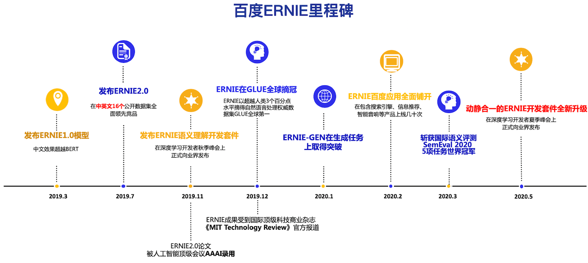

[English](./README.en.md)|简体中文



ERNIE是百度开创性提出的基于知识增强的持续学习语义理解框架，该框架将大数据预训练与多源丰富知识相结合，通过持续学习技术，不断吸收海量文本数据中词汇、结构、语义等方面的知识，实现模型效果不断进化。ERNIE在情感分析、文本匹配、自然语言推理、词法分析、阅读理解、智能问答等16个公开数据集上全面显著超越世界领先技术，在国际权威的通用语言理解评估基准GLUE上，得分首次突破90分，获得全球第一。在今年3月落下帷幕的全球最大语义评测SemEval 2020上，ERNIE摘得5项世界冠军， 该技术也被全球顶级科技商业杂志《麻省理工科技评论》官方网站报道，相关创新成果也被国际顶级学术会议AAAI、IJCAI收录。ERNIE在工业界得到了大规模应用，如搜索引擎、新闻推荐、广告系统、语音交互、智能客服等。

**提醒: ERNIE老版本代码已经迁移至[repro分支](https://github.com/PaddlePaddle/ERNIE/tree/repro)，欢迎使用我们全新升级的基于动静结合的新版ERNIE套件进行开发。另外，也欢迎上[EasyDL](https://ai.baidu.com/easydl/pro)体验更丰富的功能（如ERNIE 2.0、ERNIE 2.1、ERNIE领域模型等）。**

[【了解更多】](https://wenxin.baidu.com/)

# 新闻

- 2020.12.29:
   - `ERNIE`开源工具套件全面升级 [PaddlePaddle v2.0](https://github.com/PaddlePaddle/Paddle/tree/release/2.0-rc)
   - 所有demo教程均引入AMP（混合精度训练), 平均提速达2.3倍。
   - 引入`Gradient accumulation`, 8G显存也可运行`ERNIE-large`模型。

- 2020.9.24:
   - `ERNIE-ViL` 模型正式开源! ([点击进入](https://github.com/PaddlePaddle/ERNIE/tree/repro/ernie-vil))
       - 面向视觉-语言知识增强的预训练框架，首次在视觉-语言预训练引入结构化的知识。
           - 利用场景图中的知识，构建了物体、属性和关系预测任务，精细刻画模态间细粒度语义对齐。
       - 五项视觉-语言下游任务取得最好效果，[视觉常识推理榜单](https://visualcommonsense.com/)取得第一。


- 2020.5.20:
    - 欢迎试用`动态图`实现的 ERNIE:
        - 动态执行, 所见即所得。
        - 大规模分布式训练。
        - 易于部署。
        - 通过Aistudio 教程快速入门NLP。
        - 向后兼容老版 checkpoint。
    -  `ERNIE-GEN` 模型正式开源! ([点击进入](https://github.com/PaddlePaddle/ERNIE/tree/repro/ernie-gen))
        - 最强文本生成预训练模型正式开源，相关工作已被 `IJCAI-2020` 收录。
            - 首次把 ERNIE 预训练技术能力扩展至文本生成领域，在多个典型任务上取得最佳。
            - 您现在即可下载论文报告的所有模型（包含 [`base/large/large-430G`](https://github.com/PaddlePaddle/ERNIE/tree/repro/ernie-gen/README.zh.md#预训练模型)）。
        - 首次在预训练阶段加入span-by-span 生成任务，让模型每次能够生成一个语义完整的片段。
        - 提出填充式生成机制和噪声感知机制来缓解曝光偏差问题。
        - 精巧的 Mulit-Flow Attention 实现框架。
- 2020.4.30 发布[ERNIESage](https://github.com/PaddlePaddle/PGL/tree/master/examples/erniesage)， 一种新型图神经网络模型，采用ERNIE做为aggreagtor. 由[PGL](https://github.com/PaddlePaddle/PGL)实现。
- 2020.3.27 [在SemEval2020五项子任务上夺冠](https://www.jiqizhixin.com/articles/2020-03-27-8)。
- 2019.12.26 [GLUE榜第一名](https://www.technologyreview.com/2019/12/26/131372/ai-baidu-ernie-google-bert-natural-language-glue/)。
- 2019.11.6 发布[ERNIE Tiny](https://www.jiqizhixin.com/articles/2019-11-06-9)。
- 2019.7.7 发布[ERNIE 2.0](https://www.jiqizhixin.com/articles/2019-07-31-10)。
- 2019.3.16 发布[ERNIE 1.0](https://www.jiqizhixin.com/articles/2019-03-16-3)。


# 导航

* [教程](#教程)
* [安装](#安装)
* [支持的NLP任务](#支持的nlp任务)
* [预训练(ERNIE 1.0)](#预训练-ernie-10)
* [在线预测](#在线预测)
* [蒸馏](#蒸馏)

# 快速上手
```python
import numpy as np
import paddle as P
from ernie.tokenizing_ernie import ErnieTokenizer
from ernie.modeling_ernie import ErnieModel

model = ErnieModel.from_pretrained('ernie-1.0')    # Try to get pretrained model from server, make sure you have network connection
model.eval()
tokenizer = ErnieTokenizer.from_pretrained('ernie-1.0')

ids, _ = tokenizer.encode('hello world')
ids = P.to_tensor(np.expand_dims(ids, 0))  # insert extra `batch` dimension
pooled, encoded = model(ids)                 # eager execution
print(pooled.numpy())                        # convert  results to numpy

```

# 教程

手边没有GPU？欢迎在[AIStudio](https://aistudio.baidu.com/aistudio/index)中直接试用 ERNIE.
(请选择最新版本的教程并申请GPU运行环境)

1. [从0开始学ERNIE](https://aistudio.baidu.com/studio/edu/group/quick/join/314947)
1. [情感识别](https://aistudio.baidu.com/aistudio/projectdetail/427482)
2. [完形填空](https://aistudio.baidu.com/aistudio/projectdetail/433491)
3. [知识蒸馏](https://aistudio.baidu.com/aistudio/projectdetail/439460)
4. [万事不决问ERNIE](https://aistudio.baidu.com/aistudio/projectdetail/456443)
5. [加载并读取老式checkpoint](https://aistudio.baidu.com/aistudio/projectdetail/493415)
6. [ERNIE作诗](https://aistudio.baidu.com/aistudio/projectdetail/502844)

# 安装

##### 1. 安装 PaddlePaddle

本项目依赖PaddlePaddle 1.7.0+， 请参考[这里](https://www.paddlepaddle.org.cn/install/quick)安装 PaddlePaddle。

##### 2. 安装 ERNIE 套件


```script
pip install paddle-ernie
```

或者

```shell
git clone https://github.com/PaddlePaddle/ERNIE.git --depth 1
cd ERNIE
pip install -r requirements.txt
pip install -e .
```
`propeller`是辅助模型训练的高级框架，包含NLP常用的前、后处理流程。你可以通过将本repo根目录放入`PYTHONPATH`的方式导入`propeller`:
```shell
export PYTHONPATH=$PWD:$PYTHONPATH
```

##### 3. 下载预训练模型（可选）<a name="section-pretrained-models"></a>


| Model                                              | 细节参数                                                                  |下载简写|
| :------------------------------------------------- |:------------------------------------------------------------------------- |:-------|
| [ERNIE 1.0 Base 中文](https://ernie-github.cdn.bcebos.com/model-ernie1.0.1.tar.gz)           | Layer:12, Hidden:768, Heads:12  |ernie-1.0|
| [ERNIE Tiny](https://ernie-github.cdn.bcebos.com/model-ernie_tiny.1.tar.gz)                  | Layer:3, Hdden:1024, Heads:16   |ernie-tiny|
| [ERNIE 2.0 Base 英文](https://ernie-github.cdn.bcebos.com/model-ernie2.0-en.1.tar.gz)        | Layer:12, Hidden:768, Heads:12  |ernie-2.0-en|
| [ERNIE 2.0 Large 英文](https://ernie-github.cdn.bcebos.com/model-ernie2.0-large-en.1.tar.gz) | Layer:24, Hidden:1024, Heads16  |ernie-2.0-large-en|
| [ERNIE Gen Base 英文](https://ernie-github.cdn.bcebos.com/model-ernie-gen-base-en.1.tar.gz)  | Layer:12, Hidden:768, Heads:12  |ernie-gen-base-en|
| [ERNIE Gen Large 英文](https://ernie-github.cdn.bcebos.com/model-ernie-gen-large-en.1.tar.gz)| Layer:24, Hidden:1024, Heads:16 |ernie-gen-large-en|
| [ERNIE Gen Large 430G英文](https://ernie-github.cdn.bcebos.com/model-ernie-gen-large-430g-en.1.tar.gz)| Layer:24, Hidden:1024, Heads:16 + 额外430G 预训练语料 | ernie-gen-large-430g-en |

##### 4. 下载数据集


**英文数据集**

运行[此](https://gist.github.com/W4ngatang/60c2bdb54d156a41194446737ce03e2e)脚本，下载[GLUE datasets](https://gluebenchmark.com/tasks).

请将数据目录整理成以下格式，方便在后续 demo 教程中使用（通过`--data_dir`参数将数据路径传入训练脚本）；

```shell
data/xnli
├── dev
│   └── 1
├── test
│   └── 1
└── train
    └── 1
```

[示例](https://ernie-github.cdn.bcebos.com/data-mnli-m.tar.gz)数据（MNLI任务测试、训练集合）。


**中文数据**

| 数据集|描述|
|:--------|:----------|
| [XNLI](https://ernie-github.cdn.bcebos.com/data-xnli.tar.gz)                 |XNLI 是由 Facebook 和纽约大学的研究者联合构建的自然语言推断数据集，包括 15 种语言的数据。我们用其中的中文数据来评估模型的语言理解能力。[链接](https://github.com/facebookresearch/XNLI)|
| [ChnSentiCorp](https://ernie-github.cdn.bcebos.com/data-chnsenticorp.tar.gz) |ChnSentiCorp 是一个中文情感分析数据集，包含酒店、笔记本电脑和书籍的网购评论。|
| [MSRA-NER](https://ernie-github.cdn.bcebos.com/data-msra_ner.tar.gz)         |MSRA-NER (SIGHAN2006) 数据集由微软亚研院发布，其目标是识别文本中具有特定意义的实体，包括人名、地名、机构名。|
| [NLPCC2016-DBQA](https://ernie-github.cdn.bcebos.com/data-dbqa.tar.gz)       |NLPCC2016-DBQA 是由国际自然语言处理和中文计算会议 NLPCC 于 2016 年举办的评测任务，其目标是从候选中找到合适的文档作为问题的答案。[链接](http://tcci.ccf.org.cn/conference/2016/dldoc/evagline2.pdf)|
|[CMRC2018](https://ernie-github.cdn.bcebos.com/data-cmrc2018.tar.gz)|CMRC2018 是中文信息学会举办的评测，评测的任务是抽取类阅读理解。[链接](https://github.com/ymcui/cmrc2018)


# 支持的NLP任务

- 使用 `动态图` 模型进行finetune:

```script
python3 ./ernie_d/demo/finetune_classifier.py \
       --from_pretrained ernie-1.0 \
       --data_dir ./data/xnli
```

   - 加入`--use_amp`以启用AMP功能(请在支持`TensorCore`设备上启用AMP)
   - 通过`--bsz`指定全局batch\_size(一步优化中模型所能见到的样本数), 通过`--micro_bsz` 指定输入给每一张GPU卡的样本数
若`--bsz > --micro_bsz` 脚本会自动开启梯度累计功能.


- 分布式 finetune

`paddle.distributed.launch` 是一个进程管理器，我们采用它在每一张GPU上启动一个python进程，并配置相应的环境变量以进行分布式训练:

当采用分布式训练时，我们采用`max_steps`做为终止条件而非`epoch`, 这样处理是为了避免进程间死锁。
你可以通过`EPOCH * NUM_TRAIN_EXAMPLES / TOTAL_BATCH`的方式计算出所需执行的`max_steps`.
另外值得注意的是训练集需要在不同的进程间进行切分；以避免所有进程训练同一份数据造成的过拟合。

示例脚本（请确保你有两张以上GPU卡, 在线模型下载功能在`paddle.distributed.launch`下无法工作，
你可能需要一个先通过单卡finetune方式下载预训练模型，或者根据[这里](#section-pretrained-models)手动下载并解压预训练模型）:

```script
python3 -m paddle.distributed.launch \
./demo/finetune_classifier_distributed.py \
    --data_dir data/mnli \
    --max_steps 10000 \
    --from_pretrained ernie2.0-en
```


更多示例脚本:

1. [情感分析](./demo/finetune_sentiment_analysis.py)
1. [语义匹配](./demo/finetune_classifier.py)
1. [命名实体识别(NER)](./demo/finetune_ner.py)
1. [机器阅读理解](./demo/finetune_mrc.py) (需要多卡环境运行；参见上面"分布式 finetune"一节)
1. [文本摘要生成](./demo/seq2seq/README.md)
1. [使用静态图完成文本分类](./demo/finetune_classifier_static.py)


**推荐超参数设置：**

|任务|batch size|learning rate|
|--|--|--|
| CoLA         | 32 / 64 (base)  | 3e-5                     |
| SST-2        | 64 / 256 (base) | 2e-5                     |
| STS-B        | 128             | 5e-5                     |
| QQP          | 256             | 3e-5(base)/5e-5(large)   |
| MNLI         | 256 / 512 (base)| 3e-5                     |
| QNLI         | 256             | 2e-5                     |
| RTE          | 16 / 4 (base)   | 2e-5(base)/3e-5(large)   |
| MRPC         | 16 / 32 (base)  | 3e-5                     |
| WNLI         | 8               | 2e-5                     |
| XNLI         | 512             | 1e-4(base)/4e-5(large)   |
| CMRC2018     | 64              | 3e-5                     |
| DRCD         | 64              | 5e-5(base)/3e-5(large)   |
| MSRA-NER(SIGHAN2006)  | 16     | 5e-5(base)/1e-5(large)   |
| ChnSentiCorp | 24              | 5e-5(base)/1e-5(large)   |
| LCQMC        | 32              | 2e-5(base)/5e-6(large)   |
| NLPCC2016-DBQA| 64             | 2e-5(base)/1e-5(large)   |
| VCR           | 64             | 2e-5(base)/2e-5(large)   |

# 预训练 (ERNIE 1.0)

请见[这里](./demo/pretrain/README.md)

# 在线预测

如果`finetune_classifier.py`中指定了`--inference_model_dir`参数，funetune脚本会将你的模型序列化并产出可以直接部署线上预测的`inference_model`.

关于生产环境中使用线上预测代码的实现细节，请见[C++ inference API](./inference/README.md).
或者你可以使用`propeller`启动一个多GPU预测服务(需要GPU环境)，只需执行：

```shell
python -m propeller.tools.start_server -m /path/to/saved/inference_model  -p 8881
```

即可启动预测服务；随后在Python端采用如下命令访问该服务(仅限 python3):

```python
from propeller.service.client import InferenceClient
from ernie.tokenizing_ernie import ErnieTokenizer

client = InferenceClient('tcp://localhost:8881')
tokenizer = ErnieTokenizer.from_pretrained('ernie-1.0')
ids, sids = tokenizer.encode('hello world')
ids = np.expand_dims(ids, 0)
sids = np.expand_dims(sids, 0)
result = client(ids, sids)
```

你也可从[此处](https://ernie.bj.bcebos.com/ernie1.0_zh_inference_model.tar.gz)下载一个预先制作好的ernie-1.0 base模型的 `inference_model`.
该模型没有经过finetune，一般可以用做上层模型结构的 feature-base finetune或者做为一个文本特征抽取器。
因为该模行由老版API 产出，在进行客户端请求时需要在输入tensor后面追加一个维度：

```python3
ids = np.expand_dims(ids, -1) # ids.shape==[BATCH, SEQLEN, 1]
```

# 蒸馏

知识蒸馏是进行ERNIE模型压缩、加速的有效方式；关于知识蒸馏的实现细节请参见[这里](./demo/distill/README.md)。

# 文献引用

### ERNIE 1.0
```
@article{sun2019ernie,
  title={Ernie: Enhanced representation through knowledge integration},
  author={Sun, Yu and Wang, Shuohuan and Li, Yukun and Feng, Shikun and Chen, Xuyi and Zhang, Han and Tian, Xin and Zhu, Danxiang and Tian, Hao and Wu, Hua},
  journal={arXiv preprint arXiv:1904.09223},
  year={2019}
}
```

### ERNIE 2.0
```
@article{sun2019ernie20,
  title={ERNIE 2.0: A Continual Pre-training Framework for Language Understanding},
  author={Sun, Yu and Wang, Shuohuan and Li, Yukun and Feng, Shikun and Tian, Hao and Wu, Hua and Wang, Haifeng},
  journal={arXiv preprint arXiv:1907.12412},
  year={2019}
}
```

### ERNIE-GEN

```
@article{xiao2020ernie-gen,
  title={ERNIE-GEN: An Enhanced Multi-Flow Pre-training and Fine-tuning Framework for Natural Language Generation},
  author={Xiao, Dongling and Zhang, Han and Li, Yukun and Sun, Yu and Tian, Hao and Wu, Hua and Wang, Haifeng},
  journal={arXiv preprint arXiv:2001.11314},
  year={2020}
}
```

### ERNIE-ViL

```
@article{yu2020ernie,
  title={ERNIE-ViL: Knowledge Enhanced Vision-Language Representations Through Scene Graph},
  author={Yu, Fei and Tang, Jiji and Yin, Weichong and Sun, Yu and Tian, Hao and Wu, Hua and Wang, Haifeng},
  journal={arXiv preprint arXiv:2006.16934},
  year={2020}
}

```

若希望复现 paper 中的所有实验，请切换至本repo的`repro`分支。

### 讨论组
- [ERNIE官方主页](https://wenxin.baidu.com/)
- [Github Issues](https://github.com/PaddlePaddle/ERNIE/issues): bug reports, feature requests, install issues, usage issues, etc.
- QQ 群: 760439550 (ERNIE discussion group).
- QQ 2群: 958422639 (ERNIE discussion group-v2).
- [Forums](http://ai.baidu.com/forum/topic/list/168?pageNo=1): discuss implementations, research, etc.
