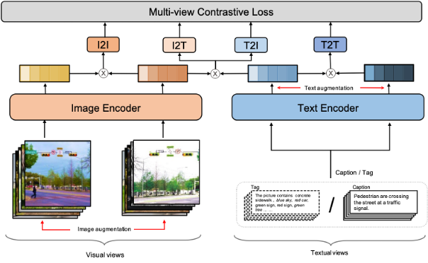

Simplified Chinese|[English](./readme_en.md)

# ERNIE-ViL 2.0 
In recent years, the cross modal model based on large-scale data pre training has made remarkable achievements. The two tower pre training framework based on **constrastive learning** can make full use of large-scale text alignment data, and show great improvement in tasks such as cross modal retrieval. At the same time, it has received wide attention due to its high computational efficiency, such as [CLIP](https://arxiv.org/pdf/2103.00020.pdf), [ALIGN](https://arxiv.org/pdf/2102.05918.pdf) Etc. However, the traditional vision language pre training technology is based on single perspective comparative learning, and cannot learn the correlation between and within multiple modes.   
**ERNIE-ViL 2.0** proposes a pre-training framework based on multiple perspective contrastive learning. By building rich visual/text views, it can learn multiple correlations between and within modes at the same time, so as to learn more robust cross modal alignment, and achieve an industry-leading level in tasks such as cross modal retrieval.  

## Methods
ERNIE-ViL 2.0's multi-view  contrastive learning includes:
- Cross modal contrastive learning: image-caption, image-objects
- Modal contrast learning: iamge-image, text-text


## Cross-modal retrieval performance (Zero-Shot)
* **ERNIE-ViL 2.0 base (ViT)**: ViT-B-16 (visual backbone) + ERNIE 3.0 base (text backbone)  

|Dataset | T2I R@1  |   I2T  R@1  |   meanRecall  |  
|------------|-------|--------|----|
| [COCO-CN]( https://arxiv.org/pdf/1805.08661.pdf ) | 66.00 | 65.90 |  84.28 |    
| [AIC-ICC]( https://arxiv.org/pdf/1711.06475.pdf ) | 17.93 | 30.41 |  38.57 |
* **ERNIE-ViL 2.0 large (ViT)**: ViT-L-14 (visual backbone) + ERNIE 3.0 large (text backbone)  

|Dataset | T2I R@1  |   I2T  R@1  |   meanRecall  |  
|------------|-------|--------|----|
| [COCO-CN]( https://arxiv.org/pdf/1805.08661.pdf ) | 70.30 | 68.80| 86.32 |    
| [AIC-ICC]( https://arxiv.org/pdf/1711.06475.pdf ) | 20.17 | 32.29 | 41.08 |
* Here, AIC-ICC is the effect of the first 10000 lines of the validation set  

## Examples
Here, ERNIE-ViL 2.0 base (ViT) (open source) is used as an example to perform the text retrieval task of zero-shot on COCO-CN:  

* Model Download:
[ERNIE-ViL 2.0 Base（ViT)]( http://bj.bcebos.com/wenxin-models/ERNIE_VIL2_BASE_ViT.pdparams)
* Data preparation: we have built in a [COCO-CN](http://bj.bcebos.com/wenxin-models/test.coco_cn.data) test set. The data format (UTF-8 encoding by default) is three columns separated by \t. The first column is text, the second column is the image ID in coco, and the third column is the image encoded by Base64.
* First, install the environment and install [paddle>=2.1.3](https://www.paddlepaddle.org.cn/install/quick?docurl=/documentation/docs/zh/develop/install/pip/linux-pip.HTML) and [requirements.txt](requirements.txt),
* Then, for ./packages/configs/ernie_vil_base.yaml performs various configurations. For details, please refer to the notes in the configuration (including input/output path location and model parameter path).
* Finally, run the following command to get cross modal graphic embeddings

```bash
# Usage: bash $0 gpu-card-index config-path
$ bash run_infer.sh 2 ./packages/configs/ernie_vil_base.yaml 
```
By define in /packages/configs/ernie_vil_base.yaml The location of the output result defined by base.yaml is evaluated using the following script:

```bash
# Usage: python $0 output-embedding-path
$ python eval_retri.py test_out/cross_modal_embeddings.out
```

The following is the result of ERNIE-ViL 2.0 base model in COCO-CN

| Name       |    R@1  |    R@5  |    R@10  |   meanRecall |
|------------|-------|-------|--------|--------------|
| Text2Image | 66.00 | 90.00 |  96.10 |        84.03 |
| Image2Text | 65.90 | 91.40 |  96.30 |        84.53 | 
| MeanRecall | 65.95 | 90.70 |  96.20 |        84.28 |  
