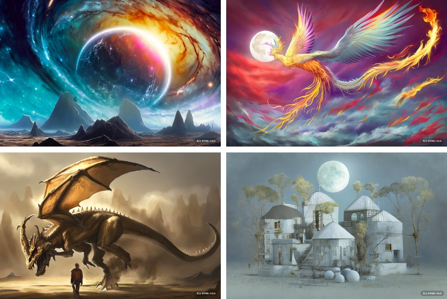
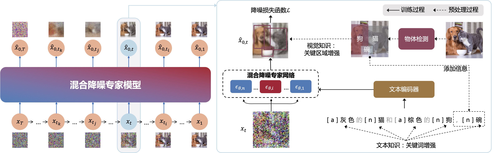
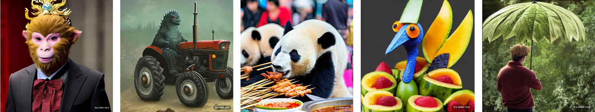
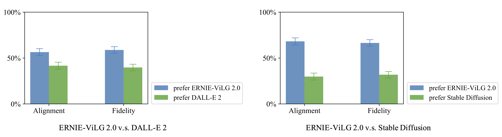
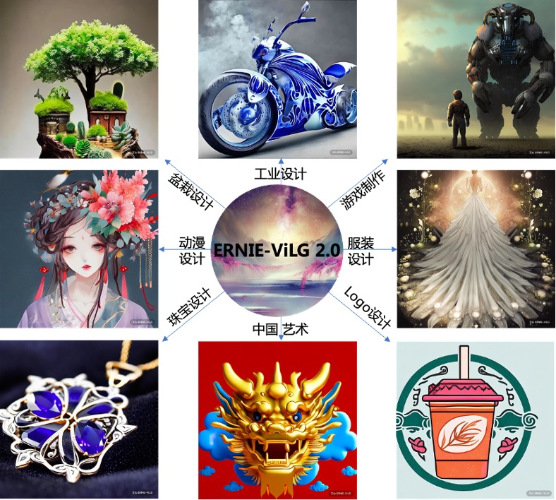

# ERNIE-ViLG 2.0 文生图扩散模型：基于知识增强的混合降噪专家模型

[调用API体验](https://wenxin.baidu.com/ernie-vilg)

[中英双语文生图评测集ViLG-300](./data/ViLG-300.csv)

更多技术细节请参考 我们的论文：
>[_**ERNIE-ViLG 2.0: Improving Text-to-Image Diffusion Model with Knowledge-Enhanced Mixture-of-Denoising-Experts**_](https://arxiv.org/abs/2210.15257)
>
>Zhida Feng*, Zhenyu Zhang*, Xintong Yu*, Yewei Fang, Lanxin Li, Xuyi Chen, Yuxiang Lu, Jiaxiang Liu, Weichong Yin, Shikun Feng, Yu Sun, Li Chen, Hao Tian, Hua Wu, Haifeng Wang
>
>CVPR 2023, Highlight

## 模型概述

文心 ERNIE-ViLG 2.0 采用基于知识增强算法的混合降噪专家建模，是全球首个知识增强的 AI 作画大模型，也是目前全球参数规模最大的 AI 作画大模型，在文本生成图像公开权威评测集 MS-COCO 和人工盲评上均超越了 Stable Diffusion、DALL-E 2 等模型，取得了当前该领域的世界最好效果，并在语义可控性、图像清晰度、中国文化理解等方面展现出了显著优势。

## 模型说明
文心 ERNIE-ViLG 2.0 通过视觉、语言等多源知识指引扩散模型学习，强化文图生成扩散模型对于语义的精确理解，以提升生成图像的可控性和语义一致性。同时，ERNIE-ViLG 2.0 首次引入基于时间步的混合降噪专家模型来提升模型建模能力，让模型在不同的生成阶段选择不同的“降噪专家”网络，从而实现更加细致的降噪任务建模，提升生成图像的质量。

### 原理介绍

**基于语言和图像知识的知识增强算法。** 为提升生成图像的语义一致性和可控性，ERNIE ViLG 2.0 将知识增强算法融入扩散模型学习，在扩散模型学习过程中，引入语言、视觉等多源知识指引模型更加关注文本和图像中的核心语义元素，同时针对训练数据噪声带来的训练图文样本语义偏差问题提出了文本语义补全的方法，对图文的语义一致性进行针对性学习，进而实现精准的细粒度语义控制。

**混合降噪专家网络。** 针对模型建模能力不足，导致图像质量不够好的问题，ERNIE ViLG 2.0 提出了针对不同阶段选择不同网络（降噪专家）进行建模的框架，有效地解决了不同阶段对模型能力要求不一致的问题，减少降噪任务的互相干扰，提升图像生成的质量。由于每个生成阶段只选取一个专家进行生成，实现了在不增加模型预测计算量的情况下对模型建模能力的扩充。

### 模型效果
文心 ERNIE-ViLG 2.0 能够根据文字描述，精准地生成现实世界中没有的具有创造性的图像。

同时，ERNIE-ViLG 2.0 也具备强大的中文语义理解能力。

相较于 DALL-E 2、Imagen、Parti 等模型，文心 ERNIE-ViLG 2.0 在文本生成图像权威集合 MS-COCO 上取得了当前最好效果，刷新了该任务的基准。（ FID 指标代表了模型生成图像的逼真程度，数值越低代表模型越好）

|Model|Zero-shot FID-30k↓|
|:----|:----|
|DALL-E|27.50|
|CogView|27.10|
|LAFITE|26.94|
|LDM|12.61|
|ERNIE-ViLG|14.70|
|GLIDE|12.24|
|Make-A-Scene|11.84|
|DALL-E 2|10.39|
|CogView2|24.00|
|Imagen|7.27|
|Parti|7.23|
|**ERNIE-ViLG 2.0**|**6.75**|

由于ERNIE-ViLG 2.0以中文为输入，为了与仅支持英文输入的文生图模型进行公平的对比，我们提出了文生图双语评测集[ViLG-300](./data/ViLG-300.csv)，可以对中文和英文的文生图模型进行系统的评估和对比。
ViLG-300从两个现有的文生图评测集DrawBench和ERNIE-ViLG采集了共16个大类、300条prompt，每条prompt均包含中文、英文两个版本。

基于ViLG-300，在图文相关性和图像保真度两个维度的人工评估上，ERNIE-ViLG 2.0 相对 DALL-E 2 和 Stable Diffusion （调用日期：2022-10-25）具有较大优势。

### 应用场景

文心 ERNIE-ViLG 2.0 可应用于工业设计、动漫设计、游戏制作、摄影艺术等场景，激发设计者创作灵感，提升内容生产的效率。通过简单的描述，模型便可以在短短几十秒内得到图像，极大地提升了设计效率、降低商业出图的门槛。

作为百度文心大模型“家族”中重要一员，ERNIE-ViLG 2.0 代表着百度在 AIGC 领域迈出的坚实步伐，将进一步加速 AI 辅助视觉内容创作与生产时代的来临，从技术自主创新和加速产业应用方面持续推动中国 AI 发展。

### 使用方案

#### 通过开放API平台ERNIE-ViLG文生图在线体验

通过ERNIE-ViLG文生图体验专区在线体验 ERNIE-ViLG 2.0 的文生图能力，您可自定义输入文本，并选择古风、二次元、油画、未来主义等修饰词风格以及方图（1024x1024）、长图（1024x1536）、横图（1536x1024）等不同分辨率尺寸的的图片要求，模型会根据输入内容自动创作出符合要求的图片。

#### 通过 API 调用体验

ERNIE-ViLG 2.0 提供 API 体验调用的入口，您可以在开放API ERNIE-ViLG文生图 体验专区的头像入口查看或申请 AK/SK 进行接口调用体验，接口文档可通过体验专区点击使用文档进行查看，或者点击代码调用复制代码进行调用体验。
