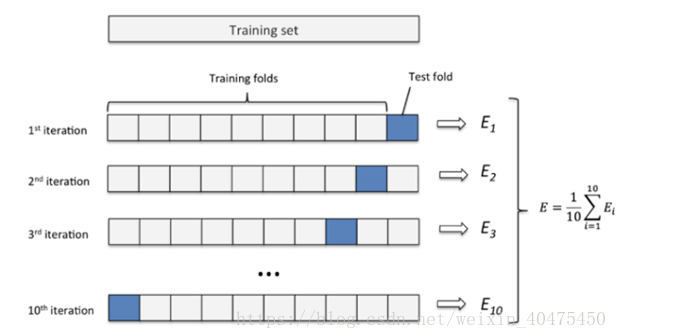
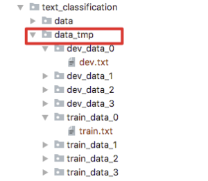
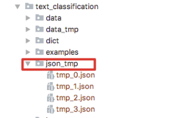
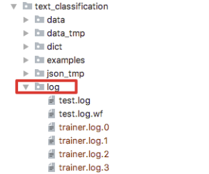

# 交叉验证

- 交叉验证(Cross Validation) 是在机器学习建立模型和验证模型参数时常用的方法。顾名思义，就是重复的使用数据，把得到的样本数据进行切分，组合为不同的训练集和验证集。用训练集来训练模型，验证集来评估模型的好坏。在此基础上可以得到多组不同的训练集和测试集，某次训练集中的样本，在下次可能成为测试集中的样本，也就是所谓的交叉。
- 交叉验证用在数据量不是很充足的情况(比如数据量小于一万条)，能够从有限的数据中获取尽可能多的有效信息。
- 交叉验证用于评估模型的预测性能，尤其是训练好的模型在新数据上的表现，能够一定程度上减小过拟合。

## 交叉验证常见方法

- 留出法交叉验证
  - 留出法 (Hold-Out Cross Validation) 是一种简单交叉验证，即针对原始数据集，通常分为训练集、验证集。训练集用于训练模型、验证集对于模型来说是未知数据，用于评估模型的泛化能力。比如我们随机的将样本数据分为两部分(80%的训练集，20%的验证集)，然后用训练集来训练模型，验证集上验证模型及参数，最后选择损失函数评估最优的模型和参数。
- K折交叉验证（文心中使用这种方法），K折交叉验证 (k-fold Cross Validation) 过程如下所示：
  - 不重复抽样将原始数据随机分成k份；
  - 每次挑选其中1份作为验证集，剩余k-1份作为训练集用于训练模型；
  - 重复第2步k次，在每个训练集上训练后得到一个模型。用这个模型在相应的验证集上测试，计算并保存模型的评估指标。



## 文心中使用交叉验证

这里我们以BOW分类任务为例介绍文心中的交叉验证的使用方式，主要分为以下几个步骤：

1. 准备数据：数据集的准备与通用的BOW分类任务一致，不再赘述，详细信息请移步[实战演练：使用文心进行模型训练](https://ai.baidu.com/ai-doc/ERNIE-Ultimate/Ekmlrorrp)。

2. 配置参数：以applications/tasks/text_classification/examples/cls_bow_ch.json为例，交叉验证仅需要在dataset_reader部分进行配置，其余部分与普通的训练任务一致。dataset_reader中k_fold相关参数为K折交叉验证的配置：

   - num_fold表示需要将训练集拆成K折，num_fold的取值需要>=2；

   - num_use_split表示被拆成K折，并组成K个训练集+验证集的数据集合中，有几个用来训练模型(num_use_split的取值不能大于num_fold)；

   - data_path表示需要被拆分的原始数据集路径，必须是目录；

   - data_path_split表示使用K折交叉验证拆分完成之后的数据存放路径，必须是个目录。

```
    	{
    	"dataset_reader": {
    	"k_fold": {
        "num_fold": 4,    ## 表示需要将训练集拆成K折（num_fold的取值需要>=2）
        "data_path": "./data/train_data",  ## 待拆分的原始数据集路径
        "data_path_split": "./data_tmp",  ## 表示使用K折交叉验证拆分完成之后的数据存放路径，模型训练时真正用到的数据集路径。
        "num_use_split": 4     ## 拆好的K折中，有几个数据集要用来做训练，其取值不能大于num_fold。
    	},
    	"train_reader": {
        ...
        "config": {
            "data_path": "./data/train_data",
            "shuffle": false,
            "batch_size": 8,
            "epoch": 3,
            "sampling_rate": 1.0
        }
    	}
    	 ...
    	},
    	"model": {
    	"type": "BowClassification",
    	"optimization": {
        "learning_rate": 2e-5
    	},
    	"vocab_size": 33261,
    	"num_labels": 2
    	},
    	 ...
    	}
```

3. 启动训练：使用交叉验证进行训练的启动脚本与普通训练任务不一样，启动脚本为**run_with_preprocess.py**，该脚本的位置在applications/tools/run_preprocess/目录下，可以拷贝到applications/tasks/text_classification目录下使用，入参为上一步骤配置好k_fold参数的json文件，具体如下所示：

```
# BOW 中文文本分类模型
# 基于json实现预置网络训练。其调用了配置文件./examples/cls_bow_ch.json（添加了交叉验证配置的json）
python run_with_preprocess.py --param_path ./examples/cls_bow_ch.json
```

## 运行过程中产生的文件

运行过程中，使用**run_with_preprocess.py**启动的交叉验证任务会产生一些额外的目录，如下所示：

- data_tmp：通过K折交叉验证处理过后的数据，如图所示就是将原始数据分成了4组，每组包含train_data 和 dev_data，如下图所示：



- json_tmp：交叉验证处理完成之后生成的新的待运行配置文件，如下图所示：



- log：基于交run_with_preprocess.py运行的任务都会生成新的json配置，每个json对应一个独立的trainer，各个trainer按照顺序串行训练，所以日志会分别输出到对应编号的log中。如下图就是串行的4个trainer的日志。日志内容和单独运行run_trainer.py输出到test.log中的日志一样，如下图所示：


