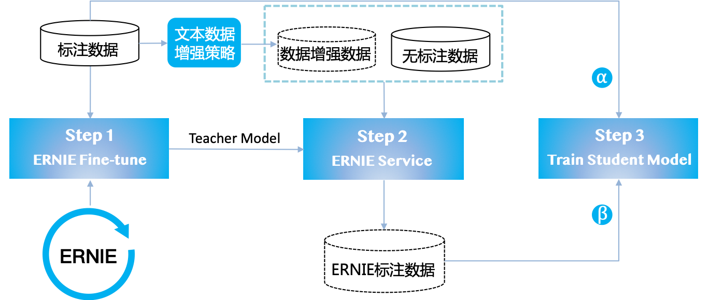

* [ERNIE Slim 数据蒸馏](#ernie-slim-数据蒸馏)
    * [ERNIE数据蒸馏三步](#ernie数据蒸馏三步)
    * [数据增强](#数据增强)
* [使用教程](#使用教程)
   * [离线蒸馏](#离线蒸馏)
   * [在线蒸馏](#在线蒸馏)
* [效果验证](#效果验证)
    * [Case#1 用户提供“无标注数据”](#case1)
    * [Case#2 用户未提供“无标注数据”](#case2)
* [FAQ](#faq)

# ERNIE Slim 数据蒸馏
在ERNIE强大的语义理解能力背后，是需要同样强大的算力才能支撑起如此大规模模型的训练和预测。很多工业应用场景对性能要求较高，若不能有效压缩则无法实际应用。



因此，如上图所示，我们基于[数据蒸馏技术](https://arxiv.org/pdf/1712.04440.pdf)构建了**ERNIE Slim数据蒸馏系统**。它的原理是通过数据作为桥梁，将ERNIE模型的知识迁移至小模型，以达到损失很小的效果却能达到上千倍的预测速度提升的效果。


### ERNIE数据蒸馏三步

 - **Step 1**. 使用ERNIE模型对输入标注数据对进行fine-tune，得到Teacher Model
 - **Step 2**. 使用ERNIE Service对以下无监督数据进行预测：
 
   1. 用户提供的大规模无标注数据，需与标注数据同源
   2. 对标注数据进行数据增强，具体增强策略见下节
   3. 对无标注数据和数据增强数据进行一定比例混合 
   
 - **Step 3.** 使用步骤2的数据训练出Student Model


### 数据增强
目前采用三种[数据增强策略](https://arxiv.org/pdf/1903.12136.pdf)策略，对于不用的任务可以特定的比例混合。三种数据增强策略包括：

 1. 添加噪声：对原始样本中的词，以一定的概率（如0.1）替换为”UNK”标签
 2. 同词性词替换：对原始样本中的所有词，以一定的概率（如0.1）替换为本数据集钟随机一个同词性的词
 3. N-sampling：从原始样本中，随机选取位置截取长度为m的片段作为新的样本，其中片段的长度m为0到原始样本长度之间的随机值


# 使用教程

我们采用上述3种增强策略制作了chnsenticorp的增强数据：增强后的数据为原训练数据的10倍(96000行)，可以从[这里](https://ernie.bj.bcebos.com/distill_data.tar.gz)下载。将下载的 `distill` 文件夹放入 `${TASK_DATA_PATH}` 后即可执行下面的脚本开始蒸馏。

### 离线蒸馏
离线蒸馏指的是先通过训练好的ERNIE模型预测出无监督数据的label，然后student模型去学习这些label。只需执行
```script
sh ./distill/script/distill_chnsenticorp.sh
```
即可开始离线蒸馏。

该脚本会进行前述的三步：1. 在任务数据上Fine-tune。 2. 加载Fine-tune好的模型对增强数据进行打分。 3.使用Student模型进行训练。脚本采用hard-label蒸馏，在第二步中将会直接预测出ERNIE标注的label。

该脚本涉及两个python文件:`./example/finetune_classifier.py` 负责finetune以及预测teacher模型， `distill/distill_chnsentocorp.py` 负责student模型的训练。事先构造好的增强数据放在`${TASK_DATA_PATH}/distill/chnsenticorp/student/unsup_train_aug`

在脚本的第二步中，使用 `--do_predict` 参数进入预测模式:
```script
cat ${TASK_DATA_PATH}/distill/chnsenticorp/student/unsup_train_aug/part.0 |python3 -u ./example/finetune_classifier.py \
    --do_predict \
    --data_dir ${TASK_DATA_PATH}/distill/chnsenticorp/teacher \
    --warm_start_from ${MODEL_PATH}/params \
    --vocab_file ${MODEL_PATH}/vocab.txt \
    ...
```
脚本从标准输入获取明文输入，并将打分输出到标准输出。用这种方式对数据增强后的无监督训练预料进行标注。最终的标注结果放在 `prediction_output/part.0` 文件中。标注结果包含两列, 第一列为明文，第二列为标注label。

在第三步开始student模型的训练：
```script
python3 ./distill/distill_chnsentocorp.py \
    --data_dir ${TASK_DATA_PATH}/distill/chnsenticorp/student \
    --vocab_file ${TASK_DATA_PATH}/distill/chnsenticorp/student/vocab.txt \
    --unsupervise_data_dir ./prediction_output/ \
    --max_seqlen 128 \
    ...
```

训练流程与第一步相同，`--data_dir` 指定的监督数据，`--unsupervise_data_dir` 指定ERNIE标注数据。Student模型是一个简单的BOW模型，其定义位于`distill/distill_chnsentocorp.py`。用户只需改写其中的model部分即可实现定制蒸馏模型。

如果用户已经拥有了无监督数据，则可以将无监督数据放入 `${TASK_DATA_PATH}/distill/chnsenticorp/student/unsup_train_aug` 即可。

### 在线蒸馏
考虑到在某些场景下，无监督数据过大导致预测过程十分耗时，或者ERNIE预测出的分布过大而无法预先存放在磁盘中。针对这种场景我们提出一种 **在线蒸馏** 方案。采用`propeller` 进行fine-tune并使用 `BestInferenceModelExporter` 后，`propeller` 会自动将指标最好的模型保存为paddle inference model格式，随后启动一个预测服务。Student模型在训练的同时，实时地访问这个服务来获得ERNIE的预测打分。只需执行
```
sh ./distill/script/distill_chnsenticorp_with_propeller_server.sh
```
即可完成上述流程。

流程包含3步：1. finetune ERNIE模型。2. 取指标最好的ERNIE模型启动`propeller`服务。 3.在student模型的训练过程中访问服务获取teacher模型的标注。

此流程涉及两个python文件: `example/finetune_classifier.py` 与 `distill/distill_chnsentocorp_with_propeller_server.py`  。其中第一步与离线蒸馏中的用法完全一样。
第二步中使用
```script
python3 -m propeller.tools.start_server -p 8113 -m ${teacher_dir}/best/inference/ &
```
启动一个ernie预测服务

第三步开始student模型的同步训练：
```script
python3 ./distill/distill_chnsentocorp_with_propeller_server.py \
    --data_dir ${TASK_DATA_PATH}/distill/chnsenticorp/student \
    --vocab_file ${TASK_DATA_PATH}/distill/chnsenticorp/student/vocab.txt \
    --teacher_vocab_file ${MODEL_PATH}/vocab.txt \
    --max_seqlen 128 \
    --teacher_max_seqlen 128 \
    --server_batch_size 64 \
    --teacher_host tcp://localhost:8113 \
    --num_coroutine 10
```
该脚本将`${TASK_DATA_PATH}/distill/chnsenticorp/student/unsup_train_aug` 目录下的增强数据进行切字并请求`propeller` 服务。`--num_coroutine` 指定了请求的并发数，`--teacher_host` 指定了服务的端口和IP，`--server_batch_size` 指定了请求的batch_size，在实际的请求中每个batch的数据会拆分成若干个 `--server_batch_size` 大小的数据去请求服务。

# 效果验证
我们将实际应用场景分类为两种：

### Case#1 用户提供“无标注数据”<a name="case1"></a>

|模型 | 评论低质识别【分类 \| ACC】 | 中文情感【分类 \| ACC】 |问题识别【分类 \| ACC】|搜索问答匹配【匹配 \| 正逆序】|
|---|---|---|---|---|
|ERNIE-Finetune | 90.6% | 96.2% | 97.5% | 4.25 |
|非ERNIE基线（BOW）| 80.8% | 94.7% | 93.0% | 1.83 |
|**+ 数据蒸馏** | 87.2% | 95.8% | 96.3% | 3.30 |

### Case#2 用户未提供“无标注数据”（通过数据增强生成数据）<a name="case2"></a>

|模型 |ChnSentiCorp |
|---|---|
|ERNIE-Finetune |95.4% |
|非ERNIE基线(BOW)|90.1%|
|**+ 数据蒸馏** |91.4%| 
|非ERNIE基线（LSTM）|91.2%|
|**+ 数据蒸馏**|93.9%|

# FAQ

### FQA1: 预测同时蒸馏报错：`Client call failed`

终端打印的错误是client的日志，server端的日志在前面。一般来说可能是server显存超限导致。这种时候需要在student模型finetune的脚本中使用`--server_batch_size ` 显示控制请求服务的batch大小。
