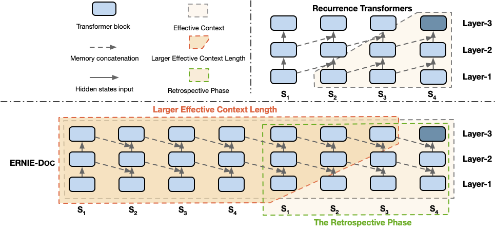

English | [简体中文](./README_zh.md)

## _ERNIE-Doc_: A Retrospective Long-Document Modeling Transformer

- [Framework](#framework)
- [Pre-trained Models](#Pre-trained-Models)
- [Fine-tuning Tasks](#Fine-tuning-Tasks)
  * [Language Modeling](#Language-Modeling)
  * [Long-Text Classification](#Long-Text-Classification)
  * [Question Answering](#Question-Answering)
  * [Information Extraction](#Information-Extraction)
  * [Semantic Matching](#Semantic-Matching)
- [Usage](#Usage)
  * [Install Paddle](#Install-PaddlePaddle)
  * [Fine-tuning](#Fine-tuning)
- [Citation](#Citation)

For technical description of the algorithm, please see our paper:
>[_**ERNIE-Doc: A Retrospective Long-Document Modeling Transformer**_](https://arxiv.org/abs/2012.15688)
>
>Siyu Ding\*, Junyuan Shang\*, Shuohuan Wang, Yu Sun, Hao Tian, Hua Wu, Haifeng Wang (\* : equal contribution)
>
>Preprint December 2020
>
>Accepted by **ACL-2021**

  

---
**ERNIE-Doc is a document-level language pretraining model**. Two well-designed techniques, namely the **retrospective feed mechanism** and the **enhanced recurrence mechanism**, enable ERNIE-Doc, which has a much longer effective context length, to capture the contextual information of a complete document. ERNIE-Doc improved the state-of-the-art language modeling result of perplexity to 16.8 on WikiText-103. Moreover, it outperformed competitive pretraining models by a large margin on most language understanding tasks, such as text classification, question answering, information extraction and semantic matching.

## Framework

We proposed three novel methods to enhance the long document modeling ability of Transformers:

- **Retrospective Feed Mechanism**: Inspired by the human reading behavior of skimming a document first and then looking back upon it attentively, we design a retrospective feed mechanism in which segments from a document are fed twice as input. As a result, each segment in the retrospective phase could explicitly fuse the semantic information of the entire document learned in the skimming phase, which prevents context fragmentation.
- **Enhanced Recurrence Mechansim**, a drop-in replacement for a Recurrence Transformer (like Transformer-XL), by changing the shifting-one-layer-downwards recurrence to the same-layer recurrence. In this manner, the maximum effective context length can be expanded, and past higher-level representations can be exploited to enrich future lower-level representations.
- **Segment-reordering Objective**, a document-aware task of predicting the correct order of the permuted set of segments of a document, to model the relationship among segments directly. This allows ERNIE-Doc to build full document representations for prediction. 



Illustrations of ERNIE-Doc and Recurrence Transformers, where models with three layers take as input a long document which is sliced into four segments.

## Pre-trained Models

We release the checkpoints for **ERNIE-Doc _base_en/zh_** and **ERNIE-Doc _large_en_** model。 

- [**ERNIE-Doc _base_en_**](https://ernie-github.cdn.bcebos.com/model-ernie-doc-base-en.tar.gz) (_12-layer, 768-hidden, 12-heads_)
- [**ERNIE-Doc _base_zh_**](https://ernie-github.cdn.bcebos.com/model-ernie-doc-base-zh.tar.gz) (_12-layer, 768-hidden, 12-heads_)
- [**ERNIE-Doc _large_en_**](https://ernie-github.cdn.bcebos.com/model-ernie-doc-large-en.tar.gz) (_24-layer, 1024-hidden, 16-heads_)


## Fine-tuning Tasks

We compare the performance of [ERNIE-Doc](https://arxiv.org/abs/2012.15688) with the existing SOTA pre-training models (such as [Longformer](https://arxiv.org/abs/2004.05150), [BigBird](https://arxiv.org/abs/2007.14062), [ETC](https://arxiv.org/abs/2004.08483) and [ERNIE2.0](https://arxiv.org/abs/1907.12412)) for language modeling (**_WikiText-103_**) and document-level natural language understanding tasks, including long-text classification (**_IMDB_**,  **_HYP_**, **_THUCNews_**, **_IFLYTEK_**), question answering (**_TriviaQA_**, **_HotpotQA_**, **_DRCD_**, **_CMRC2018_**, **_DuReader_**, **_C3_**), information extraction (**_OpenKPE_**) and semantic matching (**_CAIL2019-SCM_**).

### Language Modeling

- [WikiText-103](https://arxiv.org/abs/1609.07843)

| Model                    | Param. | PPL  |
|--------------------------|:--------:|:------:|
| _Results of base models_   |        |      |
| LSTM                     |    -   | 48.7 |
| LSTM+Neural cache        |    -   | 40.8 |
| GCNN-14                  |    -   | 37.2 |
| QRNN                     |  151M  | 33.0 |
| Transformer-XL Base      |  151M  | 24.0 |
| SegaTransformer-XL Base  |  151M  | 22.5 |
| **ERNIE-Doc** Base           |  151M  | **21.0** |
| _Results of large models_  |        |      |
| Adaptive Input           |  247M  | 18.7 |
| Transformer-XL Large     |  247M  | 18.3 |
| Compressive Transformer  |  247M  | 17.1 |
| SegaTransformer-XL Large |  247M  | 17.1 |
| **ERNIE-Doc** Large          |  247M  | **16.8** |

### Long-Text Classification

- [IMDB reviews](http://ai.stanford.edu/~amaas/data/sentiment/index.html)

| Models          | Acc. | F1 | 
|-----------------|:----:|:----:|
| RoBERTa         | 95.3 | 95.0 | 
| Longformer      | 95.7 |   -  | 
| BigBird         |   -  | 95.2 |
| **ERNIE-Doc** Base  | **96.1** | **96.1** |
| XLNet-Large     | 96.8 |   -  |   -  |
| **ERNIE-Doc** Large | **97.1** | **97.1** | 

- [Hyperpartisan News Dection](https://pan.webis.de/semeval19/semeval19-web/)

| Models          | F1 |
|-----------------|:----:|
| RoBERTa         | 87.8 | 
| Longformer      | 94.8 |   
| BigBird         |  92.2  | 
| **ERNIE-Doc** Base  |  **96.3** | 
| **ERNIE-Doc** Large | **96.6** | 

- [THUCNews(THU)](http://thuctc.thunlp.org/)、[IFLYTEK(IFK)](https://arxiv.org/abs/2004.05986)

| Models          |    THU   |    THU   |    IFK   |
|-----------------|:--------:|:--------:|:--------:|
|                 |   Acc.   |   Acc.   |   Acc.   |
|                 |    Dev   | Test     |    Dev   |
| BERT            |   97.7   |   97.3   |   60.3   |
| BERT-wwm-ext    |   97.6   |   97.6   |   59.4   |
| RoBERTa-wwm-ext |     -    |     -    |   60.3   |
| ERNIE 1.0       |   97.7   |   97.3   |   59.0   |
| ERNIE 2.0       |   98.0   |   97.5   |   61.7   |
| **ERNIE-Doc**       | **98.3** | **97.7** | **62.4** |

### Question Answering

- [TriviaQA](http://nlp.cs.washington.edu/triviaqa/) on dev-set

| Models        | F1 |
|-----------------|:----:|
| RoBERTa         | 74.3 | 
| Longformer      | 75.2 |   
| BigBird         |  79.5 | 
| **ERNIE-Doc** Base  |  **80.1** | 
| Longformer Large  |  77.8 | 
|   BigBird Large  |  - | 
| **ERNIE-Doc** Large | **82.5** | 

- [HotpotQA](https://hotpotqa.github.io/) on dev-set

| Models          | Span-F1 | Supp.-F1 | Joint-F1 |
|-----------------|:----:|:----:|:----:|
| RoBERTa         | 73.5 | 83.4 | 63.5 | 
| Longformer      | 74.3 |  84.4 | 64.4 |  
| BigBird         |  75.5 | **87.1** | 67.8 | 
| **ERNIE-Doc** Base  |  **79.4** | 86.3 | **70.5** | 
| Longformer Large  |  81.0 | 85.8 | 71.4 | 
|   BigBird Large  |  81.3 | **89.4** | - | 
| **ERNIE-Doc** Large | **82.2** | 87.6 | **73.7** | 

- [DRCD](https://arxiv.org/abs/1806.00920), [CMRC2018](https://arxiv.org/abs/1810.07366), [DuReader](https://arxiv.org/abs/1711.05073), [C3](https://arxiv.org/abs/1904.09679)

| Models            | DRCD          | DRCD          | CMRC2018      | DuReader      | C3       | C3       |
|-----------------|---------------|---------------|---------------|---------------|----------|----------|
|                 | dev           | test          | dev           | dev           | dev      | test     |
|                 | EM/F1         | EM/F1         | EM/F1         | EM/F1         | Acc.     | Acc.     |
| BERT            | 85.7/91.6     | 84.9/90.9     | 66.3/85.9     | 59.5/73.1     |   65.7   |   64.5   |
| BERT-wwm-ext    | 85.0/91.2     | 83.6/90.4     | 67.1/85.7     | -/-           |   67.8   |   68.5   |
| RoBERTa-wwm-ext | 86.6/92.5     | 85.2/92.0     | 67.4/87.2     | -/-           |   67.1   |   66.5   |
| MacBERT         | 88.3/93.5     | 87.9/93.2     | 69.5/87.7     | -/-           |     -    |     -    |
| XLNet-zh        | 83.2/92.0     | 82.8/91.8     | 63.0/85.9     | -/-           |     -    |     -    |
| ERNIE 1.0       | 84.6/90.9     | 84.0/90.5     | 65.1/85.1     | 57.9/72/1     |   65.5   |   64.1   |
| ERNIE 2.0       | 88.5/93.8     | 88.0/93.4     | 69.1/88.6     | 61.3/74.9     |   72.3   |   73.2   |
| **ERNIE-Doc**   | **90.5/95.2** | **90.5/95.1** | **76.1/91.6** | **65.8/77.9** | **76.5** | **76.5** |

### Information Extraction

- [Open Domain Web Keyphrase Extraction](https://www.aclweb.org/anthology/D19-1521/)

| Models    | F1@1 | F1@3 | F1@5 |
|-----------|:----:|:----:|:----:|
| BLING-KPE | 26.7 | 29.2 | 20.9 |
| JointKPE  | 39.1 | 39.8 | 33.8 |
| ETC       |   -  | 40.2 |   -  |
| ERNIE-Doc | **40.2** | **40.5** | **34.4** |

### Semantic Matching

- [CAIL2019-SCM](https://arxiv.org/abs/1911.08962)

| Models    |      Dev (Acc.)     |     Test  (Acc.)       |
|-----------|:-------------:|:-------------:|
| BERT      |      61.9     |      67.3     |
| ERNIE 2.0 |      64.9     |      67.9     |
| ERNIE-Doc | **65.6** | **68.8** |


## Usage

### Install PaddlePaddle

This code base has been tested with Paddle (version>=2.0) with Python3. Other dependency of ERNIE-Doc is listed in `requirements.txt`, you can install it by
```script
pip install -r requirements.txt
```

### Fine-tuning
We release the finetuning code for English and Chinese classification tasks and Chinese Question Answers Tasks. For example, you can finetune **ERNIE-Doc** base model on IMDB and IFLYTEK dataset by
```shell
sh script/run_imdb.sh
sh script/run_iflytek.sh
sh script/run_dureader.sh
```
[Preprocessing code for IMDB dataset](./data/imdb/README.md)


The log of training and the evaluation results are in `log/job.log.0`.

**Notice**: The actual total batch size is equal to `configured batch size * number of used gpus`.


## Citation

You can cite the paper as below:

```
@article{ding2020ernie,
  title={ERNIE-DOC: The Retrospective Long-Document Modeling Transformer},
  author={Ding, Siyu and Shang, Junyuan and Wang, Shuohuan and Sun, Yu and Tian, Hao and Wu, Hua and Wang, Haifeng},
  journal={arXiv preprint arXiv:2012.15688},
  year={2020}
}
```


