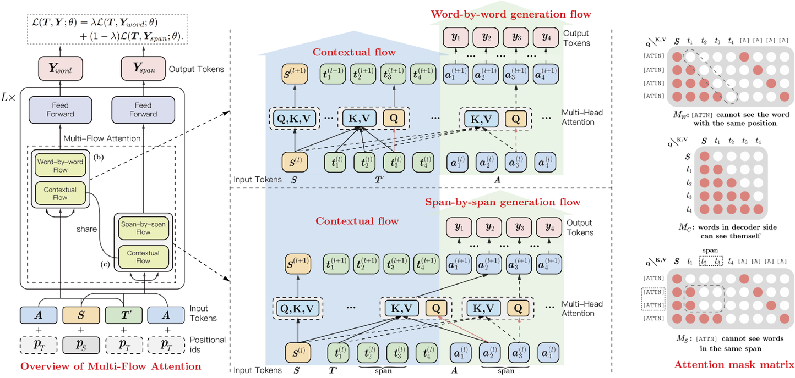

[English](./README.md) | 简体中文

## _ERNIE-GEN_: An Enhanced Multi-Flow Pre-training and Fine-tuning Framework for Natural Language Generation

- [模型框架](#模型框架)
- [预训练模型](#预训练模型)
- [微调任务](#微调任务)
  * [生成式摘要](#生成式摘要)
  * [问题生成](#问题生成)
  * [多轮对话](#多轮对话)
  * [生成式多轮问答](#生成式多轮问答)
- [使用说明](#使用说明)
  * [安装飞桨](#安装飞桨)
  * [运行微调](#运行微调)
  * [使用动态图](#使用动态图)
  * [中文生成任务使用 ERNIE 1.0](#中文生成任务使用-ernie-10)
- [引用](#引用)

关于算法的详细描述，请参见我们的论文：
>[_**ERNIE-GEN:An Enhanced Multi-Flow Pre-training and Fine-tuning Framework for Natural Language Generation**_](https://arxiv.org/abs/2001.11314)
>
>Dongling Xiao\*, Han Zhang\*, Yukun Li, Yu Sun, Hao Tian, Hua Wu, Haifeng Wang (\* : equal contribution)
>
>Preprint January 2020
>
>Accepted by **IJCAI-2020**

      
---
**ERNIE-GEN 是面向生成任务的预训练-微调框架**，首次在预训练阶段加入**span-by-span 生成**任务，让模型每次能够生成一个语义完整的片段。在预训练和微调中通过**填充式生成机制**和**噪声感知机制**来缓解曝光偏差问题。此外, ERNIE-GEN 采样**多片段-多粒度目标文本采样**策略, 增强源文本和目标文本的关联性，加强了编码器和解码器的交互。

## 模型框架

我们提出了三种方法来提高语言生成能力:

- **Span-by-span 生成任务**:  让模型能够每次生成一个语义完整的片段。
- **填充式生成**和**噪声感知生成**: 缓解曝光偏差问题。
- **多片段-多粒度目标文本采样**:  预训练阶段增强编码器和解码器的交互。

我们基于 Transformer 模型设计了 **Mulit-Flow Attention** 框架，用于实现 span-by-span 的填充式生成。



## 预训练模型

我们发布了 **ERNIE-GEN _base_** 模型和 **ERNIE-GEN _large_** 模型。 预训练数据使用英文维基百科和 BookCorpus，总共16GB。此外，我们还发布了基于 160GB 语料预训练的**ERNIE-GEN _large_** 模型，此份语料也被用于 [RoBERTa](https://arxiv.org/abs/1907.11692) 和 [BART](https://arxiv.org/abs/1910.13461) 的预训练。

- [**ERNIE-GEN _base_**](https://ernie.bj.bcebos.com/ernie_gen_base.tgz) (_lowercased | 12-layer, 768-hidden, 12-heads, 110M parameters_)
- [**ERNIE-GEN _large_**](https://ernie.bj.bcebos.com/ernie_gen_large.tgz) (_lowercased | 24-layer, 1024-hidden, 16-heads, 340M parameters_)
- [**ERNIE-GEN _large with 160G_**](https://ernie.bj.bcebos.com/ernie_gen_large_160g.tgz) (_lowercased | 24-layer, 1024-hidden, 16-heads, 340M parameters_)


## 微调任务

我们在五个典型生成任务上与当前效果最优的生成预训练模型([UniLM](https://arxiv.org/abs/1905.03197)、[MASS](https://arxiv.org/abs/1905.02450)、[PEGASUS](https://arxiv.org/abs/1912.08777)、[BART](https://arxiv.org/abs/1910.13461)、[T5](https://arxiv.org/abs/1910.10683)等)进行对比, 包括生成式摘要 (Gigaword 和 CNN/DailyMail), 问题生成(SQuAD), 多轮对话(Persona-Chat) 和生成式多轮问答(CoQA)。 

### 生成式摘要

- _**Gigaword**_

在 Gigaword-10k (Gigaword 的子集) 上的效果:

| 模型                                                      | <strong>数据量 / 参数量</strong> | <strong>Rouge-1</strong> | <strong>Rouge-2</strong> | <strong>Rouge-L</strong> |
| :-------------------------------------------------------- | :------------------------------: | :----------------------: | :----------------------: | :----------------------: |
| UniLM                 |           16G / 340M             |          34.21           |          15.28           |          31.54           |
| **ENRIE-GEN** _base_  |           16G / 110M             |          33.75           |          15.23           |          31.35           |
| **ERNIE-GEN** _large_ |           16G / 340M             |        35.05         |        16.10         |        32.50         |
| **ERNIE-GEN** _large_ (160G) |           160G / 340M           |        **35.51**         |        **16.79**         |        **33.23**         |

在 Gigaword 上的效果:

| 模型                                                      | <strong>数量 / 参数量</strong> | <strong>Rouge-1</strong> | <strong>Rouge-2</strong> | <strong>Rouge-L</strong> |
| :-------------------------------------------------------- | :----------------------------: | :----------------------: | :----------------------: | :----------------------: |
| MASS                 |           18G / 160M           |          38.73           |          19.71           |          35.96           |
| [BERTSHARE](https://arxiv.org/abs/1907.12461)          |           16G / 110M           |          38.13           |          19.81           |          35.62           |
| UniLM                |           16G / 340M           |          38.45           |          19.45           |          35.75           |
| PEGASUS (_C4_)        |          750G / 568M           |          38.75           |          19.96           |          36.14           |
| PEGASUS (_HugeNews_)  |          3.8T / 568M           |          39.12           |          19.86           |          36.24           |
| **ENRIE-GEN** _base_  |           16G / 110M           |          38.83           |          20.04           |          36.20           |
| **ERNIE-GEN** _large_ |           16G / 340M           |        39.25         |        20.25         |        36.53         |
| **ERNIE-GEN** _large_ (160G) |           160G / 340M           |        **39.46**         |        **20.34**         |        **36.74**         |

我们按照 UniLM 的方式处理了数据，下载链接 [Gigaword](https://ernie.bj.bcebos.com/gigaword.tgz)。

- _**CNN/Daily Mail**_

在 CNN/Daily Mail 上的效果: 

| <strong>模型</strong> | 数据量 /参数量| <strong>Rouge-1</strong> | <strong>Rouge-2</strong> | <strong>Rouge-L</strong> |
| :-------------------------------------------------------- | :-----------: | :----------------------: | :----------------------: | :----------------------: |
| MASS                  |  18G / 160M   |          42.12           |          19.50           |          39.01           |
| UniLM                 |  16G / 340M   |          43.33           |          20.21           |          40.51           |
| T5 _large_            |  750G / 340M  |          42.50           |          20.68           |          39.75           |
| T5 _xlarge_           |  750G / 11B   |          43.52           |        **21.55**         |          40.69           |
| BART                  |  160G / 400M  |          44.16           |          21.28           |          40.90           |
| PEGASUS (_C4_)        |  750G / 568M  |          43.90           |          21.20           |          40.76           |
| PEGASUS (_HugeNews_)  |  3.8T / 568M  |          44.17           |          21.47           |          41.11           |
| **ENRIE-GEN** _base_  |  16G / 110M   |          42.30           |          19.92           |          39.68           |
| **ENRIE-GEN** _large_ |  16G / 340M   |          44.02           |          21.17           |          41.26           |
| **ENRIE-GEN** _large_ (160G) |  160G / 340M   |        **44.31**         |          21.35           |        **41.60**         |

我们按照 UniLM 的方式处理了数据，下载链接 [CNN/Daily Mail](https://ernie.bj.bcebos.com/cnndm.tgz)。

### 问题生成

- _**SQuAD**_

在 SQuAD 1.1 数据集上的效果(测试集划分按照 [[Du et al., 2017]](https://arxiv.org/abs/1705.00106)) :

| 模型                                                         | <strong>BLEU-4</strong> | <strong>METEOR</strong> | <strong>Rouge-L</strong> |
| :----------------------------------------------------------- | :----------------------: | :----------------------: | :----------------------: |
| [SemQG](https://arxiv.org/abs/1909.06356)                    |          18.37           |          22.65           |          46.68           |
| UniLM _large_ (beam size=1) |          22.12           |          25.06           |          51.07           |
| **ENRIE-GEN** _base_ (beam size=1) |          22.28           |          25.13           |          50.38           |
| **ERNIE-GEN** _large_ (beam size=1) |        24.03         |        26.31         |        52.36         |
| **ERNIE-GEN** _large_ (beam size=5) |        25.40         |        **26.92**         |        52.84         |
| **ERNIE-GEN** _large_ (beam size=5) + (160G) |        **25.41**         |        26.77         |        **52.91**         |

按照 [[Zhao et al., 2018]](https://www.aclweb.org/anthology/D18-1424/) 反向使用验证集和测试集，效果如下:

| Model                                                        | <strong>BLEU-4</strong> | <strong>METEOR</strong> | <strong>Rouge-L</strong> |
| :----------------------------------------------------------- | :----------------------: | :----------------------: | :----------------------: |
| [SemQG](https://arxiv.org/abs/1909.06356)                    |          20.76           |          24.20           |          48.91           |
| UniLM _large_ (beam size=1) |          23.75           |          25.61           |          52.04           |
| **ENRIE-GEN** _base_ (beam size=1) |          23.52           |          25.61           |          51.45           |
| **ERNIE-GEN** _large_ (beam size=1) |        25.57         |        26.89         |        53.31         |
| **ERNIE-GEN** _large_ (beam size=5) |        26.95         |        **27.57**         |        53.77         |
| **ERNIE-GEN** _large_ (beam size=5) + (160G) |        **27.05**         |        27.43         |        **53.83**         |

*_我们增加了将 beam size 扩大到 5 的结果。_

我们按照 UniLM 的方式处理了数据，下载链接 [SQuAD](https://ernie.bj.bcebos.com/squad_qg.tgz)。

### 多轮对话

- _**Personal-Chat**_

| Model                                                     | <strong>BLEU-1</strong> | <strong>BLEU-2</strong> | <strong>Distinct-1</strong> | <strong>Distinct-2</strong> |
| :-------------------------------------------------------- | :---------------------: | :---------------------: | :-------------------------: | :---------------------------: |
| [LIC](https://arxiv.org/abs/1910.07931)                   |          40.5           |          32.0           |            0.019            | 0.113                       |
| [PLATO](https://arxiv.org/abs/1910.07931)                 |          45.8           |          35.7           |            0.012            | 0.064                       |
| [PLATO](https://arxiv.org/abs/1910.07931) _w/o latent_    |          40.6           |          31.5          |            0.021            | 0.121                    |
| **ERNIE-GEN** _large_ |        **46.8**         |        **36.4**         |          **0.023**          | **0.168**                   |

我们处理的数据下载链接 [Personal-Chat](https://ernie.bj.bcebos.com/persona_chat.tgz)。

### 生成式多轮问答

- _**CoQA**_

在 CoQA 验证集上的效果: 

| 模型                                                      | F1-score |
| :-------------------------------------------------------- | :------: |
| [Seq2Seq](https://arxiv.org/abs/1910.07931)               |   27.5   |
| [PGNet](https://arxiv.org/abs/1910.07931)                 |   45.4   |
| UniLM _large_         |   82.5   |
| **ERNIE-GEN** _large_ | **84.5** |

我们对原始的 CoQA 数据集进行了处理，下载链接 [CoQA](https://ernie.bj.bcebos.com/coqa.tgz)。

此外，我们与同期的工作 [ProphetNet](https://arxiv.org/abs/2001.04063) 在 Gigaword，CNN/Daily Mail 和 SQuAD 三个数据集上进行了对比:

- _**生成式摘要**_

| 模型 / 任务                                               | <strong>数据量 / 参数量</strong> | <strong>Gigaword</strong> |<strong>CNN/Daily Mail</strong>|
| :-------------------------------------------------------- | :------------------------------: | :----------------------: | :----------------------: |
| Metric                                                     | - | <strong>Rouge-1 / Rouge-2 / Rouge-L</strong> |<strong>Rouge-1 / Rouge-2 / Rouge-L</strong>|
| ProphetNet _large_ (160G) |           160G / 340M           |     **39.51** / **20.42** / 36.69       |44.20 / 21.17 / 41.30|
| **ERNIE-GEN** _large_ (160G) |           160G / 340M           |        39.46 / 20.34 / **36.74**         |**44.31** / **21.35** / **41.60**|

- _**问题生成**_

| 模型                                                      | <strong>数据量 / 参数量</strong> | <strong>BLEU-4 / METEOR / Rouge-L</strong> |<strong>BLEU-4 / METEOR / Rouge-L</strong>|
| :-------------------------------------------------------- | :------------------------------: | :----------------------: |:----------------------: |
| Data split                                                     | - | <strong>Original</strong> |<strong>Reversed dev-test</strong>|
| ProphetNet** _large_ (16G) |           16G / 340M           |     25.01 / 26.83 / 52.57       |26.72 / **27.64** / **53.79** |
| **ERNIE-GEN** _large_ (16G) |           16G / 340M           |        **25.40** / **26.92** / **52.84**       |**26.95** / 27.57 / **53.77**|

## 使用说明

### 安装飞桨

我们的代码基于 Paddle Fluid 1.7 和 Python 2.7。 ERNIE-GEN 依赖的其他模块也列举在 `requirements.txt`，可以通过下面的指令安装:
```script
pip install -r requirements.txt
```

### 运行微调
在运行 ERNIE-GEN 前，需要将 CUDA 、cuDNN 、NCCL2 的动态库路径添加到 LD_LIBRARY_PATH 。 我们把下游任务的参数配置文件放到了 `config/` ，可以简单地通过配置文件运行。 例如，您可以通过下面的指令在 Gigaword 数据集上微调 ERNIE-GEN base 模型:
```script
MODEL="base"      # base or large or large_160g
TASK="gigaword"   # cnndm, coqa, gigaword, squad_qg or persona-chat
sh run_seq2seq.sh ./configs/${MODEL}/${TASK}_conf
```
训练和评估的日志在 `log/job.log.0`。 如果要在您自己的数据集上微调，可以参考我们提供的数据格式处理自己的数据。

我们的微调实验在 8 张 32GB 显存的英伟达 V100 GPU 上运行，如果您的 GPU 显存不够，可以减小配置文件中的 batch_size 。

**注意**: 训练时实际的 batch size 等于 `配置的 batch size * GPU 卡数`。

### 使用动态图

动态图版本的 ERNIE-GEN 代码更加简洁灵活，使用请参考 [ERNIE-GEN Dygraph](https://github.com/PaddlePaddle/ERNIE/tree/develop/experimental/seq2seq)。

### 中文生成任务使用 ERNIE 1.0

ERNIE-GEN 的代码兼容 [ERNIE 1.0 模型](https://ernie.bj.bcebos.com/ERNIE_1.0_max-len-512.tar.gz)，修改配置文件中模型和数据相关的设置，就可以用 ERNIE 1.0 在中文生成任务上微调。

## 引用

可以按下面的格式引用我们的论文:

```
@article{xiao2020ernie-gen,
  title={ERNIE-GEN: An Enhanced Multi-Flow Pre-training and Fine-tuning Framework for Natural Language Generation},
  author={Xiao, Dongling and Zhang, Han and Li, Yukun and Sun, Yu and Tian, Hao and Wu, Hua and Wang, Haifeng},
  journal={arXiv preprint arXiv:2001.11314},
  year={2020}
}
```


