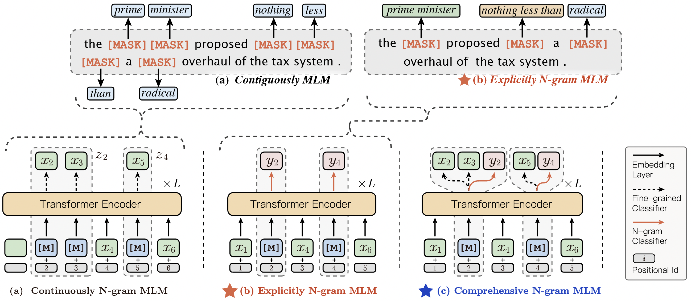

## _ERNIE-Gram_: Pre-Training with Explicitly N-Gram Masked Language Modeling for Natural Language Understanding

- [Proposed Methods](#proposed-methods)
- [Pre-trained Models](#pre-trained-models)
- [Fine-tuning on Downstream Tasks](#fine-tuning-on-downstream-tasks)
  * [GLUE](#glue-benchmark)
  * [SQuAD](#squad-benchmark)
- [Usage](#usage)
  * [Install PaddlePaddle](#install-paddlepaddle)
  * [Fine-tuning](#fine-tuning)
  * [Employ Dynamic Computation Graph](#employ-dynamic-computation-graph)
- [Citation](#citation)
- [Communication](#communication)

For technical description of the algorithm, please see our paper:
>[_**ERNIE-Gram: Pre-Training with Explicitly N-Gram Masked Language Modeling for Natural Language Understanding**_](https://www.aclweb.org/anthology/2021.naacl-main.136/)
>
>Dongling Xiao, Yu-Kun Li, Han Zhang, Yu Sun, Hao Tian, Hua Wu, Haifeng Wang
>
>Accepted by **NAACL-HLT 2021**

    
---
**[ERNIE-Gram](https://www.aclweb.org/anthology/2021.naacl-main.136/)** is an **explicitly** n-gram masking and predicting method to eliminate the limitations of previous contiguously masking strategies and incorporate coarse-grained linguistic information into pre-training sufficiently. To model the intra-dependencies and inter-relation of coarse-grained linguistic information, n-grams are masked and predicted directly using explicit n-gram identities rather than contiguous sequences of n tokens. Furthermore, ERNIE-Gram employs a generator model to sample plausible n-gram identities as optional n-gram masks and predict them in both coarse-grained and fine-grained manners to enable comprehensive n-gram prediction and relation modeling.

## Proposed Methods

We construct three novel methods to model the intra-dependencies and inter-relation of coarse-grained linguistic information:

- **Explicitly N-gram Masked Language Modeling**: n-grams are masked with single [MASK] symbols, and predicted directly using explicit n-gram identities rather than sequences of tokens.
- **Comprehensive N-gram Prediction**: masked n-grams are simultaneously predicted in coarse-grained (explicit n-gram identities) and fine-grained (contained token identities) manners.
- **Enhanced N-gram Relation Modeling**: n-grams are masked with plausible n-grams identities sampled from a generator model, and then recovered to the original n-grams.



## Pre-trained Models

We release the checkpoints for **ERNIE-Gram _16G_** and  **ERNIE-Gram _160G_** models which are pre-trained on the base-scale corpora (16GB text for BERT) and the large-scale corpora (160GB text for RoBERTa) respectively. 

- [**ERNIE-Gram _16G_**](https://ernie-github.cdn.bcebos.com/model-ernie-gram-en-16g.tar.gz) (_lowercased | 12-layer, 768-hidden, 12-heads, 110M parameters_)
- [**ERNIE-Gram _160G_**](https://ernie-github.cdn.bcebos.com/model-ernie-gram-en-160g.tar.gz) (_lowercased | 12-layer, 768-hidden, 12-heads, 110M parameters_)


## Fine-tuning on Downstream Tasks

We compare the performance of [ERNIE-Gram](https://www.aclweb.org/anthology/2021.naacl-main.136/) with the existing SOTA pre-training models for natural language generation ([MPNet](https://arxiv.org/abs/2004.09297), [UniLMv2](https://arxiv.org/abs/2002.12804), [ELECTRA](https://arxiv.org/abs/2003.10555), [RoBERTa](https://arxiv.org/abs/1907.11692) and [XLNet](https://arxiv.org/abs/1906.08237)) on several language understanding tasks, including [GLUE benchmark](https://openreview.net/pdf?id=rJ4km2R5t7) (General Language Understanding Evaluation), [SQuAD](https://arxiv.org/abs/1606.05250) (Stanford Question Answering). 


### GLUE benchmark
The General Language Understanding Evaluation ([GLUE](https://openreview.net/pdf?id=rJ4km2R5t7)) is a multi-task benchmark consisting of various NLU tasks, which contains 1) pairwise classification tasks like language inference [MNLI](https://www.aclweb.org/anthology/N18-1101), [RTE](http://dx.doi.org/10.1007/11736790_9)), question answering (QNLI) and paraphrase detection (QQP, [MRPC](https://www.aclweb.org/anthology/I05-5002)), 2) single-sentence classification tasks like linguistic acceptability ([CoLA](https://www.aclweb.org/anthology/Q19-1040)), sentiment
analysis ([SST-2](https://www.aclweb.org/anthology/D13-1170)) and 3) text similarity task ([STS-B](https://www.aclweb.org/anthology/S17-2001)).

The results on GLUE are presented as follows:

|Tasks| <strong>MNLI</strong> | <strong>QNLI</strong> | <strong>QQP</strong> | <strong>SST-2</strong> | <strong>CoLA</strong> | <strong>MRPC</strong> | <strong>RTE</strong> | <strong>STS-B</strong> | <strong>AVG</strong> |
| :--------| :------: | :------: | :------: | :------: | :------: | :------: | :------: | :------: | :------: |
|Metrics| ACC | ACC | ACC | ACC | MCC | ACC | ACC | PCC | <strong>AVG</strong> |
| XLNet     |86.8|91.7|91.4|94.7|60.2|88.2|74.0|89.5|84.5|
| RoBERTa   |87.6|92.8|91.9|94.8|63.6|90.2|78.7|91.2|86.4|
| ELECTRA   |88.8|93.2|91.5|95.2|67.7|89.5|82.7|91.2|87.5|
| UniLMv2   |88.5|**93.5**|91.7|95.1|65.2|**91.8**|81.3|91.0|87.3|
| MPNet     |88.5|93.3|91.9|95.4|65.0|91.5|**85.2**|90.9|87.7|
| **ERNIE-Gram** |**89.1**|93.2|**92.2**|**95.6**|**68.6**|90.7|83.8|**91.3**|**88.1**|

Download the [GLUE data](https://gluebenchmark.com/tasks) by running [this script](https://gist.github.com/W4ngatang/60c2bdb54d156a41194446737ce03e2e) and unpack it to some directory `${TASK_DATA_PATH}`

After the dataset is downloaded, you should run `sh ./utils/glue_data_process.sh $TASK_DATA_PATH` to convert the data format for training. If everything goes well, there will be a folder named `data`  created with all the converted datas in it.

### SQuAD benchmark
The Stanford Question Answering (SQuAD) tasks are designed to extract the answer span within the given passage conditioned on the question. We conduct experiments on [SQuAD1.1](https://www.aclweb.org/anthology/D16-1264) and [SQuAD2.0](https://www.aclweb.org/anthology/P18-2124) by adding a classification layer on the sequence outputs of ERNIE-Gram and predicting whether each token is the start or end position of the answer span. 

The results on SQuAD are presented as follows: 

| Tasks                                                | <strong>SQuADv1</strong> | <strong>SQuADv2</strong> | 
| :-------------------------------------------------------- | :----------------------------: | :----------------------: | 
| Metrics                                                | EM / F1 | EM / F1 | 
| RoBERTa    |84.6 / 91.5|80.5 / 83.7|
| XLNet    |- / - | 80.2 / -|
| ELECTRA    |86.8 / - | 80.5 / -|
| MPNet    |86.8 / 92.5 | 82.8 / 85.6|
| UniLMv2    |87.1 / 93.1 | 83.3 / 86.1|
| **ERNIE-Gram**    |**87.2** / **93.2** | **84.1** / **87.1**|

The preprocessed data for SQuAD can be downloaded from [SQuADv1](https://ernie-github.cdn.bcebos.com/data-SQuADv1.tar.gz) and [SQuADv2](https://ernie-github.cdn.bcebos.com/data-SQuADv2.tar.gz). Please unpack them to `./data`.

The preprocessed data for tasks involving long text can be downloaded from [RACE](https://ernie-github.cdn.bcebos.com/data-RACE.tar.gz), [IMDB](https://ernie-github.cdn.bcebos.com/data-IMDB.tar.gz) and [AG'news](https://ernie-github.cdn.bcebos.com/data-AG.tar.gz). Please unpack them to `./data`.

## Usage

### Install PaddlePaddle

This code base has been tested with PaddlePaddle 2.0.0+, You can install PaddlePaddle follow [this site](https://www.paddlepaddle.org.cn/install/quick). 

### Fine-tuning
Please update LD_LIBRARY_PATH about CUDA, cuDNN, NCCL2 before running ERNIE-Gram. We have put the parameter configurations of the finetuning tasks in `./task_conf`. You can easily run finetuning through these configuration files. For example, you can finetune ERNIE-Gram model on RTE by
```script
TASK="RTE"   # MNLI, SST-2, CoLA, SQuADv1..., please see ./task_conf
MODEL_PATH="./ernie-gram-160g" #path for pre-trained models
sh run.sh ${TASK} ${MODEL_PATH}
```
The log of training and the evaluation results are in `log/*job.log.0`. To finetune on your own task data, you can refer to the data format we provide for processing your data.


### Employ Dynamic Computation Graph

The ERNIE-Gram-zh code using dynamic graph is more concise and flexible, please refer to [ERNIE-Gram Dygraph](https://github.com/PaddlePaddle/ERNIE/tree/develop/ernie-gram) for specific use.

## Citation

You can cite the paper as below:

```
@article{xiao2021ernie-gram,
  title={ERNIE-Gram: Pre-Training with Explicitly N-Gram Masked Language Modeling for Natural Language Understanding},
  author={Xiao, Dongling and Li, Yukun and Zhang, Han and Sun, Yu and Tian, Hao and Wu, Hua and Wang, Haifeng},
  journal={arXiv preprint arXiv:2010.12148},
  year={2021}
}
```

## Communication

- [ERNIE homepage](https://wenxin.baidu.com/)
- [Github Issues](https://github.com/PaddlePaddle/ERNIE/issues): bug reports, feature requests, install issues, usage issues, etc.
- QQ discussion group: 760439550 (ERNIE discussion group).
- QQ discussion group: 958422639 (ERNIE discussion group-v2).
- [Forums](http://ai.baidu.com/forum/topic/list/168?pageNo=1): discuss implementations, research, etc.

