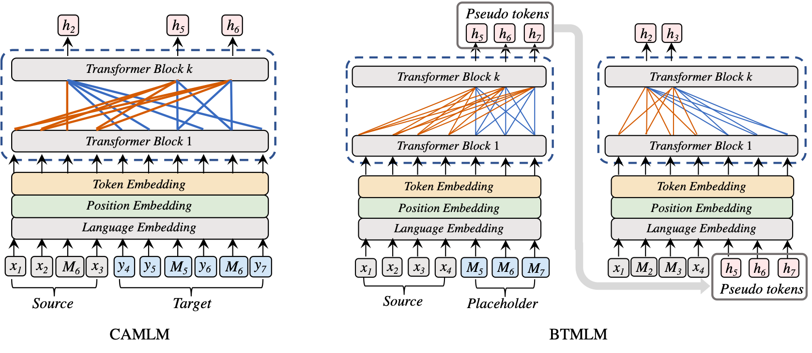

English | [简体中文](./README_zh.md)

## ERNIE-M: Enhanced Multilingual Representation by Aligning Cross-lingual Semantics with Monolingual Corpora

- [Framework](#framework)
- [Pre-trained Models](#Pre-trained-Models)
- [Fine-tuning Tasks](#Fine-tuning-Tasks)
  * [Cross-lingual Natural Language Inference](#Cross-lingual-Natural-Language-Inference)
  * [Named Entity Recognition](#Named-Entity-Recognition)
  * [Cross-lingual Question Answering](#Cross-lingual-Question-Answering)
  * [Cross-lingual Paraphrase Identification](#Cross-lingual-Paraphrase-Identification)
  * [Cross-lingual Sentence Retrieval](#Cross-lingual-Sentence-Retrieval)
- [Usage](#Usage)
  * [Install Paddle](#Install-PaddlePaddle)
  * [Fine-tuning](#Fine-tuning)
- [Citation](#Citation)

For technical description of the algorithm, please see our paper:
>[_**ERNIE-M: Enhanced Multilingual Representation by Aligning Cross-lingual Semantics with Monolingual Corpora**_](https://arxiv.org/pdf/2012.15674.pdf)
>
>Xuan Ouyang, Shuohuan Wang, Chao Pang, Yu Sun, Hao Tian, Hua Wu, Haifeng Wang
>
>Preprint December 2020
>
>Accepted by **EMNLP-2021**

 

---
**ERNIE-M is a multilingual language model**. We propose a new training method that encourages the model to align the representation of multiple languages with monolingual corpora, to overcome the constraint that the parallel corpus size places on the model performance. Our key insight is to integrate **back-translation** into the pre-training process. We **generate pseudo-parallel sentence pairs on a monolingual corpus** to enable the learning of semantic alignments between different languages, thereby enhancing the semantic modeling of cross-lingual models. Experimental results show that ERNIE-M outperforms existing cross-lingual models and delivers new state-of-the-art results in various cross-lingual downstream tasks.

## Framework

We proposed two novel methods to align the representation of multiple languages:

- **Cross-Attention Masked Language Modeling(CAMLM)**: In CAMLM, we learn the multilingual semantic representation by restoring the MASK tokens in the input sentences.  
- **Back-Translation masked language modeling(BTMLM)**: We use BTMLM to train our model to generate pseudo-parallel sentences from the monolingual sentences. The generated pairs are then used as the input of the model to further align the cross-lingual semantics, thus enhancing the multilingual representation.





## Pre-trained Models

We release the checkpoints for **ERNIE-M _base_** and **ERNIE-M _large_** model。 

- [**ERNIE-M _base_**](http://bj.bcebos.com/wenxin-models/model-ernie-m-base.tar.gz) (_12-layer, 768-hidden, 12-heads_)
- [**ERNIE-M _large_**](http://bj.bcebos.com/wenxin-models/model-ernie-m-large.tar.gz) (_24-layer, 1024-hidden, 16-heads_)


## Fine-tuning Tasks

We compare the performance of [ERNIE-M](https://arxiv.org/pdf/2012.15674.pdf) with the existing SOTA pre-training models (such as [XLM](https://arxiv.org/pdf/1901.07291.pdf), [Unicoder](https://arxiv.org/pdf/1909.00964.pdf), [XLM-R](https://arxiv.org/pdf/1911.02116.pdf), [INFOXLM](https://arxiv.org/pdf/2007.07834.pdf), [VECO](https://arxiv.org/pdf/2010.16046.pdf) and [mBERT](https://arxiv.org/pdf/1810.04805.pdf)) for cross-lingual downstream tasks, including natural language inference (**_XNLI_**), named entity recognition(**_CoNLL_**), question answering (**_MLQA_**), paraphrase identification (**_PAWS-X_**) and sentence-retrieval (**_Tatoeba_**).

### Cross-lingual Natural Language Inference

- [XNLI](https://arxiv.org/pdf/1809.05053.pdf)

| Model | en | fr | es | de | el | bg | ru | tr | ar | vi | th | zh | hi | sw | ur | Avg |
| --- | --- | --- | --- | --- | --- | --- | --- | --- | --- | --- | --- | --- | --- | --- | --- | --- |
| Cross-lingual Transfer |  |  |  |  |  |  |  |  |  |  |  |  |  |  |  |  |
| XLM | 85.0 | 78.7 | 78.9 | 77.8 | 76.6 | 77.4 | 75.3 | 72.5 | 73.1 | 76.1 | 73.2 | 76.5 | 69.6 | 68.4 | 67.3 | 75.1 |
| Unicoder | 85.1 | 79.0 | 79.4 | 77.8 | 77.2 | 77.2 | 76.3 | 72.8 | 73.5 | 76.4 | 73.6 | 76.2 | 69.4 | 69.7 | 66.7 | 75.4 |
| XLM-R | 85.8 | 79.7 | 80.7 | 78.7 | 77.5 | 79.6 | 78.1 | 74.2 | 73.8 | 76.5 | 74.6 | 76.7 | 72.4 | 66.5 | 68.3 | 76.2 |
| INFOXLM | **86.4** | **80.6** | 80.8 | 78.9 | 77.8 | 78.9 | 77.6 | 75.6 | 74.0 | 77.0 | 73.7 | 76.7 | 72.0 | 66.4 | 67.1 | 76.2 |
| **ERNIE-M** | 85.5 | 80.1 | **81.2** | **79.2** | **79.1** | **80.4** | **78.1** | **76.8** | **76.3** | **78.3** | **75.8** | **77.4** | **72.9** | **69.5** | **68.8** | **77.3** |
| XLM-R Large | 89.1 | 84.1 | 85.1 | 83.9 | 82.9 | 84.0 | 81.2 | 79.6 | 79.8 | 80.8 | 78.1 | 80.2 | 76.9 | 73.9 | 73.8 | 80.9 |
| INFOXLM Large | **89.7** | 84.5 | 85.5 | 84.1 | 83.4 | 84.2 | 81.3 | 80.9 | 80.4 | 80.8 | 78.9 | 80.9 | 77.9 | 74.8 | 73.7 | 81.4 |
| VECO Large | 88.2 | 79.2 | 83.1 | 82.9 | 81.2 | 84.2 | 82.8 | 76.2 | 80.3 | 74.3 | 77.0 | 78.4 | 71.3 | **80.4** | **79.1** | 79.9 |
| **ERNIR-M Large** | 89.3 | **85.1** | **85.7** | **84.4** | **83.7** | **84.5** | 82.0 | **81.2** | **81.2** | **81.9** | **79.2** | **81.0** | **78.6** | 76.2 | 75.4 | **82.0** |
| Translate-Train-All |  |  |  |  |  |  |  |  |  |  |  |  |  |  |  |  |
| XLM | 85.0 | 80.8 | 81.3 | 80.3 | 79.1 | 80.9 | 78.3 | 75.6 | 77.6 | 78.5 | 76.0 | 79.5 | 72.9 | 72.8 | 68.5 | 77.8 |
| Unicoder | 85.6 | 81.1 | 82.3 | 80.9 | 79.5 | 81.4 | 79.7 | 76.8 | 78.2 | 77.9 | 77.1 | 80.5 | 73.4 | 73.8 | 69.6 | 78.5 |
| XLM-R | 85.4 | 81.4 | 82.2 | 80.3 | 80.4 | 81.3 | 79.7 | 78.6 | 77.3 | 79.7 | 77.9 | 80.2 | 76.1 | 73.1 | 73.0 | 79.1 |
| INFOXLM | 86.1 | 82.0 | 82.8 | 81.8 | 80.9 | 82.0 | 80.2 | 79.0 | 78.8 | 80.5 | 78.3 | 80.5 | 77.4 | 73.0 | 71.6 | 79.7 |
| **ERNIE-M** | **86.2** | **82.5** | **83.8** | **82.6** | **82.4** | **83.4** | **80.2** | **80.6** | **80.5** | **81.1** | **79.2** | **80.5** | **77.7** | **75.0** | **73.3** | **80.6** |
| XLM-R Large | 89.1 | 85.1 | 86.6 | 85.7 | 85.3 | 85.9 | 83.5 | 83.2 | 83.1 | 83.7 | 81.5 | **83.7** | **81.6** | 78.0 | 78.1 | 83.6 |
| VECO Large | 88.9 | 82.4 | 86.0 | 84.7 | 85.3 | 86.2 | **85.8** | 80.1 | 83.0 | 77.2 | 80.9 | 82.8 | 75.3 | **83.1** | **83.0** | 83.0 |
| **ERNIE-M Large** | **89.5** | **86.5** | **86.9** | **86.1** | **86.0** | **86.8** | 84.1 | **83.8** | **84.1** | **84.5** | **82.1** | 83.5 | 81.1 | 79.4 | 77.9 | **84.2** |

### Named Entity Recognition

- [CoNLL](https://arxiv.org/pdf/cs/0306050.pdf)

| Model | en | nl | es | de | Avg |
| --- | --- | --- | --- | --- | --- |
| Fine-tune on English dataset |  |  |  |  |  |
| mBERT | 91.97 | 77.57 | 74.96 | 69.56 | 78.52 |
| XLM-R | 92.25 | **78.08** | 76.53 | **69.60** | 79.11 |
| **ERNIE-M** | **92.78** | 78.01 | **79.37** | 68.08 | **79.56** |
| XLM-R Large | 92.92 | 80.80 | 78.64 | 71.40 | 80.94 |
| **ERNIE-M Large** | **93.28** | **81.45** | **78.83** | **72.99** | **81.64** |
| Fine-tune on all dataset |  |  |  |  |  |
| XLM-R | 91.08 | 89.09 | 87.28 | 83.17 | 87.66 |
| **ERNIE-M** | **93.04** | **91.73** | **88.33** | **84.20** | **89.32** |
| XLM-R Large | 92.00 | 91.60 | **89.52** | 84.60 | 89.43 |
| **ERNIE-M Large** | **94.01** | **93.81** | 89.23 | **86.20** | **90.81** |

### Cross-lingual Question Answering

- [MLQA](https://arxiv.org/pdf/1910.07475.pdf)

| Model | en | es | de | ar | hi | vi | zh | Avg |
| --- | --- | --- | --- | --- | --- | --- | --- | --- |
| mBERT | 77.7/65.2 | 64.3/46.6 | 57.9/44.3 | 45.7/29.8 | 43.8/29.7 | 57.1/38.6 | 57.5/37.3 | 57.7/41.6 |
| XLM | 74.9/62.4 | 68.0/49.8 | 62.2/47.6 | 54.8/36.3 | 48.8/27.3 | 61.4/41.8 | 61.1/39.6 | 61.6/43.5 |
| XLM-R | 77.1/64.6 | 67.4/49.6 | 60.9/46.7 | 54.9/36.6 | 59.4/42.9 | 64.5/44.7 | 61.8/39.3 | 63.7/46.3 |
| INFOXLM | 81.3/68.2 | 69.9/51.9 | 64.2/49.6 | 60.1/40.9 | 65.0/47.5 | 70.0/48.6 | 64.7/**41.2** | 67.9/49.7 |
| ERNIE-M | **81.6**/**68.5** | **70.9**/**52.6** | **65.8**/**50.7** | **61.8**/**41.9** | **65.4**/**47.5** | **70.0**/**49.2** | **65.6**/41.0 | **68.7**/**50.2** |
| XLM-R Large | 80.6/67.8 | 74.1/56.0 | 68.5/53.6 | 63.1/43.5 | 62.9/51.6 | 71.3/50.9 | 68.0/45.4 | 70.7/52.7 |
| INFOXLM Large | **84.5**/**71.6** | **75.1**/**57.3** | **71.2**/**56.2** | **67.6**/**47.6** | 72.5/54.2 | **75.2**/**54.1** | 69.2/45.4 | 73.6/55.2 |
| ERNIE-M Large | 84.4/71.5 | 74.8/56.6 | 70.8/55.9 | 67.4/47.2 | **72.6**/**54.7** | 75.0/53.7 | **71.1**/**47.5** | **73.7**/**55.3** |

### Cross-lingual Paraphrase Identification

- [PAWS-X](https://arxiv.org/pdf/1908.11828.pdf)

| Model | en | de | es | fr | ja | ko | zh | Avg |
| --- | --- | --- | --- | --- | --- | --- | --- | --- |
| Cross-lingual Transfer |  |  |  |  |  |  |  |  |
| mBERT | 94.0 | 85.7 | 87.4 | 87.0 | 73.0 | 69.6 | 77.0 | 81.9 |
| XLM | 94.0 | 85.9 | 88.3 | 87.4 | 69.3 | 64.8 | 76.5 | 80.9 |
| MMTE | 93.1 | 85.1 | 87.2 | 86.9 | 72.0 | 69.2 | 75.9 | 81.3 |
| XLM-R Large | 94.7 | 89.7 | 90.1 | 90.4 | 78.7 | 79.0 | 82.3 | 86.4 |
| VECO Large | **96.2** | 91.3 | 91.4 | 92.0 | 81.8 | 82.9 | 85.1 | 88.7 |
| ERNIE-M Large | 96.0 | **91.9** | **91.4** | **92.2** | **83.9** | **84.5** | **86.9** | **89.5** |
| Translate-Train-All |  |  |  |  |  |  |  |  |
| VECO Large | 96.4 | 93.0 | 93.0 | 93.5 | 87.2 | 86.8 | 87.9 | 91.1 |
| ERNIE-M Large | **96.5** | **93.5** | **93.3** | **93.8** | **87.9** | **88.4** | **89.2** | **91.8** |

### Cross-lingual Sentence Retrieval

- [Tatoeba](https://arxiv.org/pdf/2003.11080.pdf)

| Model | Avg |
| --- | --- |
| XLM-R Large | 75.2 |
| VECO Large | 86.9 |
| ERNIE-M Large | **87.9** |
| ERNIE-M Large* | 93.3 |

\* indicates the results after fine-tuning.

## Usage

### Install PaddlePaddle

This code base has been tested with Paddle (version>=2.0) with Python3. Other dependency of ERNIE-M is listed in `requirements.txt`, you can install it by
```script
pip install -r requirements.txt
```

### Fine-tuning
We release the finetuning code for natural language inference, named entity recognition, question answering and paraphrase identification. For example, you can finetune ERNIE-M large model on XNLI dataset by
```shell
sh scripts/large/xnli_cross_lingual_transfer.sh # Cross-lingual Transfer
sh scripts/large/xnli_translate-train_all.sh # Translate-Train-All
```

The log of training and the evaluation results are in log/job.log.0.

**Notice**: The actual total batch size is equal to `configured batch size * number of used gpus`.


## Citation

You can cite the paper as below:

```
@inproceedings{ouyang-etal-2021-ernie,
    title = "{ERNIE}-{M}: Enhanced Multilingual Representation by Aligning Cross-lingual Semantics with Monolingual Corpora",
    author = "Ouyang, Xuan  and
      Wang, Shuohuan  and
      Pang, Chao  and
      Sun, Yu  and
      Tian, Hao  and
      Wu, Hua  and
      Wang, Haifeng",
    booktitle = "Proceedings of the 2021 Conference on Empirical Methods in Natural Language Processing",
    month = nov,
    year = "2021",
    address = "Online and Punta Cana, Dominican Republic",
    publisher = "Association for Computational Linguistics",
    url = "https://aclanthology.org/2021.emnlp-main.3",
    pages = "27--38",
    abstract = "Recent studies have demonstrated that pre-trained cross-lingual models achieve impressive performance in downstream cross-lingual tasks. This improvement benefits from learning a large amount of monolingual and parallel corpora. Although it is generally acknowledged that parallel corpora are critical for improving the model performance, existing methods are often constrained by the size of parallel corpora, especially for low-resource languages. In this paper, we propose Ernie-M, a new training method that encourages the model to align the representation of multiple languages with monolingual corpora, to overcome the constraint that the parallel corpus size places on the model performance. Our key insight is to integrate back-translation into the pre-training process. We generate pseudo-parallel sentence pairs on a monolingual corpus to enable the learning of semantic alignments between different languages, thereby enhancing the semantic modeling of cross-lingual models. Experimental results show that Ernie-M outperforms existing cross-lingual models and delivers new state-of-the-art results in various cross-lingual downstream tasks. The codes and pre-trained models will be made publicly available.",
}
```


