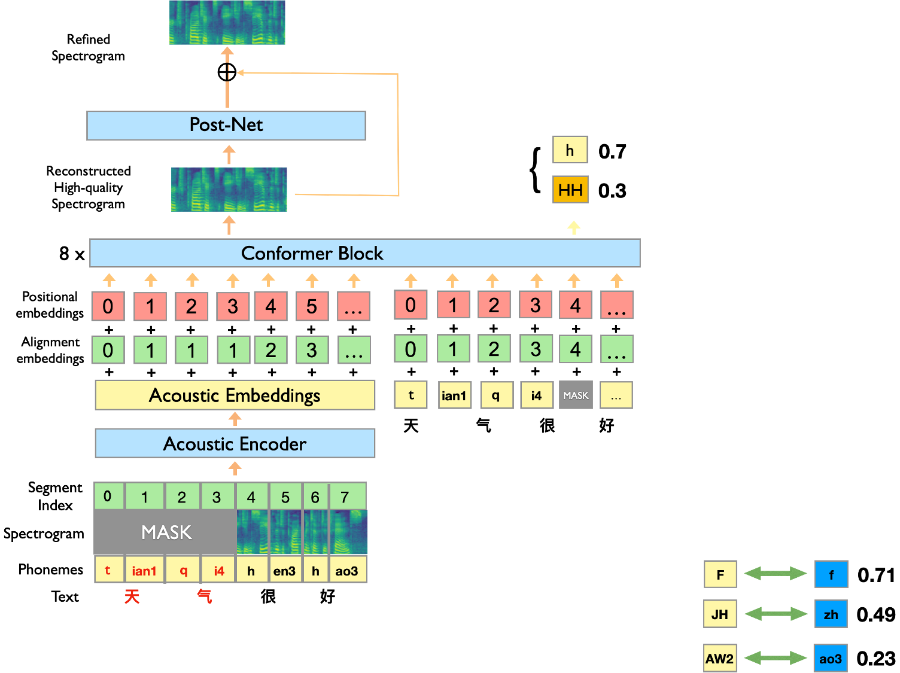

ERNIE-SAT是可以同时处理中英文的跨语言的语音-语言跨模态大模型，其在语音编辑、个性化语音合成以及跨语言的语音合成等多个任务取得了领先效果。可以应用于语音编辑、个性化合成、语音克隆、同传翻译等一系列场景，该项目供研究使用。

## 模型框架
ERNIE-SAT中我们提出了两项创新：
- 在预训练过程中将中英双语对应的音素作为输入，实现了跨语言、个性化的软音素映射；
- 采用语言和语音的联合掩码学习实现了语言和语音的对齐：



## 使用说明

### 1.安装飞桨

我们的代码基于 Paddle(version>=2.0)


### 2.预训练模型
预训练模型ERNIE-SAT的模型如下所示:
- [ERNIE-SAT_ZH](http://bj.bcebos.com/wenxin-models/model-ernie-sat-base-zh.tar.gz) 
- [ERNIE-SAT_EN](http://bj.bcebos.com/wenxin-models/model-ernie-sat-base-en.tar.gz)  
- [ERNIE-SAT_ZH_and_EN](http://bj.bcebos.com/wenxin-models/model-ernie-sat-base-en_zh.tar.gz) 


### 3.下载

1. 我们使用parallel wavegan作为声码器(vocoder): 
    - [pwg_aishell3_ckpt_0.5.zip](https://paddlespeech.bj.bcebos.com/Parakeet/released_models/pwgan/pwg_aishell3_ckpt_0.5.zip)  

创建download文件夹，下载上述预训练的声码器(vocoder)模型并将其解压

```bash
mkdir download
cd download
unzip pwg_aishell3_ckpt_0.5.zip
```

 2. 我们使用[FastSpeech2](https://arxiv.org/abs/2006.04558) 作为音素(phoneme)的持续时间预测器:
    - [fastspeech2_conformer_baker_ckpt_0.5.zip](https://paddlespeech.bj.bcebos.com/Parakeet/released_models/fastspeech2/fastspeech2_conformer_baker_ckpt_0.5.zip)  中文场景下使用 
    - [fastspeech2_nosil_ljspeech_ckpt_0.5.zip](https://paddlespeech.bj.bcebos.com/Parakeet/released_models/fastspeech2/fastspeech2_nosil_ljspeech_ckpt_0.5.zip)  英文场景下使用

 下载上述预训练的fastspeech2模型并将其解压

```bash
cd download
unzip fastspeech2_conformer_baker_ckpt_0.5.zip
unzip fastspeech2_nosil_ljspeech_ckpt_0.5.zip
```

### 4.推理

我们目前只开源了语音编辑、个性化语音合成、跨语言语音合成的推理代码，后续会逐步开源。
注：当前采用的声码器版本与[模型训练时版本](https://github.com/kan-bayashi/ParallelWaveGAN)在英文上存在差异，您可使用模型训练时版本作为您的声码器，模型将在后续更新中升级。

我们提供特定音频文件, 以及其对应的文本、音素相关文件:
- prompt_wav: 提供的音频文件
- prompt/dev: 基于上述特定音频对应的文本、音素相关文件


```text
prompt_wav
├── p299_096.wav                 # 样例语音文件1
├── SSB03540428.wav              # 样例语音文件2
└── ...
```

```text
prompt/dev
├── text                     # 样例语音对应文本
├── wav.scp                  # 样例语音路径
├── mfa_text                 # 样例语音对应音素
├── mfa_start                # 样例语音中各个音素的开始时间
└── mfa_end                  # 样例语音中各个音素的结束时间
```
1. `--am` 声学模型格式符合 {model_name}_{dataset}
2. `--am_config`, `--am_checkpoint`, `--am_stat` 和 `--phones_dict` 是声学模型的参数，对应于 fastspeech2 预训练模型中的 4 个文件。
3. `--voc` 声码器(vocoder)格式是否符合 {model_name}_{dataset}
4. `--voc_config`, `--voc_checkpoint`, `--voc_stat` 是声码器的参数，对应于 parallel wavegan 预训练模型中的 3 个文件。
5. `--lang` 对应模型的语言可以是 `zh` 或 `en` 。
6. `--ngpu` 要使用的GPU数，如果 ngpu==0，则使用 cpu。
7. ` --model_name` 模型名称
8. ` --uid` 特定提示(prompt)语音的id
9. ` --new_str` 输入的文本(本次开源暂时先设置特定的文本)
10. ` --prefix` 特定音频对应的文本、音素相关文件的地址
11. ` --source_language` , 源语言
12. ` --target_language` , 目标语言
13. ` --output_name` , 合成语音名称
14. ` --task_name` , 任务名称, 包括：语音编辑任务、个性化语音合成任务、跨语言语音合成任务

运行以下脚本即可进行实验
```shell
sh run_sedit_en.sh # 语音编辑任务(英文) 
sh run_gen_en.sh # 个性化语音合成任务(英文)
sh run_clone_en_to_zh.sh # 跨语言语音合成任务(英文到中文的克隆)
```

