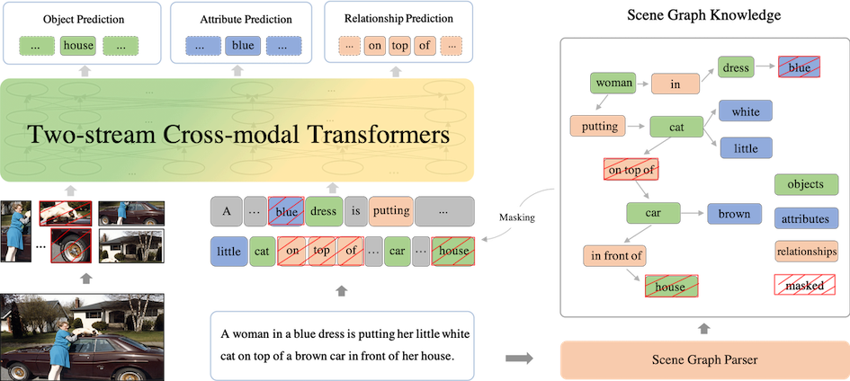

[English](./README.md) | 简体中文

## _ERNIE-ViL_: Knowledge Enhanced Vision-Language Representations Through Scene Graph
- [模型框架](#模型框架)
- [预训练模型](#预训练模型)
- [下游任务](#下游任务)
  * [视觉推理](#视觉推理)
- [使用说明](#使用说明)
  * [安装飞桨](#安装飞桨)
  * [运行微调](#运行微调)
  * [预测](#预测)
- [引用](#引用)

关于算法的详细描述，请参见我们的论文

>[_**ERNIE-ViL:Knowledge Enhanced Vision-Language Representations Through Scene Graph**_](https://arxiv.org/abs/2006.16934)
>
>Fei Yu\*, Jiji Tang\*, Weichong Yin, Yu Sun, Hao Tian, Hua Wu, Haifeng Wang (\* : equal contribution)
>
>Preprint June 2020
>
    


---
**ERNIE-ViL
是面向视觉-语言任务的知识增强预训练框架**，首次在视觉-语言预训练中引入了结构化的知识。ERNIE-ViL利用场景图中的结构化知识，构建了**物体预测，属性预测，关系预测**三种预训练任务，精细地刻画了视觉-语言模态之间细粒度语义的对齐，从而获得了更好的视觉-语言联合表示。

## 模型框架

基于文本中解析出的场景图，ERNIE-ViL提出了三个多模态场景图预测任务：
- **物体预测**：随机选取图中的一部分物体，然后对其在句子中对应的词进行掩码和预测；
- **属性预测**：对于场景图中的属性-物体组合，随机选取一部分词对其中属性词进行掩码和预测；
- **关系预测**：对于场景图中的物体-关系-物体三元组，对其中的关系词进行掩码和预测。



ERNIE-ViL 场景图预训练任务结构

## 预训练模型


ERNIE-ViL使用大规模图文对齐数据集作为预训练数据，基于[**Conceptual
Captions**](https://www.aclweb.org/anthology/P18-1238.pdf)和[**SBU
Captions**](http://papers.nips.cc/paper/4470-im2text-describing-images-using-1-million-captio)数据集，训练和发布了两种参数规模的模型：

- [**ERNIE-ViL _base_**](https://ernie-github.cdn.bcebos.com/model-ernie-vil-base-en.1.tar.gz) (_lowercased | 12-text-stream-layer, 6-visual-stream-layer_)
- [**ERNIE-ViL _large_**](https://ernie-github.cdn.bcebos.com/model-ernie-vil-large-en.1.tar.gz) (_lowercased | 24-text-stream-layer, 6-visual-stream-layer_)

## 下游任务

ERNIE-ViL在五个视觉语言下游任务进行了实验，包括[**视觉常识推理**](https://openaccess.thecvf.com/content_CVPR_2019/papers/Zellers_From_Recognition_to_Cognition_Visual_Commonsense_Reasoning_CVPR_2019_paper.pdf)，
[**视觉问答**](https://openaccess.thecvf.com/content_iccv_2015/papers/Antol_VQA_Visual_Question_ICCV_2015_paper.pdf)，
[**跨模态图片检索**](https://www.mitpressjournals.org/doi/abs/10.1162/tacl_a_00166)，
[**跨模态文本检索**](https://www.mitpressjournals.org/doi/abs/10.1162/tacl_a_00166)，
[**引用式理解**](https://www.aclweb.org/anthology/D14-1086.pdf)。 

_当前仅开源视觉常识推理任务相关模型和代码，后续计划开源更多下游任务的模型和代码。_


### **视觉常识推理**
   * 数据集合
      * 训练、验证和测试集合相关数据由[**视觉常识推理官网**](http://visualcommonsense.com/download/)提供；
      * 视觉端特征的组织方式借鉴[**ViLBERT**](https://github.com/jiasenlu/vilbert_beta), 因此项目直接使用**ViLBERT**中的数据，数据[下载地址](https://github.com/jiasenlu/vilbert_beta/tree/master/data);
      * 将所有获取的文件放在 data/vcr 目录下；
      
  
   * 任务预训练： 在视觉推理任务中进行了任务预训练，预训练获得模型如下
      * [**ERNIE-ViL-VCR-task-pretrain _base_**](https://ernie-github.cdn.bcebos.com/model-ernie-vil-base-VCR-task-pre-en.1.tar.gz)
      * [**ERNIE-ViL-VCR-task-pretrain _large_**](https://ernie-github.cdn.bcebos.com/model-ernie-vil-large-VCR-task-pre-en.1.tar.gz)
   * 效果: ERNIE-ViL与之前最优预训练模型[**VILLA**](https://arxiv.org/pdf/2006.06195.pdf)在视觉常识推理任务上的效果对比如下：

      | 模型                                |      <strong>Q->A</strong>    |      <strong>QA->R</strong>    |     <strong>Q->AR</strong>       |
      | :---------------------------------- | :---------------------------: | :----------------------------: | :---------------------------:    |
      | VILLA (task-pretrain) _base_        |           75.54(76.4)         |            78.78(79.1)         |           59.75(60.6)            |
      | ERNIE-ViL (task-pretrain) _base_    |           76.37(77.0)         |            79.65(80.3)         |           61.24(62.1)            |
      | VILLA (task-pretrain) _large_       |           78.45(78.9)         |            82.57(82.8)         |           65.18(65.7)            |
      | ERNIE-ViL (task-pretrain) _large_   |  <strong>78.52(79.2)</strong> |  <strong>83.37(83.5)</strong>  |  <strong/>65.81(66.3) </strong>  |

      _注：括号外表示验证集效果，括号内表示测试集效果，测试集效果由[VCR榜单](https://visualcommonsense.com/leaderboard/)提供。_


## 使用说明

### 安装飞桨

ERNIE-ViL代码基于Paddle Fluid 1.8 和 Python 2.7， 依赖的其他模块也列举在 requirements.txt，可以通过下面的指令安装: 
 ```script
      pip install -r requirements.txt
  ```
### 运行微调
在运行 ERNIE-ViL 前，需要将 CUDA 、cuDNN 、NCCL2 的动态库路径添加到 LD_LIBRARY_PATH 。 我们把下游任务的参数配置文件放到了 conf/ ，可以简单地通过配置文件运行。 例如，您可以通过下面的指令在VCR上任务上进行微调：
```script
    sh run_finetuning.sh vcr conf/vcr/model_conf_vcr $vocab_file $ernie_vil_config $pretrain_models_params
```
前面提供的模型链接中包含了所有需要的文件, 包含词表文件，配置文件和预训练参数。VCR任务的微调实验是在 4 张32 GB 的英伟达V100 GPU上运行，如果您的GPU显存不够，可以考虑八张卡运行或者减小配置中的batch_size。
_我们目前开放了预训练模型和VCR的任务代码，其他的下游任务可以参考任务自主尝试。_

### 预测
基于已经训练的模型，您可以通过下面的命令测试VCR的效果：

  **Task Q->A**
 
  ```script
       sh run_inference.sh vcr qa $split(val/test) conf/vcr/model_conf_vcr $vocab_file $ernie_vil_config $model_params $res_file
  ```
  **Task QA->R**
 
  ```script
        sh run_inference.sh vcr qar $split(val/test) conf/vcr/model_conf_vcr $vocab_file $ernie_vil_config $model_params $res_file
  ```
  
  
  VCR的测试可以在一张32GB的英伟达V100 GPU上运行，测试的结果包含Q->A 任务、QA->R任务和Q->AR任务，其中Q->AR任务由前两个任务结果合并所得。


## 引用

可以按下面的格式引用我们的论文:

```
@article{yu2020ernie,
  title={ERNIE-ViL: Knowledge Enhanced Vision-Language Representations Through Scene Graph},
  author={Yu, Fei and Tang, Jiji and Yin, Weichong and Sun, Yu and Tian, Hao and Wu, Hua and Wang, Haifeng},
  journal={arXiv preprint arXiv:2006.16934},
  year={2020}
}

```

